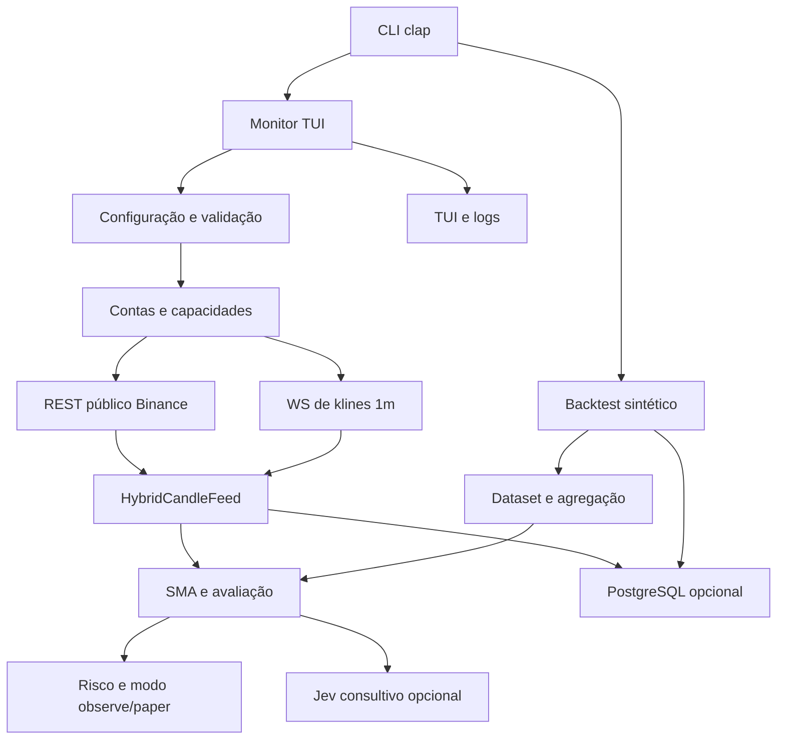

# Arquitetura do backend

> Revisão: 2026-09-27. Este documento descreve o código presente em `backend/src`, os testes em `backend/tests` e os contratos já registrados nos SDDs desta documentação.

## Visão do sistema

O binário `bot` possui dois caminhos de execução:

O caminho de monitor não envia ordens. A autorização atual permite apenas backfill histórico público da Binance Spot em `dev`; os caminhos de saldo e execução permanecem bloqueados. O contrato de pausa/retomada está em [SDD T-10](../sdd/monitor-pause-resume-sdd.md), o de persistência em [SDD T-15](../sdd/monitor-persistence-policy-sdd.md) e o de redirects em [SDD T-05](../sdd/rest-redirect-sdd.md).

## Módulos de raiz

| Módulo | Interface principal | Responsabilidade | Fonte de implementação |
|---|---|---|---|
| `main` | `main() -> Result` | Parseia CLI, escolhe monitor/backtest e inicializa persistência/logging. | `src/main.rs` |
| `app` | `run(Config, Option<Database>)` | Orquestra o monitor, concorrência REST/WS, avaliação, Jev, feed e dashboard. | `src/app.rs` |
| `config` | `Config::load`, `Config::validate` | Carrega TOML, aplica overrides CLI e valida ambiente, operação, timeframe, risco e Jev. | `src/config/mod.rs` |
| `domain` | Tipos de identidade, sinais e métricas | Define tipos de domínio, normalização de símbolo, sinais e resultados compartilhados. | `src/domain.rs` |
| `error` | `BotError`, `BotResult` | Normaliza erros de configuração, mercado, exchange, persistência e Jev. | `src/error.rs` |
| `market` | `Candle`, `HistoricalDataset` | Valida candles, cria manifestos, calcula gaps e agrega dados 1m. | `src/market.rs` |
| `market_feed` | `HybridCandleFeed` | Mescla janelas REST e candles WS fechados, deduplica, ordena, limita a janela e rastreia timestamps avaliados. | `src/market_feed.rs` |
| `strategy` | Snapshot SMA e períodos por operação | Calcula cruzamentos SMA e seleciona períodos autorizados por operação. | `src/strategy/mod.rs` |
| `risk` | Limites e verificação de sinal | Calcula limites por perfil e impede uso incompatível com o modo de execução. | `src/risk.rs` |
| `portfolio` | Tipos de ativos, posições e snapshots | Valida snapshots de carteira e suporta o estado paper; não executa ordens. | `src/portfolio.rs` |
| `backtest` | Simulação de posições e relatório | Simula entradas/saídas, taxas, slippage, equity e métricas. | `src/backtest.rs` |
| `backtest_cli` | Subcomando `backtest` | Gera fixture sintética 1m, agrega timeframe, executa simulação, opcionalmente persiste e imprime JSON. | `src/backtest_cli.rs` |
| `exchanges` | Registro, conta, REST, WS e market data | Agrupa toda a integração de exchanges e os gates de capacidade. | `src/exchanges/` |
| `jev` | `JevAdvisor::review` | Envia snapshot reduzido para avaliação consultiva opcional; não tem autoridade de ordem. | `src/jev/mod.rs` |
| `persistence` | `Database::connect_from_env`, `persist_dataset` | Conecta apenas ao banco `trading_bot`, aplica migrações e grava datasets/candles de forma idempotente. | `src/persistence/mod.rs` |
| `logging` | Inicialização de tracing | Configura stderr e arquivos JSON rotacionados. | `src/logging.rs` |
| `ui` | Dashboard e comandos de teclado | Renderiza TUI, mostra estados e envia pausa, retomada e saída. | `src/ui/mod.rs` |

## Submódulos de exchanges

| Módulo | Interface e responsabilidade |
|---|---|
| `account_file` | Carrega TOML da conta e valida origens REST/WS permitidas. |
| `binance` | Adapter de candles Spot; valida cada janela concluída antes de entregar dados ao feed. |
| `bootstrap` | Constrói o registro de contas a partir da configuração e seleciona a conta Spot. |
| `capabilities` | Descreve capacidades declaradas sem habilitar execução. |
| `live` | Abre e mantém a sessão WS de klines fechados `1m`, com cancelamento e fallback. |
| `market_data` | Seam `MarketDataSource::candles`, usado por adapters e testes. |
| `preflight` | Produz catálogo e amostras diagnósticas de recursos; não inicia execução. |
| `registry` | Armazena e consulta contas de exchange, incluindo Futures registrados mas não selecionados. |
| `resources` | Modela recursos gerenciados e o catálogo de inicialização. |
| `rest` | Autoriza usos REST; só backfill público Spot em `dev` passa hoje. |
| `router` | Mapeia necessidade de mercado para transporte e modelo de assinatura; não envia ordens. |
| `stream` | Modela tipos de stream, eventos e assinaturas. |
| `ws` | Valida configuração e plano de sessão WebSocket. |

## Interfaces e seams importantes

- **Dados de mercado:** `MarketDataSource` é o seam externo para o adapter da exchange e para fakes de teste.
- **Feed híbrido:** `HybridCandleFeed` concentra ordenação, deduplicação, limite de janela e watermark; o monitor não deve reproduzir essas regras.
- **Configuração:** `Config::load/validate` é o seam que separa TOML/CLI das regras de operação.
- **Persistência:** `Database` concentra conexão, migração e gravação transacional; o monitor trata a persistência como capacidade opcional.
- **Aconselhamento:** `JevAdvisor::review` é um adapter consultivo isolado, com timeout, endpoint validado e payload sem credenciais.
- **Execução:** `authorize_rest_use` é o gate central atual; qualquer futura ordem precisa de um seam e de autorização próprios.

Esses seams mantêm profundidade: o chamador conhece uma interface pequena e as regras de validação ficam concentradas na implementação. A exceção a observar é `app`, que hoje orquestra muitas responsabilidades e merece decomposição cuidadosa somente quando houver uma necessidade concreta de mudança.

## Fluxo do monitor

1. `main` carrega `Config` e inicializa logging.
2. Se `DATABASE_URL` existir, tenta conectar ao banco dedicado e aplicar migrações; falha de persistência degrada o monitor em vez de habilitar execução.
3. `app` seleciona a conta Spot e cria o adapter de mercado.
4. Para `1m`, WS envia somente klines fechados; REST mantém backfill e fallback.
5. `HybridCandleFeed` entrega uma janela contígua suficiente para a estratégia.
6. `strategy` produz snapshot SMA; Jev pode produzir observações consultivas.
7. `risk` aplica limites e o modo observe/paper; a UI publica estado e logs.
8. O monitor persiste somente quando o opt-in e o banco estão disponíveis.

## Fluxo do backtest

1. `backtest_cli` valida timeframe e tamanho.
2. Gera candles 1m determinísticos.
3. `market` valida e agrega para o timeframe selecionado.
4. `backtest` simula o cruzamento, o fill na barra seguinte, taxas e slippage.
5. O CLI imprime o resumo JSON e pode persistir o dataset.

## Cobertura de testes

- Configuração e caminho de arquivo: `tests/config_cli.rs`.
- Fixture de backtest em todos os presets/timeframes: `tests/backtest_fixture.rs`.
- Política pura de origem de redirect: `tests/redirect_origin_test.rs`.
- Política HTTP de redirect: `tests/redirect_policy_test.rs`.
- Testes unitários adicionais estão junto dos módulos de domínio, feed, exchange, estratégia, risco, UI e persistência.
- Round-trip PostgreSQL é ignorado por padrão e requer banco `trading_bot`.

## Limites conhecidos

- HFT é rejeitado; o backend usa polling REST e WS de klines.
- Produção e ordens continuam desabilitadas.
- A pesquisa de capacidades de agentes permanece provisória até ingestão local das fontes externas.
- A política de redirects depende da implementação vendorizada de `ccxt-core`; o SDD correspondente registra a evidência e os gates pendentes.
