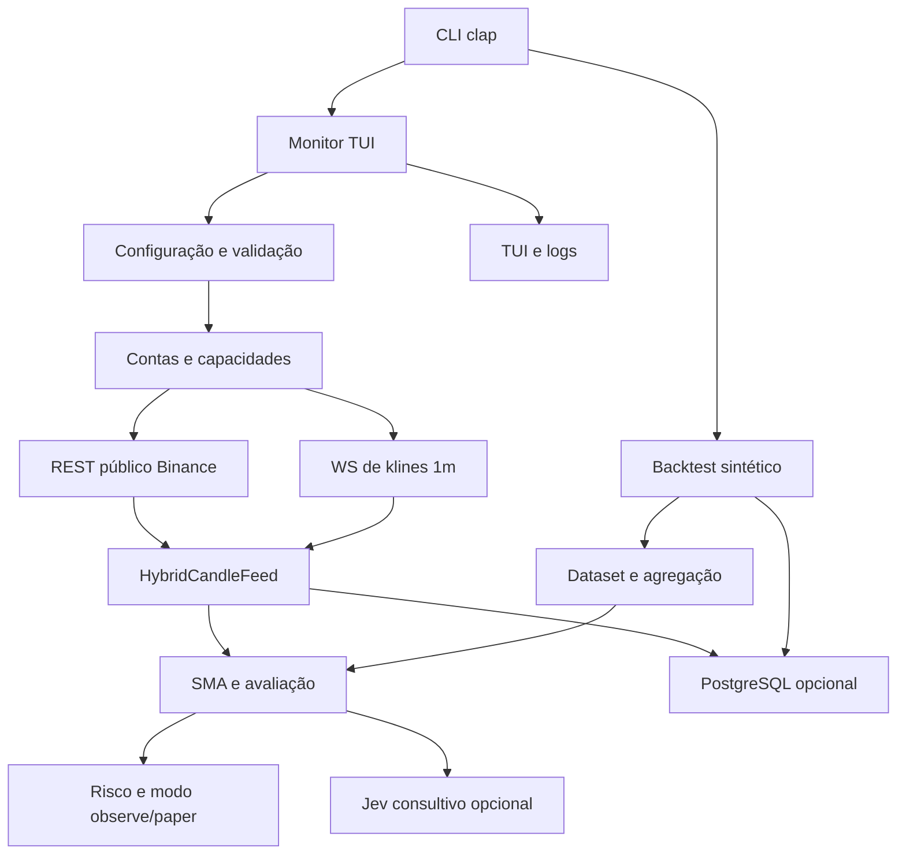

# Arquitetura do backend

> Revisão: 2026-09-26 (pós F1–F6). Layout: `src/core/`, `src/modules/` (MVC), `src/presentation/`. Este documento descreve `backend/src`, `backend/tests` e os SDDs referenciados. Entrada resumida: [README](../../README.md#architecture) e [convenção MVC](../sdd/modules-mvc-convention-sdd.md).

## Visão do sistema

O binário `bot` possui dois caminhos de execução:

O caminho de monitor não envia ordens. A autorização atual permite apenas backfill histórico público da Binance Spot em `dev`; os caminhos de saldo e execução permanecem bloqueados. O contrato de pausa/retomada está em [SDD T-10](../sdd/monitor-pause-resume-sdd.md), o de persistência em [SDD T-15](../sdd/monitor-persistence-policy-sdd.md) e o de redirects em [SDD T-05](../sdd/rest-redirect-sdd.md).

## Camadas e módulos

| Camada | Módulo | Interface principal | Responsabilidade | Implementação |
|---|---|---|---|---|
| raiz | `main` | `main() -> Result` | Parseia CLI, escolhe monitor/backtest e inicializa logging/persistência via monitor startup. | `src/main.rs` |
| `core` | `config` | `Config::load`, `Config::validate` | Carrega TOML (`src/core/config/bot.toml`), aplica CLI e valida ambiente, operação, timeframe, risco e Jev. | `src/core/config/mod.rs` |
| `core` | `error` | `BotError`, `BotResult` | Erros compartilhados de configuração, mercado, exchange, persistência e Jev. | `src/core/error.rs` |
| `core` | `logging` | `init(&LoggingConfig)` | Tracing em stderr e arquivos JSON rotacionados. | `src/core/logging.rs` |
| `core` | `persistence` | `Database`, `persist_dataset` | PostgreSQL dedicado `trading_bot`, migrações em `src/core/persistence/migrations/`. | `src/core/persistence/mod.rs` |
| `modules` | `application_contracts` | `Signal`, `BotSignal` | Tipos neutros compartilhados entre módulos (sem lógica de domínio pesada). | `src/modules/application_contracts.rs` |
| `modules` | `monitor` | `run`, `bootstrap_monitor` | Supervisor do monitor: REST/WS, pausa/retomada, avaliação, Jev, feed, dashboard e persistência opcional. | `src/modules/monitor/controllers/supervisor.rs`, `startup.rs` |
| `modules` | `market` | `Candle`, `HistoricalDataset`, `HybridCandleFeed` | Valida/agrega candles; feed híbrido REST+WS. | `src/modules/market/models.rs`, `controllers/feed.rs` |
| `modules` | `strategy` | SMA, `evaluate` | Cruzamentos e períodos por operação. | `src/modules/strategy/` |
| `modules` | `risk` | limites e gate de sinal | Perfis e modo observe/paper. | `src/modules/risk/` |
| `modules` | `portfolio` | snapshots paper | Modelos de carteira; não executa ordens. | `src/modules/portfolio/` |
| `modules` | `backtest` | simulação SMA | Fixture, simulação, relatório; CLI em `cli.rs`. | `src/modules/backtest/` |
| `modules` | `exchanges` | registro, REST, WS, market data | Integração Binance e gates de capacidade. | `src/modules/exchanges/` |
| `modules` | `jev` | `JevAdvisor::review` | Consulta TypeSafe opcional; sem autoridade de ordem. | `src/modules/jev/` |
| `presentation` | `terminal` | TUI Ratatui | Renderização e teclado; contrato com monitor via `presentation_contract`. | `src/presentation/terminal/mod.rs`, `modules/monitor/views/` |

## Submódulos de exchanges (`src/modules/exchanges/`)

| Módulo | Interface e responsabilidade |
|---|---|
| `account_file` | Carrega TOML da conta e valida origens REST/WS permitidas. |
| `binance` | Adapter de candles Spot; valida cada janela concluída antes de entregar dados ao feed. |
| `bootstrap` | Constrói o registro de contas a partir da configuração e seleciona a conta Spot. |
| `capabilities` | Descreve capacidades declaradas sem habilitar execução. |
| `live` | Abre e mantém a sessão WS de klines fechados `1m`, com cancelamento e fallback. |
| `market_data` | Seam `MarketDataSource::candles`, usado por adapters e testes. |
| `preflight` | Produz catálogo e amostras diagnósticas de recursos; não inicia execução. |
| `registry` | Armazena e consulta contas de exchange, incluindo Futures registrados mas não selecionados. |
| `resources` | Modela recursos gerenciados e o catálogo de inicialização. |
| `rest` | Autoriza usos REST; só backfill público Spot em `dev` passa hoje. |
| `router` | Mapeia necessidade de mercado para transporte e modelo de assinatura; não envia ordens. |
| `stream` | Modela tipos de stream, eventos e assinaturas. |
| `ws` | Valida configuração e plano de sessão WebSocket. |

## Interfaces e seams importantes

- **Dados de mercado:** `MarketDataSource` é o seam externo para o adapter da exchange e para fakes de teste.
- **Feed híbrido:** `HybridCandleFeed` concentra ordenação, deduplicação, limite de janela e watermark; o monitor não deve reproduzir essas regras.
- **Configuração:** `Config::load/validate` é o seam que separa TOML/CLI das regras de operação.
- **Persistência:** `Database` concentra conexão, migração e gravação transacional; o monitor trata a persistência como capacidade opcional.
- **Aconselhamento:** `JevAdvisor::review` é um adapter consultivo isolado, com timeout, endpoint validado e payload sem credenciais.
- **Execução:** `authorize_rest_use` é o gate central atual; qualquer futura ordem precisa de um seam e de autorização próprios.

Esses seams mantêm profundidade: o chamador conhece uma interface pequena e as regras de validação ficam concentradas na implementação. O supervisor do monitor (`modules::monitor::controllers::supervisor`) continua concentrando orquestração; mudanças devem preservar os contratos MVC documentados no SDD de convenção.

## Fluxo do monitor

1. `main` carrega `Config` e inicializa logging.
2. Se `DATABASE_URL` existir, tenta conectar ao banco dedicado e aplicar migrações; falha de persistência degrada o monitor em vez de habilitar execução.
3. O supervisor seleciona a conta Spot e cria o adapter de mercado.
4. Para `1m`, WS envia somente klines fechados; REST mantém backfill e fallback.
5. `HybridCandleFeed` entrega uma janela contígua suficiente para a estratégia.
6. `strategy` produz snapshot SMA; Jev pode produzir observações consultivas.
7. `risk` aplica limites e o modo observe/paper; `presentation::terminal` e as views do monitor publicam estado e logs.
8. O monitor persiste somente quando o opt-in e o banco estão disponíveis.

## Fluxo do backtest

1. `modules::backtest::cli` valida timeframe e tamanho.
2. Gera candles 1m determinísticos.
3. `market` valida e agrega para o timeframe selecionado.
4. `backtest` simula o cruzamento, o fill na barra seguinte, taxas e slippage.
5. O CLI imprime o resumo JSON e pode persistir o dataset.

## Cobertura de testes

- Configuração e caminho de arquivo: `tests/config_cli.rs`.
- Fixture de backtest em todos os presets/timeframes: `tests/backtest_fixture.rs`.
- Política pura de origem de redirect: `tests/redirect_origin_test.rs`.
- Política HTTP de redirect: `tests/redirect_policy_test.rs`.
- Testes unitários adicionais estão junto dos módulos de domínio, feed, exchange, estratégia, risco, UI e persistência.
- Round-trip PostgreSQL é ignorado por padrão e requer banco `trading_bot`.

## Limites conhecidos

- HFT é rejeitado; o backend usa polling REST e WS de klines.
- Produção e ordens continuam desabilitadas.
- A pesquisa de capacidades de agentes permanece provisória até ingestão local das fontes externas.
- A política de redirects depende da implementação vendorizada de `ccxt-core`; o SDD correspondente registra a política, a prova HTTP e os limites de manutenção do vendor.
