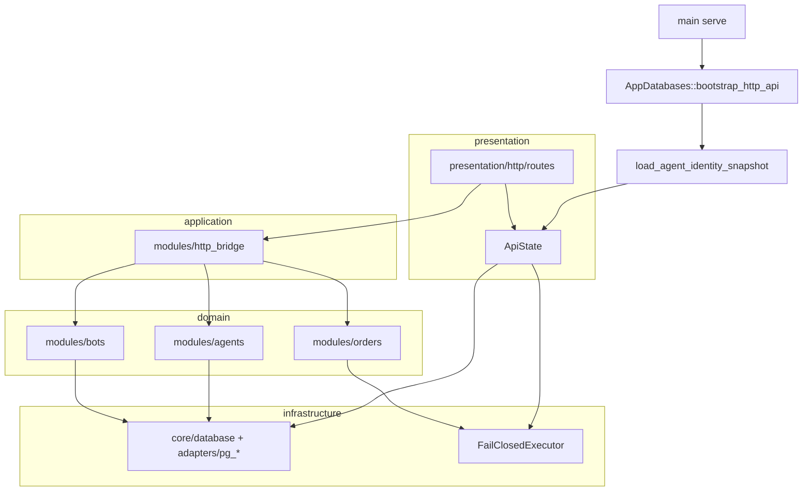

# Mapeamento de camadas

> Revisão: 2026-09-27. O repositório não usa uma pasta `application/` separada; a camada de aplicação está concentrada em `modules/http_bridge` e tipos compartilhados em `modules/application_contracts`.

## Tabela de correspondência

| Camada (objetivo) | Local no `src/` | Papel | Exemplos de integração verificável |
|---|---|---|---|
| **Domain** | `modules/<domínio>/models`, `controllers` | Regras e estado de negócio sem transporte | `AgentRegistry`, `submit_order` + `OrderIntent`, `full_ranking` |
| **Application** | `modules/http_bridge/*`, `application_contracts` | Casos de uso expostos a HTTP/CLI; DTOs OpenAPI | `persist_catalog_for_config`, `load_agent_identity_snapshot`, `submit_order_http` |
| **Infrastructure** | `core/database`, `core/persistence`, `modules/*/adapters`, `modules/exchanges` | IO, migrações, ports externos | `PgAgentIdentityStore`, `PgBotCatalogStore`, `AppDatabases::bootstrap_http_api`, Binance REST/WS |
| **Presentation** | `presentation/http`, `presentation/terminal` | Transporte (Axum, Ratatui) | Rotas finas → `http_bridge`; `ApiState` como composition root |
| **Infra transversal** | `core/config`, `error`, `logging`, `health`, `providers` | Config, erros, readiness, Jev | `/readyz`, `JevAdvisor` (advisory-only) |

## Fluxo HTTP (`serve`)



## Regras de dependência (gates)

Validadas por `./scripts/check-import-direction.sh`:

- `core/` não importa `modules/`.
- `presentation/http/routes` importa apenas `http_bridge` (não `strategy`/`risk` direto).
- `modules/` não importa `presentation/` (exceto spawn da TUI no supervisor do monitor).

## Composition root (`ApiState`)

| Campo | Camada | Integração |
|---|---|---|
| `agents` | Domain (registry) + infra (PG write-through) | `ApiState::persist_agent_after_mutation`; `shared_agent_registry` + `BOT_AGENCY` |
| `bot_catalog` | Infra (`BotCatalogBackend`) | `ApiState::persist_bot_catalog` / `bot_catalog_snapshot`; memória ou PG |
| `order_executor` | Infra port | `FailClosedExecutor` até adapter exchange |
| `http_admin_auth` | Presentation seam | `BOT_HTTP_ADMIN_TOKEN`, `BOT_HTTP_OWNER_ID`, `BOT_HTTP_AGENCY_ID` |
| `databases` | Infra | Postgres + Neo4j opcional para `/readyz` |
| `monitor` | Domain handle via infra | `monitor_snapshot` / `accept_monitor_command` quando `--with-monitor` |
| `jev` + agents | Application bridge | `run_agent_advisory` (prepare + finish) |

## Lacunas conscientes

- Runtime live de bots e execução exchange: ports existem; implementação live pendente.
- Auth owner verificável: seam HTTP em [SDD HTTP admin](../sdd/http-admin-auth-seam-sdd.md).

## Verificação

```text
./scripts/verify-backend-gates.sh
cargo test --locked --bin bot
```

Evidência: **205** testes no bin `bot`, **5** ignorados (PG/Neo4j).

## Documentos relacionados

- [module-catalog.md](./module-catalog.md)
- [integrations.md](./integrations.md)
- [module-implementation-status.md](./module-implementation-status.md)
