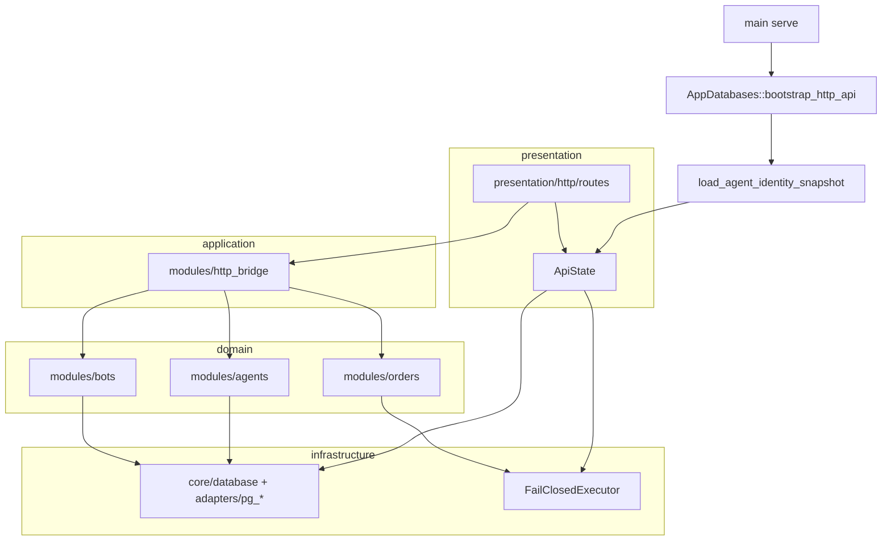

# Mapeamento de camadas

> Revisão: 2026-09-27. O repositório não usa uma pasta `application/` separada; a camada de aplicação está concentrada em `modules/http_bridge` e tipos compartilhados em `modules/application_contracts`.

## Tabela de correspondência

| Camada (objetivo) | Local no `src/` | Papel | Exemplos de integração verificável |
|---|---|---|---|
| **Domain** | `modules/<domínio>/models`, `controllers` | Regras e estado de negócio sem transporte | `AgentRegistry`, `submit_order` + `OrderIntent`, `full_ranking` |
| **Application** | `modules/http_bridge/*`, `application_contracts` | Casos de uso expostos a HTTP/CLI; DTOs OpenAPI | `persist_catalog_for_config`, `load_agent_identity_snapshot`, `submit_order_http` |
| **Infrastructure** | `core/database`, `core/persistence`, `modules/*/adapters`, `modules/exchanges` | IO, migrações, ports externos | `PgAgentIdentityStore`, `PgBotCatalogStore`, `AppDatabases::bootstrap_http_api`, Binance REST/WS |
| **Presentation** | `presentation/http`, `presentation/terminal` | Transporte (Axum, Ratatui) | Rotas finas → `http_bridge`; `ApiState` como composition root |
| **Infra transversal** | `core/config`, `error`, `logging`, `health`, `providers` | Config, erros, readiness, Jev | `/readyz`, `JevAdvisor` (advisory-only) |

## Fluxo HTTP (`serve`)



## Regras de dependência (gates)

Validadas por `./scripts/check-import-direction.sh`:

- `core/` não importa `modules/`.
- `presentation/http/routes` importa apenas `http_bridge` (não `strategy`/`risk` direto).
- `presentation/http/routes` não usa `with_agents`, `modules::agents::` nem `state.app_config()` (composition root via `ApiState`).
- `modules/` não importa `presentation/` (exceto spawn da TUI no supervisor do monitor).

## Composition root (`ApiState`)

| Campo | Camada | Integração |
|---|---|---|
| `agents` | Domain (registry) + infra (PG write-through) | `register_*` / `pause|resume|retire_*_and_persist`, `run_agent_advisory`; `shared_agent_registry` + `BOT_AGENCY` |
| `bot_catalog` | Infra (`BotCatalogBackend`) | `persist_bot_catalog` / `bot_catalog_snapshot`; write-through no boot HTTP quando PG; memória ou PG |
| `order_executor` | Presentation seam (`HttpOrderExecutor`) | `BOT_ORDERS_EXECUTION`: `disabled`, `dev_accept`, `paper` → `PaperLedgerExecutor`; `live_exchange` + `BOT_ORDERS_EXCHANGE_SUBMIT=recording` → `ExchangeSpotExecutor` (`live_exchange_wired`); sem backend → `ReservedLiveExchangeExecutor` (**503** `live_exchange_not_wired`); `for_http_server` lê env |
| `bot_runtime` | Infra/presentation seam (`BotRuntimePort`) | `shared_bot_runtime()` + `BOT_RUNTIME_ENABLED`; HTTP `/bots/runtime/*` (`assert_bot_promotion_allowed`: catálogo + mercado do config); monitor snapshot + `enrich_monitor_snapshot_from_shared_runtime` |
| `http_admin_auth` | Presentation seam | `BOT_HTTP_ADMIN_TOKEN`, `BOT_HTTP_OWNER_ID`, `BOT_HTTP_AGENCY_ID` |
| `databases` | Infra | Postgres + Neo4j opcional para `/readyz` |
| `monitor` | Domain handle via infra | `monitor_snapshot` / `accept_monitor_command` quando `--with-monitor` |
| `jev` + agents | Application bridge | `run_agent_advisory` (prepare + finish) |


## ApiState — API HTTP (composition root)

Métodos usados pelas rotas com estado ou config carregada no `serve`:

| Método | Domínio |
|--------|---------|
| `require_http_admin` / `require_register_owner_id` / `require_bound_agency` | Auth seam |
| `list_agents_in_agency`, `get_agent_in_agency`, `agents_audit_log` | Agents (leitura) |
| `register_agent_and_persist`, `pause|resume|retire_agent_and_persist` | Agents (mutação + PG) |
| `run_agent_advisory` | Agents + Jev |
| `persist_agent_after_mutation` | Agents PG write-through |
| `bot_catalog_for_config`, `persist_bot_catalog`, `bot_catalog_snapshot` | Bots |
| `bot_runtime_status`, `promote_bot_http`, `demote_bot_http` | Bots runtime seam (Gate 2 parcial) |
| `submit_order_http` (async) | Orders: risco + `HttpOrderExecutor`; reconciliação memória/PG; idempotência memória/PG |
| `monitor_snapshot`, `accept_monitor_command` | Monitor |
| `active_config_snapshot` (incl. `monitor_registry`), `providers_status_snapshot` | Config / providers |
| `order_execution_mode` + `GET /orders/execution-status` | Orders seam (read-only status) |
| `order_reconciliation_lookup` + `GET /orders/reconciliation/{client_order_id}` | Reconciliação pós-submit live |
| `reconcile_pending_orders_once` / `POST /orders/reconciliation/poll` + job `BOT_ORDERS_RECONCILIATION_POLL_SECS` | Poller (`LiveExchangeSpotOrderReconciliationQuery`) |
| `hydrate_order_reconciliation_from_pg` | Infra → domain (boot HTTP `serve`, espelha `order_reconciliation` PG na memória) |
| `register_live_reconciliation_pg_mirror` | Infra: monitor testnet espelha reconciliação no PG quando `DATABASE_URL` ativo |
| `observe_testnet_spot_order_by_client_id` | Infra exchanges → observação ccxt para poller testnet |

Rotas puramente stateless (risk, strategy, backtest, exchanges, ranking, **`portfolio/paper-snapshot`**) chamam `http_bridge` diretamente com body/query. O snapshot paper agrega fills de `PaperLedgerExecutor` (modo `paper`) via `http_bridge::portfolio::paper_wallet_snapshot` → `portfolio::paper_snapshot_with_fills` (saldos quote + `positions` quando `paper_fill_unit_price` no submit HTTP ou `BOT_PAPER_FILL_UNIT_PRICE`).

## Lacunas conscientes

- Monitor `RunMode::Paper` grava fills no mesmo `PaperLedgerExecutor` que HTTP/portfolio (`paper_run_mode_*` + `http_bridge::portfolio`); `RunMode::Testnet` usa `ExchangeSpotExecutor` quando `BOT_ORDERS_EXCHANGE_SUBMIT` está ativo; demais modos fail-closed.
- Runtime live de bots e execução exchange: ports existem; implementação live pendente.
- Auth owner verificável: seam HTTP em [SDD HTTP admin](../sdd/http-admin-auth-seam-sdd.md).

## Verificação

```text
./scripts/verify-backend-gates.sh
cargo test --locked --bin bot -- --test-threads=1  # gate canônico via verify-backend-gates.sh
```

Evidência: **383** testes no bin `bot`, **8** ignorados (PG/Neo4j + testnet manual).

## Documentos relacionados

- [module-catalog.md](./module-catalog.md)
- [integrations.md](./integrations.md)
- [module-implementation-status.md](./module-implementation-status.md)
