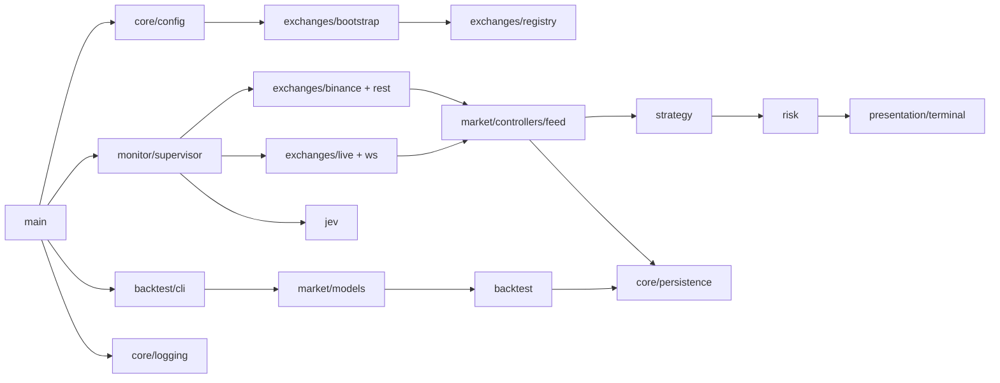

# Catálogo completo de módulos do backend

> Revisão: 2026-09-26 (inclui `modules/agents`, `modules/bots`, `modules/orders`). Fonte de verdade: `backend/src` (`core/`, `modules/`, `presentation/`), `backend/tests`, `Cargo.toml` e `src/core/persistence/migrations/`. Quando uma regra está planejada, ela é marcada como pendência; esta página descreve o comportamento presente.

## 1. Mapa de execução

O binário tem dois pontos de entrada funcionais:

- **Monitor:** `main → core::config → modules::monitor::startup → supervisor → modules::exchanges → REST/WS → modules::market::feed → strategy → risk → presentation::terminal / persistence opcional`.
- **Backtest:** `main → modules::backtest::cli → fixture 1m → modules::market → modules::backtest → JSON/persistence opcional`.

O backend não envia ordens. O uso REST autorizado hoje é o backfill público de candles Spot da conta `dev`; observe e paper são os modos operacionais disponíveis.

## 2. Inventário por camada

| Camada | Módulo | Contrato público | Responsabilidade atual | Testes principais |
|---|---|---|---|---|
| raiz | `main` | `main() -> anyhow::Result` | Monitor ou `backtest`; bootstrap de persistência via `modules::monitor::startup`. | CLI/config indiretos. |
| `core` | `config` | `Config::load`, `Config::validate` | TOML em `src/core/config/`, overrides CLI, validação. | `tests/config_cli.rs`, testes do módulo. |
| `core` | `error` / `logging` | `BotError`, `init` | Erros e tracing compartilhados. | Consumidores. |
| `core` | `persistence` | `Database`, `persist_dataset` | Migrações e gravação idempotente. | PostgreSQL ignorado por padrão. |
| `modules` | `monitor` | `run`, `bootstrap_monitor` | Supervisor REST/WS, pausa/retomada, dashboard, persistência. | Testes em `supervisor.rs` e controllers. |
| `modules` | `market` | candles, `HybridCandleFeed` | Validação, agregação 1m, feed híbrido. | Testes de feed e modelos. |
| `modules` | `strategy` | SMA, `evaluate` | Sinais sem efeitos colaterais. | Testes de períodos e sinais. |
| `modules` | `risk` | `gate_signal` | Limites e modo. | Testes de capital e modo. |
| `modules` | `portfolio` | snapshots paper | Carteira paper; sem ordens. | Testes de consistência. |
| `modules` | `backtest` | `run_sma_crossover`, CLI | Simulação e fixture sintética. | `tests/backtest_fixture.rs`. |
| `modules` | `exchanges` | registro, adapters | Binance REST/WS, autorização REST. | Testes de conta, redirect, WS. |
| `modules` | `jev` | `JevAdvisor::review` | Advisory TypeSafe. | Endpoint/config. |
| `modules` | `agents` | `AgentRegistry`, `run_advisory_step` | Identidade administrativa `IdentityOnly` em memória; lifecycle e advisory Jev sem worker nem API HTTP. **Não** é o módulo `bots`. | `modules/agents/tests.rs`. |
| `modules` | `bots` | `BotIdentity`, `full_ranking`, `build_catalog_from_config` | Executores strategy×timeframe versionados; catálogo e ranking em memória; HTTP `GET /api/v1/bots/catalog`, `POST /api/v1/bots/ranking`. Sem runtime live nem PostgreSQL (Gate 1). | `modules/bots/tests.rs`. |
| `modules` | `orders` | `submit_order`, `OrderExecutionPort`, `FailClosedExecutor` | Valida `OrderIntent` via `risk`; port fail-closed (`ExecutionDisabled`). Sem HTTP nem exchange live. | `modules/orders/tests.rs`. |
| `modules` | `application_contracts` | `BotSignal`, `Signal` | Tipos compartilhados leves; `bot_id` opcional ≠ `AgentId` nem módulo `bots`. | Testes indiretos. |
| `presentation` | `terminal` | TUI | Ratatui; comandos via contrato do monitor. | Máquina de estados / teclado. |
| `presentation` | `http` | API Axum | OpenAPI (`/openapi.json`), Scalar (`/docs`), subcomando `serve`; monitor HTTP exige `MonitorHandle` no processo. | Testes em `presentation/http/server.rs`. |

## 3. Módulo `agents` (`src/modules/agents/`)

Fundação **IdentityOnly** (draft G1 pendente — [SDD agents](../sdd/agents-module-sdd.md)). Não substitui monitor, risco ou estratégia; não envia ordens nem executa ferramentas.

| Submódulo | Contrato e comportamento |
|---|---|
| `models` | `AgentId`, `AgencyId`, `OwnerId`, papéis, `SupervisorRef`, `AgentDefinition`, estados de lifecycle, erros e eventos de auditoria em memória. |
| `controllers/registry` | `AgentRegistry`: registro, listagem por agência, validação de hierarquia sem ciclos. |
| `controllers/lifecycle` | `pause_agent`, `resume_agent`, `retire_agent` — aposentado é terminal. |
| `controllers/advisory` | `run_advisory_step` — exige agente ativo com `consult_jev`; delega a `core::providers::jev`. |
| `controllers/supervisor_hook` | `MonitorAgentHook` / `NoopMonitorAgentHook` — seam futuro com o supervisor do monitor. |
| `adapters/jev` | Adaptador fino para `JevAdvisor`; sem política de domínio nova. |

**Limites:** sem PostgreSQL de identidades, sem autenticação do owner no transporte, sem runtime durável, scheduler, gateway MCP ou canais externos.

**Agents vs bots vs backtest:** `bots::BotId` e `backtest::BotId` (reexport) compõem a mesma chave canônica `strategy@version:timeframe:symbol`; isso não é `AgentId`. O monitor opera o loop de mercado e pode, no futuro, usar `MonitorAgentHook`; hoje permanece noop. Tabela completa: [SDD bots](../sdd/bots-module-sdd.md), [SDD agents — Relação com bots](../sdd/agents-module-sdd.md).

## 3b. Módulo `bots` (`src/modules/bots/`)

Fundação strategy×timeframe ([SDD bots](../sdd/bots-module-sdd.md)). Tipos e ranking migrados do núcleo de backtest; simulação permanece em `backtest`.

| Submódulo | Contrato e comportamento |
|---|---|
| `models` | `BotIdentity`, `BotId`, `BotDefinition`, `BotMetrics`, erros e tipos de ranking. |
| `controllers` | `build_catalog_from_config`, `full_ranking` / `rank_bots`. |
| `adapters` | `BotCatalogStore` trait; `NoopBotCatalogStore` até Gate 1 PostgreSQL. |

**HTTP:** `GET /api/v1/bots/catalog`, `POST /api/v1/bots/ranking` via `presentation/http/routes/bots.rs`.

## 3c. Módulo `orders` (`src/modules/orders/`)

Seam fail-closed ([SDD orders](../sdd/orders-module-sdd.md)).

| Submódulo | Contrato e comportamento |
|---|---|
| `models` | `SubmitOrderRequest`, `OrderSide`, `OrdersError`. |
| `controllers` | `submit_order` — valida request e `risk::validate_intent`. |
| `adapters` | `OrderExecutionPort`, `FailClosedExecutor` (`ExecutionDisabled`). |

## 4. Módulos de exchanges (`src/modules/exchanges/`)

| Módulo | Contrato e comportamento |
|---|---|
| `exchanges/mod.rs` | Define `ExchangeId`, `MarketType`, `ExchangeAccountId`, `Transport` e `ExchangeError`. A chave de conta inclui exchange, tipo e rótulo. |
| `account_file` | Lê TOML de contas, normaliza credenciais e verifica URLs REST/WS permitidas por ambiente. Não imprime segredos. |
| `binance` | Implementa `MarketDataSource` para OHLCV Spot. Exige origem testnet registrada, remove candle aberto e rejeita dados não finitos, incoerentes, desalinhados ou duplicados conflitantes. |
| `bootstrap` | Lê o arquivo de exchanges, monta `ExchangeRegistry`, seleciona contas Spot e expõe contas de mercado registradas. |
| `capabilities` | Catálogo declarativo de capacidades. Declarar Futures ou ordens não as habilita. |
| `live` | Conecta ao WebSocket Binance, filtra somente klines fechados `1m`, valida payload, encaminha eventos e respeita cancelamento. |
| `market_data` | Trait assíncrono `MarketDataSource::candles(symbol, timeframe, limit)`; seam para adapter real e fakes. |
| `preflight` | Emite o plano de transporte e recursos autorizados para diagnóstico; não abre conexões de execução. |
| `registry` | Guarda contas por chave estável e impede duplicidade. A seleção de mercado ocorre antes do adapter. |
| `resources` | Modela recursos gerenciados e o catálogo de recursos; é descritivo e não concede execução. |
| `rest` | Gate `authorize_rest_use`. Permite somente `PublicSpotBackfill` em `dev`; ordens e dados privados falham fechado. |
| `router` | Traduz `MarketNeed` em transporte e assinaturas WS; não decide autorização financeira. |
| `stream` | Modela `StreamKind`, `StreamEvent` e `StreamSubscription`, incluindo intervalo e símbolo. |
| `ws` | Valida `WsConfig` e produz `WsSessionPlan`; atualmente o stream autorizado de mercado é Binance Spot testnet `1m`. |

## 5. Contratos por fluxo

### Configuração

1. `MonitorCli` define caminhos e overrides.
2. `Config::load` lê o TOML empacotado ou caminho explícito.
3. Overrides de CLI são aplicados.
4. `Config::validate` verifica ambiente, operação, timeframe, risco, produção, credenciais e Jev.
5. HFT e produção permanecem rejeitados nesta implementação.

### Monitor

1. `main` carrega config e logging.
2. Banco opcional é criado somente quando `DATABASE_URL` existe e a flag de persistência permite.
3. O supervisor seleciona a conta Spot e cria o adapter Binance.
4. REST faz backfill; WS entrega somente candle fechado.
5. `HybridCandleFeed` combina as fontes e libera avaliação quando há histórico contíguo.
6. `strategy` produz snapshot; `risk` aplica o gate; `jev` pode adicionar nota.
7. `presentation::terminal` e views do monitor publicam estado e `persistence` grava de modo assíncrono quando habilitado.
8. Pausar cancela o trabalho antigo, drena eventos WS e só aceita dados REST atuais na retomada.

### Backtest

1. CLI valida tamanho, preset e timeframe.
2. Fixture determinística é gerada em 1m.
3. `HistoricalDataset::resample` rejeita gaps e barras parciais.
4. `run_sma_crossover` usa entrada/saída na barra seguinte, fees e slippage efetivos.
5. O relatório JSON contém métricas, trades e equity; persistência é independente do monitor.

## 6. Seams e invariantes

- `MarketDataSource` é o seam para testes sem rede.
- `HybridCandleFeed` é o único dono da ordenação, deduplicação, limite e watermark.
- `Config::validate` é o ponto único de política de operação.
- `authorize_rest_use` falha fechado antes de qualquer chamada não autorizada.
- Redirect REST aceita somente a origem inicial; a política está no cliente vendorizado de `ccxt-core`.
- Candle usado pela estratégia deve ser fechado, finito, coerente e alinhado ao timeframe.
- Nenhum sinal gera ordem: observe/paper e o gate REST impedem execução financeira.
- Jev nunca decide nem altera sinal, risco, carteira ou persistência.
- Persistência opcional não pode transformar erro de banco em autorização de execução.
- Pausa/retomada deve descartar resultados obsoletos e evitar publicação fora de geração.

## 7. Débitos e limites conhecidos

- O supervisor do monitor concentra orquestração; evoluções devem respeitar MVC e os seams públicos.
- O round-trip PostgreSQL permanece não executado nesta sessão.
- A pesquisa de agentes segue provisória até ingestão local das fontes externas.
- A manutenção do vendor `ccxt-core` exige repetir a política de redirect e a prova HTTP após atualizações.
- Não existe caminho de ordens, saldo privado ou produção autorizado pelo código atual.
