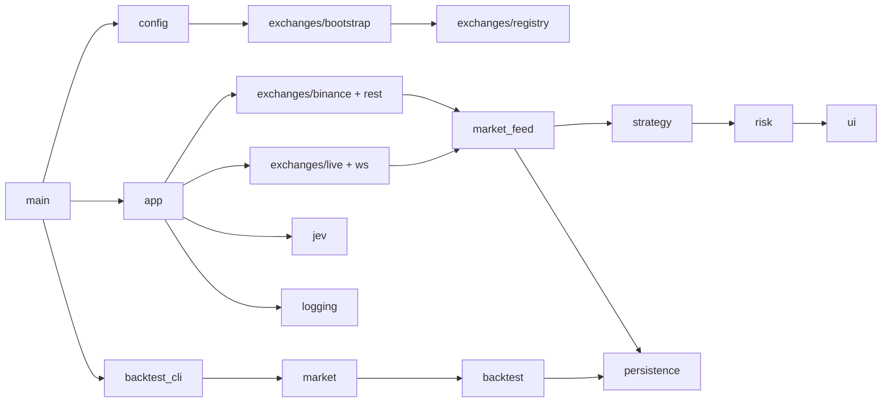

# Catálogo completo de módulos do backend

> Revisão: 2026-09-27. Fonte de verdade: `backend/src`, `backend/tests`, `Cargo.toml` e migrações. Quando uma regra está planejada, ela é marcada como pendência; esta página descreve o comportamento presente.

## 1. Mapa de execução

O binário tem dois pontos de entrada funcionais:

- **Monitor:** `main → Config → exchanges/bootstrap → app → REST/WS → market_feed → strategy → risk/UI/persistence`.
- **Backtest:** `main → backtest_cli → fixture 1m → market/resampling → backtest → JSON/persistence opcional`.

O backend não envia ordens. O uso REST autorizado hoje é o backfill público de candles Spot da conta `dev`; observe e paper são os modos operacionais disponíveis.

## 2. Inventário dos módulos raiz

| Módulo | Contrato público | Responsabilidade atual | Testes principais |
|---|---|---|---|
| `main` | `main() -> anyhow::Result` | Parseia monitor/backtest, carrega configuração, inicializa logging e banco opcional. | Execução coberta indiretamente por testes de CLI/configuração. |
| `app` | `run(Config, Option<Database>)` | Orquestra tarefas REST/WS, pausa/retomada, avaliação, Jev, persistência e dashboard. | Testes assíncronos de pausa, stale results, resume, persistência e shutdown em `src/app.rs`. |
| `config` | `Config::load`, `Config::validate`, enums de operação | Carrega TOML, aplica CLI, valida ambiente, risco, timeframe, produção e Jev. | `src/config/mod.rs`, `tests/config_cli.rs`. |
| `domain` | IDs, definições, métricas, ranking e sinais | Modela entidades e resultados compartilhados pelo backtest e avaliação. | Testes unitários de ranking, janelas e métricas. |
| `error` | `BotError`, `BotResult<T>` | Converte erros de configuração, mercado, exchange, persistência e Jev. | Cobertura indireta pelos módulos consumidores. |
| `market` | `Timeframe`, `Candle`, `HistoricalDataset` | Valida OHLCV, impede gaps/duplicatas e agrega candles 1m. | Testes de gaps, duplicatas, barras parciais e round-trip Mantis. |
| `market_feed` | `HybridCandleFeed` | Une REST e WS, substitui barras repetidas, ordena, limita e controla watermark de avaliação. | Testes de deduplicação, backlog, gaps e monotonicidade. |
| `strategy` | `periods_for_mode`, `evaluate`, `StrategySnapshot` | Calcula SMA e sinais sem efeitos colaterais. | Testes de períodos e sinais. |
| `risk` | `profile_limits`, `validate_intent`, `gate_signal` | Aplica limites por perfil e bloqueia combinações incompatíveis de sinal/modo. | Testes de capital, risco e modo. |
| `portfolio` | `Asset`, `Position`, `PortfolioSnapshot`, `paper_snapshot` | Representa carteira e estado paper; não executa ordens. | Testes de saldo, posição e consistência. |
| `backtest` | `run_sma_crossover`, `BacktestConfig`, `BacktestReport` | Simula entradas, saídas, fees, slippage, equity e métricas. | Testes de next-open, stop/take-profit e ausência de lookahead. |
| `backtest_cli` | `BacktestCli`, `run` | Gera fixture determinística, resample, executa e imprime JSON. | `tests/backtest_fixture.rs` e testes do módulo. |
| `jev` | `JevAdvisor::review` | Consulta TypeSafe/Jev com timeout e payload reduzido; resposta é somente aconselhamento. | Validações de endpoint e configuração; integração externa não é obrigatória. |
| `logging` | `init(&LoggingConfig)` | Inicializa tracing em stderr e arquivo rotacionado. | Validado por execução/configuração; sem dependência de domínio. |
| `persistence` | `Database::connect_from_env`, `migrate`, `persist_dataset` | Conecta ao PostgreSQL dedicado, migra e grava dataset/candles idempotentemente. | Teste PostgreSQL ignorado por padrão; exige `DATABASE_URL`. |
| `ui` | `Dashboard`, `UiCommand`, `AppEvent`, `ui::run` | Renderiza TUI, transforma teclado em comandos e publica estado do monitor. | Teste da máquina de estados e comando de espaço. |

## 3. Módulos de exchanges

| Módulo | Contrato e comportamento |
|---|---|
| `exchanges/mod.rs` | Define `ExchangeId`, `MarketType`, `ExchangeAccountId`, `Transport` e `ExchangeError`. A chave de conta inclui exchange, tipo e rótulo. |
| `account_file` | Lê TOML de contas, normaliza credenciais e verifica URLs REST/WS permitidas por ambiente. Não imprime segredos. |
| `binance` | Implementa `MarketDataSource` para OHLCV Spot. Exige origem testnet registrada, remove candle aberto e rejeita dados não finitos, incoerentes, desalinhados ou duplicados conflitantes. |
| `bootstrap` | Lê o arquivo de exchanges, monta `ExchangeRegistry`, seleciona contas Spot e expõe contas de mercado registradas. |
| `capabilities` | Catálogo declarativo de capacidades. Declarar Futures ou ordens não as habilita. |
| `live` | Conecta ao WebSocket Binance, filtra somente klines fechados `1m`, valida payload, encaminha eventos e respeita cancelamento. |
| `market_data` | Trait assíncrono `MarketDataSource::candles(symbol, timeframe, limit)`; seam para adapter real e fakes. |
| `preflight` | Emite o plano de transporte e recursos autorizados para diagnóstico; não abre conexões de execução. |
| `registry` | Guarda contas por chave estável e impede duplicidade. A seleção de mercado ocorre antes do adapter. |
| `resources` | Modela recursos gerenciados e o catálogo de recursos; é descritivo e não concede execução. |
| `rest` | Gate `authorize_rest_use`. Permite somente `PublicSpotBackfill` em `dev`; ordens e dados privados falham fechado. |
| `router` | Traduz `MarketNeed` em transporte e assinaturas WS; não decide autorização financeira. |
| `stream` | Modela `StreamKind`, `StreamEvent` e `StreamSubscription`, incluindo intervalo e símbolo. |
| `ws` | Valida `WsConfig` e produz `WsSessionPlan`; atualmente o stream autorizado de mercado é Binance Spot testnet `1m`. |

## 4. Contratos por fluxo

### Configuração

1. `MonitorCli` define caminhos e overrides.
2. `Config::load` lê o TOML empacotado ou caminho explícito.
3. Overrides de CLI são aplicados.
4. `Config::validate` verifica ambiente, operação, timeframe, risco, produção, credenciais e Jev.
5. HFT e produção permanecem rejeitados nesta implementação.

### Monitor

1. `main` carrega config e logging.
2. Banco opcional é criado somente quando `DATABASE_URL` existe e a flag de persistência permite.
3. `app` seleciona a conta Spot e cria o adapter Binance.
4. REST faz backfill; WS entrega somente candle fechado.
5. `HybridCandleFeed` combina as fontes e libera avaliação quando há histórico contíguo.
6. `strategy` produz snapshot; `risk` aplica o gate; `jev` pode adicionar nota.
7. `ui` publica estado e `persistence` grava de modo assíncrono quando habilitado.
8. Pausar cancela o trabalho antigo, drena eventos WS e só aceita dados REST atuais na retomada.

### Backtest

1. CLI valida tamanho, preset e timeframe.
2. Fixture determinística é gerada em 1m.
3. `HistoricalDataset::resample` rejeita gaps e barras parciais.
4. `run_sma_crossover` usa entrada/saída na barra seguinte, fees e slippage efetivos.
5. O relatório JSON contém métricas, trades e equity; persistência é independente do monitor.

## 5. Seams e invariantes

- `MarketDataSource` é o seam para testes sem rede.
- `HybridCandleFeed` é o único dono da ordenação, deduplicação, limite e watermark.
- `Config::validate` é o ponto único de política de operação.
- `authorize_rest_use` falha fechado antes de qualquer chamada não autorizada.
- Redirect REST aceita somente a origem inicial; a política está no cliente vendorizado de `ccxt-core`.
- Candle usado pela estratégia deve ser fechado, finito, coerente e alinhado ao timeframe.
- Nenhum sinal gera ordem: observe/paper e o gate REST impedem execução financeira.
- Jev nunca decide nem altera sinal, risco, carteira ou persistência.
- Persistência opcional não pode transformar erro de banco em autorização de execução.
- Pausa/retomada deve descartar resultados obsoletos e evitar publicação fora de geração.

## 6. Débitos e limites conhecidos

- `app` concentra muita orquestração; decomposição deve esperar uma mudança concreta e manter os seams.
- O round-trip PostgreSQL permanece não executado nesta sessão.
- A pesquisa de agentes segue provisória até ingestão local das fontes externas.
- A manutenção do vendor `ccxt-core` exige repetir a política de redirect e a prova HTTP após atualizações.
- Não existe caminho de ordens, saldo privado ou produção autorizado pelo código atual.
