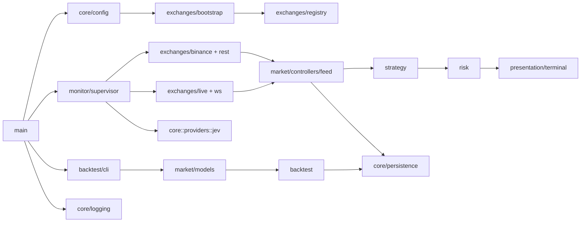

# Catálogo completo de módulos do backend

> Revisão: 2026-09-27 (inclui `modules/agents`, `modules/bots`, `modules/orders`). Fonte de verdade: `backend/src` (`core/`, `modules/`, `presentation/`), `backend/tests`, `Cargo.toml` e `src/core/database/migrations/`. Quando uma regra está planejada, ela é marcada como pendência; esta página descreve o comportamento presente.

## 1. Mapa de execução

O binário tem três pontos de entrada funcionais:

- **Monitor (TUI):** `main → core::config → modules::monitor::startup → supervisor → … → presentation::terminal`.
- **Backtest (CLI):** `main → modules::backtest::cli → fixture 1m → modules::backtest → JSON`.
- **HTTP API (`serve`):** `main → presentation::http → Axum; OpenAPI `/openapi.json`, Scalar `/docs`; opcional `--with-monitor` para rotas `/api/v1/monitor/*`. Superfície completa em `presentation/http/routes/` (**36** paths utoipa; teste `openapi_surface_lists_core_paths` em `server.rs`).

Produção REST de ordens permanece bloqueada (`authorize_rest_use`). Monitor e HTTP podem usar seams opt-in (`paper`, `recording`, testnet Spot com credenciais) via `modules/orders` — ver §3c. Backfill público de candles Spot `dev` e modos observe/paper no monitor seguem como hoje.

Mapeamento **domain / application / infrastructure / presentation** → [layer-mapping.md](./layer-mapping.md).

## 2. Inventário por camada

| Camada | Módulo | Contrato público | Responsabilidade atual | Testes principais |
|---|---|---|---|---|
| raiz | `main` | `main() -> anyhow::Result` | Monitor ou `backtest`; bootstrap de persistência via `modules::monitor::startup`. | CLI/config indiretos. |
| `core` | `config` | `Config::load`, `Config::validate` | TOML em `src/core/config/`, overrides CLI, validação. | `tests/config_cli.rs`, testes do módulo. |
| `core` | `error` / `logging` | `BotError`, `init` | Erros e tracing compartilhados. | Consumidores. |
| `core` | `database` | `AppDatabases`, `PostgresDatabase`, `Neo4jGraph` | Dual-store PG 18+ (Timescale/pgvector) + Neo4j; pool, migrate, health. | Testes unitários + integração ignorada. |
| `core` | `persistence` | `Database`, `persist_dataset` | Fachada de domínio sobre `PostgresDatabase`. | PostgreSQL ignorado por padrão. |
| `modules` | `monitor` | `run`, `bootstrap_monitor` | Supervisor REST/WS, pausa/retomada, dashboard, persistência. | Testes em `supervisor.rs` e controllers. |
| `modules` | `market` | candles, `HybridCandleFeed` | Validação, agregação 1m, feed híbrido. | Testes de feed e modelos. |
| `modules` | `strategy` | SMA/EMA, `evaluate_for_kind` | Sinais sem efeitos colaterais. | Testes de períodos e sinais. |
| `modules` | `risk` | `gate_signal` | Limites e modo. | Testes de capital e modo. |
| `modules` | `portfolio` | snapshots paper | `paper_snapshot_with_fills` + `positions`; HTTP lê ledger in-process. | `controllers.rs`, `http_bridge/portfolio.rs`, `server.rs` (`orders_submit_paper_*` + `positions`). |
| `modules` | `backtest` | `run_sma_crossover`, CLI | Simulação e fixture sintética. | `tests/backtest_fixture.rs`. |
| `modules` | `exchanges` | registro, adapters | Binance REST/WS, autorização REST. | Testes de conta, redirect, WS. |
| `core` | `providers::jev` | `JevAdvisor::review` | Advisory TypeSafe (OpenAI-compatible); sem autoridade de ordem. | `core/providers/jev`, config e testes de contrato. |
| `modules` | `agents` | `AgentRegistry`, `run_advisory_step` | Identidade administrativa `IdentityOnly`; registry em memória compartilhado; rotas HTTP `/api/v1/agents/*`; write-through e cold-start via `PgAgentIdentityStore` + `load_agent_identity_snapshot` no `serve`; PG integração `pg_agent_lifecycle_write_through_round_trip` em `http_bridge/agents.rs` (`run-pg-integration-tests.sh`). **Não** é o módulo `bots`. | `modules/agents/tests.rs`, `http_bridge/agents.rs`. |
| `modules` | `bots` | `BotIdentity`, `MonitorEvaluatorKind`, `MonitorStrategyRegistry` | Catálogo/ranking; runtime promote; catálogo HTTP `monitor_*_period` + `monitor_evaluator`; supervisor/backtest via `strategy_evaluation_binding` + `evaluate_for_kind`; `monitor_evaluation_for_promoted_identity` alinha períodos/evaluator ao registry/`Config` (`promoted_sma_cross_identity_uses_config_periods`, `promoted_ema_cross_from_registry_uses_configured_periods`). | `monitor_strategy.rs`, `http_bridge/bots.rs`, `evaluation_binding.rs`, `pg_catalog.rs`. |
| `modules` | `orders` | `submit_order`, `PaperLedgerExecutor`, `ExchangeSpotExecutor`, `exchange_order_gate`, idempotência | Risk → port; HTTP submit + `paper_fill_unit_price`; `paper`/`recording`/`testnet` seams. | `orders/tests.rs`, `spot_order_submit.rs`, `http_bridge/orders.rs`, `server.rs`. |
| `modules` | `application_contracts` | `BotSignal`, `Signal` | Tipos compartilhados leves; `bot_id` opcional ≠ `AgentId` nem módulo `bots`. | Testes indiretos. |
| `presentation` | `terminal` | TUI | Ratatui; comandos via contrato do monitor. | Máquina de estados / teclado. |
| `presentation` | `http` | API Axum + `ApiState` composition root | OpenAPI/Scalar; `serve` + `bootstrap_http_api` + hydrate agents; rotas stateful via `ApiState`, stateless via `http_bridge`; `HttpAdminAuth`. Ver [layer-mapping.md](./layer-mapping.md). | `server.rs`, `state.rs`, `admin_auth.rs`. |

## 3. Módulo `agents` (`src/modules/agents/`)

Fundação **IdentityOnly** (draft G1 pendente — [SDD agents](../sdd/agents-module-sdd.md)). Não substitui monitor, risco ou estratégia; não envia ordens nem executa ferramentas.

| Submódulo | Contrato e comportamento |
|---|---|
| `models` | `AgentId`, `AgencyId`, `OwnerId`, papéis, `SupervisorRef`, `AgentDefinition`, estados de lifecycle, erros e eventos de auditoria em memória. |
| `controllers/registry` | `AgentRegistry`: registro, listagem por agência, validação de hierarquia sem ciclos. |
| `controllers/lifecycle` | `pause_agent`, `resume_agent`, `retire_agent` — aposentado é terminal. |
| `controllers/advisory` | `run_advisory_step` — exige agente ativo com `consult_jev`; delega a `core::providers::jev`. |
| `controllers/supervisor_hook` | `MonitorAgentHook` / `NoopMonitorAgentHook` — seam futuro com o supervisor do monitor. |
| `controllers/bot_promotion` | `assert_runtime_promotion_authorized` — `bot_id` válido, agente ativo, capability `promote_runtime_bot` (testes em `bot_promotion.rs`). |
| `adapters/jev` | Adaptador fino para `JevAdvisor`; sem política de domínio nova. |

**Persistência:** `PgAgentIdentityStore` (migração `0002_agents_bots_scaffold.sql`); mutações HTTP espelham best-effort; boot `serve` restaura snapshot só se o registry compartilhado estiver vazio (`apply_agent_identity_snapshot`).

**Limites:** sem autenticação verificável do owner no transporte (seam `BOT_HTTP_ADMIN_TOKEN` / `BOT_HTTP_OWNER_ID` / `BOT_HTTP_AGENCY_ID`); `promote_runtime_bot` + `assert_runtime_promotion_authorized` quando agência vinculada; sem scheduler, gateway MCP ou canais externos.

**Agents vs bots vs backtest:** `bots::BotId` e `backtest::BotId` (reexport) compõem a mesma chave canônica `strategy@version:timeframe:symbol`; isso não é `AgentId`. O monitor opera o loop de mercado e pode, no futuro, usar `MonitorAgentHook`; hoje permanece noop. Tabela completa: [SDD bots](../sdd/bots-module-sdd.md), [SDD agents — Relação com bots](../sdd/agents-module-sdd.md).

## 3b. Módulo `bots` (`src/modules/bots/`)

Fundação strategy×timeframe ([SDD bots](../sdd/bots-module-sdd.md)). Tipos e ranking migrados do núcleo de backtest; simulação permanece em `backtest`.

| Submódulo | Contrato e comportamento |
|---|---|
| `models` | `BotIdentity`, `BotId`, `BotDefinition`, `BotMetrics`, erros e tipos de ranking. |
| `controllers` | `build_catalog_from_config`, `full_ranking` / `rank_bots`. |
| `adapters` | `BotCatalogStore`; `BotRuntimePort` (`FailClosedBotRuntime`, `InMemoryBotRuntime`); `BotCatalogBackend` (memória ou PG via `AppDatabases`). |
| `controllers` | `persist_monitor_catalog_snapshot` / `build_catalog_from_monitor_registry`; `strategy_evaluation_binding_with_runtime` (SMA do registry quando promoção casa com mercado). |

**HTTP:** `GET /api/v1/bots/catalog`, `POST /api/v1/bots/catalog/persist`, `GET /api/v1/bots/catalog/snapshot`, `POST /api/v1/bots/ranking`, `GET /api/v1/bots/runtime/status`, `POST /api/v1/bots/runtime/promote|demote` via `presentation/http/routes/bots.rs` (catálogo em `ApiState`; runtime via `BotRuntimePort`, default fail-closed, `BOT_RUNTIME_ENABLED=true` + `shared_bot_runtime` no processo `serve`; snapshot monitor enriquecido).

## 3c. Módulo `orders` (`src/modules/orders/`)

Seam fail-closed + Gate 2 parcial ([SDD orders](../sdd/orders-module-sdd.md), [Gate 2](../sdd/orders-live-execution-gate2-sdd.md)).

| Submódulo | Contrato e comportamento |
|---|---|
| `models` | `SubmitOrderRequest`, `OrderSide`, `OrdersError` (`ExecutionDisabled`, `LiveExchangeNotWired`, …). |
| `controllers` | `submit_order` — valida request e `risk::validate_intent`; dedupe `client_order_id` via `OrderIdempotencyStore`; `run_reconciliation_poll_once` — uma passagem sobre `list_pending` + `SpotOrderReconciliationQuery`. |
| `adapters` | `OrderExecutionPort` + `submit_spot_order` (`recording` / `testnet` → `binance_spot_testnet_submit`); idempotência/reconciliação PG; `LiveExchangeSpotOrderReconciliationQuery` (binding recording ou `observe_testnet_spot_order_by_client_id` em `binance_spot_testnet_reconcile`). |

**Monitor:** em modo live testnet, `supervisor` gera `client_order_id` determinístico (`mon:…`) e chama `record_monitor_spot_submit_reconciliation` no mesmo `shared_live_order_reconciliation_ledger` que o HTTP.

**Testes:** ledger partilhado — `lock_shared_live_order_reconciliation_ledger_for_test()`; com `EnvTestGuard`, ordem **env → ledger**; gate `verify-backend-gates.sh` usa `--test-threads=1` ([test-matrix](../reference/test-matrix.md)).

**HTTP:** `GET /api/v1/orders/execution-status`; `GET /api/v1/orders/reconciliation/{client_order_id}` (memória + fallback PG); `POST /api/v1/orders/reconciliation/poll` → `ApiState::reconcile_pending_orders_once` (admin bearer); `POST /api/v1/orders/submit` (**503** `execution_disabled` / `live_exchange_not_wired`, **422** risco, **200** com `dev_accept`, `paper` ou `live_exchange` wired) → `ApiState::submit_order_http`; `GET /meta` inclui `order_reconciliation_pending` (max memória/PG); job opcional `BOT_ORDERS_RECONCILIATION_POLL_SECS` no `serve` quando `live_exchange_wired`; bearer admin quando `BOT_HTTP_ADMIN_TOKEN` definido; `BOT_ORDERS_EXECUTION` em `HttpApiSeams::from_env`.

## 3d. Facade `http_bridge` (`src/modules/http_bridge/`)

Camada de aplicação fina entre `presentation::http::routes` e os módulos de domínio — rotas **não** importam `modules::*` diretamente ([import check](../../scripts/check-import-direction.sh)).

| Arquivo | Responsabilidade HTTP |
|---------|------------------------|
| `agents.rs` | Registro/lifecycle/advisory; snapshots PG (`load_agent_identity_snapshot`, `write_through_agent_identity`, `apply_agent_identity_snapshot`). |
| `bots.rs` | Catálogo/ranking/persist a partir de `Config`. |
| `bots_runtime.rs` | Promote/demote/status via `BotRuntimePort`. |
| `orders.rs` | DTO submit + `submit_order_http` (risco + idempotência + executor injetado pelo `ApiState`). |
| `portfolio.rs` | Paper snapshot/positions a partir do ledger in-process. |
| `monitor.rs` | Snapshot/commands quando `--with-monitor`. |
| `config.rs` | Active config e snapshot para OpenAPI. |
| `risk.rs` | Corpo de limites + gate de sinal. |
| `backtest.rs` | Disparo SMA crossover via HTTP. |
| `strategy.rs` / `application.rs` / `exchanges.rs` / `providers.rs` | Facades auxiliares para rotas stateless. |

Testes de contrato da facade: `http_bridge/mod.rs` (`bridge_tests` — catalog persist, agent snapshots, submit fail-closed/accept, runtime promote/demote). Integração HTTP pesada: `presentation/http/server.rs`.

## 3e. Camada `presentation::http`

| Peça | Comportamento |
|---|---|
| `admin_auth` | `BOT_HTTP_ADMIN_TOKEN` (bearer em rotas mutantes); `BOT_HTTP_OWNER_ID` opcional no registro; `BOT_HTTP_AGENCY_ID` opcional nas rotas de agentes. Ver [SDD HTTP admin](../sdd/http-admin-auth-seam-sdd.md). |
| `state` | `ApiState` (composition root); agents/bots/orders/portfolio (`submit_order_http`, `paper_wallet_snapshot`, `bot_ranking_from_metrics`, catálogo PG); `hydrate_order_reconciliation_from_pg` no boot; `order_reconciliation_lookup` (ledger + fallback PG); PG ignorados em `state_tests` — [test-matrix](../reference/test-matrix.md). |
| `server::run` | Bootstrap `AppDatabases`, `ApiState::build_api_state_for_http_serve` (agents PG + env seams + reconciliação hydrate + catálogo), poll reconciliação em background (opcional), Axum + Scalar. |
| `routes/*` | Superfície v1: agents, bots (catalog `monitor_evaluator` + runtime), orders, monitor, risk, backtest, `config/active` e `config/snapshot` (`monitor_registry[].evaluator`), health, `GET /meta` (`http_seams`). |

Rotas mutantes cobertas pelo bearer: lifecycle agents, `bots/catalog/persist`, `bots/runtime/promote|demote`, `orders/submit`, `orders/reconciliation/poll`, `monitor/commands`.

## 4. Módulos de exchanges (`src/modules/exchanges/`)

| Módulo | Contrato e comportamento |
|---|---|
| `exchanges/mod.rs` | Define `ExchangeId`, `MarketType`, `ExchangeAccountId`, `Transport` e `ExchangeError`. A chave de conta inclui exchange, tipo e rótulo. |
| `account_file` | Lê TOML de contas, normaliza credenciais e verifica URLs REST/WS permitidas por ambiente. Não imprime segredos. |
| `binance` | `MarketDataSource` (OHLCV Spot testnet) + `build_dev_spot_binance` compartilhado com submit. |
| `binance_spot_testnet_submit` | Gate 2: market buy/sell por `quote_amount` (buy `quoteOrderQty`; sell base via ticker); requer `BINANCE_TESTNET_*`; `map_bot_error` redige valores de env em `OrdersError::InvalidRequest` (`redact_known_testnet_credentials`). |
| `credentials_env` | Probes de env (`binance_testnet_credentials_configured`, seam testnet) sem logar segredos. |
| `bootstrap` | Lê o arquivo de exchanges, monta `ExchangeRegistry`, seleciona contas Spot e expõe contas de mercado registradas. |
| `capabilities` | Catálogo declarativo de capacidades. Declarar Futures ou ordens não as habilita. |
| `live` | Conecta ao WebSocket Binance, filtra somente klines fechados `1m`, valida payload, encaminha eventos e respeita cancelamento. |
| `market_data` | Trait assíncrono `MarketDataSource::candles(symbol, timeframe, limit)`; seam para adapter real e fakes. |
| `preflight` | Emite o plano de transporte e recursos autorizados para diagnóstico; não abre conexões de execução. |
| `registry` | Guarda contas por chave estável e impede duplicidade. A seleção de mercado ocorre antes do adapter. |
| `resources` | Modela recursos gerenciados e o catálogo de recursos; é descritivo e não concede execução. |
| `rest` | `authorize_rest_use`: backfill público Spot dev; `OrderSubmit` com seam `recording` ou `testnet`+credenciais. |
| `router` | Traduz `MarketNeed` em transporte e assinaturas WS; não decide autorização financeira. |
| `stream` | Modela `StreamKind`, `StreamEvent` e `StreamSubscription`, incluindo intervalo e símbolo. |
| `ws` | Valida `WsConfig` e produz `WsSessionPlan`; atualmente o stream autorizado de mercado é Binance Spot testnet `1m`. |

## 5. Contratos por fluxo

### Configuração

1. `MonitorCli` define caminhos e overrides.
2. `Config::load` lê o TOML empacotado ou caminho explícito.
3. Overrides de CLI são aplicados.
4. `Config::validate` verifica ambiente, operação, timeframe, risco, produção, credenciais e Jev.
5. HFT e produção permanecem rejeitados nesta implementação.

### Monitor

1. `main` carrega config e logging.
2. Banco opcional é criado somente quando `DATABASE_URL` existe e a flag de persistência permite.
3. O supervisor seleciona a conta Spot e cria o adapter Binance.
4. REST faz backfill; WS entrega somente candle fechado.
5. `HybridCandleFeed` combina as fontes e libera avaliação quando há histórico contíguo.
6. `strategy` produz snapshot; `risk` aplica o gate; `core::providers::jev` pode adicionar nota consultiva.
7. `presentation::terminal` e views do monitor publicam estado e `persistence` grava de modo assíncrono quando habilitado.
8. Pausar cancela o trabalho antigo, drena eventos WS e só aceita dados REST atuais na retomada.

### Backtest

1. CLI valida tamanho, preset e timeframe.
2. Fixture determinística é gerada em 1m.
3. `HistoricalDataset::resample` rejeita gaps e barras parciais.
4. `run_sma_crossover` usa entrada/saída na barra seguinte, fees e slippage efetivos.
5. O relatório JSON contém métricas, trades e equity; persistência é independente do monitor.

## 6. Seams e invariantes

- `MarketDataSource` é o seam para testes sem rede.
- `HybridCandleFeed` é o único dono da ordenação, deduplicação, limite e watermark.
- `Config::validate` é o ponto único de política de operação.
- `authorize_rest_use` falha fechado antes de qualquer chamada não autorizada.
- Redirect REST aceita somente a origem inicial; a política está no cliente vendorizado de `ccxt-core`.
- Candle usado pela estratégia deve ser fechado, finito, coerente e alinhado ao timeframe.
- Nenhum sinal gera ordem: observe/paper e o gate REST impedem execução financeira.
- Jev nunca decide nem altera sinal, risco, carteira ou persistência.
- Persistência opcional não pode transformar erro de banco em autorização de execução.
- Pausa/retomada deve descartar resultados obsoletos e evitar publicação fora de geração.

## 7. Débitos e limites conhecidos

- Evidência reproduzível (goal completude módulos): `./scripts/verify-backend-gates.sh` → **395** testes no bin `bot`, **16** ignorados (PG×14 via `run-pg-integration-tests.sh` quando `DATABASE_URL` → `trading_bot`); auditoria [modules-completeness-audit](../planning/modules-completeness-audit.md).
- O supervisor do monitor concentra orquestração; evoluções devem respeitar MVC e os seams públicos.
- Round-trips PostgreSQL de domínio (dataset, scaffold, catálogo bots, snapshot agents) existem como testes `#[ignore]` — exigem `DATABASE_URL` → `trading_bot` (PG 18+).
- A pesquisa de agentes segue provisória até ingestão local das fontes externas.
- A manutenção do vendor `ccxt-core` exige repetir a política de redirect e a prova HTTP após atualizações.
- Não existe execução financeira live, saldo privado ou produção; o seam `orders` e o HTTP de submit falham fechado após validação de risco.
