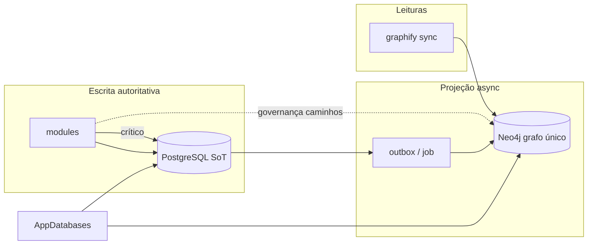
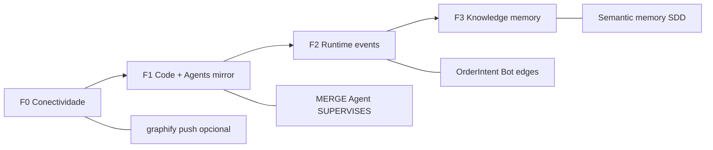
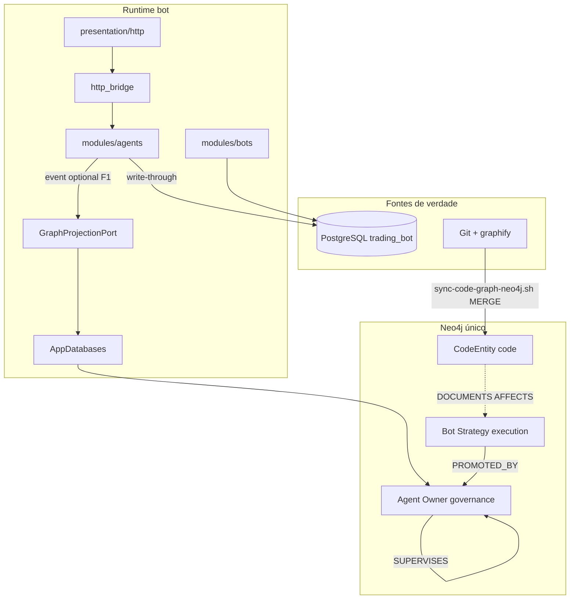

# Estratégia de grafo unificado (Neo4j)

> **G1 — análise e proposta.** Revisão independente pendente. Não autoriza CRUD massivo no runtime; define onde o grafo entra e como evitar dois grafos ou bypass de fail-closed.

## 1. Contexto e objetivo

O produto trata **governança** (owner → CEO → … → workers), **bots executores**, **código** e **operações** (orders, monitor, providers) como partes de um mesmo sistema cognitivo-operacional. A proposta de produto já prevê **banco de grafo** para conhecimento e relações ([pesquisa agents](../research/agents-capability-research.md) — fase “Conhecimento e memória”). Em paralelo, **graphify** materializa um grafo AST/docs em `backend/docs/graphify-out/` e pode **MERGE-push** no mesmo Neo4j local (`scripts/sync-code-graph-neo4j.sh`).

**Objetivo:** um **único cluster Neo4j** (instância lógica por ambiente) com namespaces de nós/arestas canônicos, alimentado por:

1. **Sync offline/CI** — código e documentação (graphify).
2. **Projeção eventual** — eventos e snapshots de domínio a partir de PostgreSQL (SoT transacional).
3. **Leitura consultiva** — travessias para impacto, governança e ferramentas de agente (sem autoridade de ordem).

**Não objetivos desta fatia:** live trading; substituir PG; expor segredos no grafo; segundo grafo (FalkorDB, `graph.json` como SoT de runtime).

PostgreSQL **não será substituído**. Neo4j **não** é opcional “nice to have” no alvo de produção: os dois **funcionam juntos**, cada um com função definida — sem overlap confuso de responsabilidade.

## 2. PostgreSQL — função (SoT autoritativo)

| Responsabilidade | Exemplos no backend |
|------------------|---------------------|
| Transações ACID e constraints | Migrações `core/database/migrations/`, FKs em `agent_identities`, orders |
| Idempotência e reconciliação de ordens | `order_idempotency_keys`, reconciliação `0004`/`0006` |
| Time-series de mercado | `candles_1m`, Timescale (`0000_extensions`, `0001_market_data`) |
| Vetores (RAG scaffold) | pgvector (`0003_vector_scaffold`) |
| Credenciais de providers | `provider_credentials` (`0007`/`0008`) — **único** lugar para secrets |
| Catálogo de bots | `bot_catalog_entries` |
| Identidades de agents + audit | `agent_identities`, `agent_identity_events` |
| Datasets de market | `market_datasets`, persistência monitor/backfill |

**Regra:** qualquer decisão que altera dinheiro, idempotência, credencial, candle persistido ou identidade administrativa **commita em PG** (ou memória já espelhada ao PG no fluxo atual). O grafo **nunca** contradiz PG.

## 3. Neo4j — função (grafo único complementar)

| Responsabilidade | Exemplos alvo |
|------------------|---------------|
| Hierarquia e supervisão de agents | Nós `:Agent`, arestas `SUPERVISES` / `MEMBER_OF` |
| Relações bot ↔ strategy ↔ symbol ↔ módulo | `:Bot` — `IMPLEMENTS` → `:Strategy`, ligação a `:Module` / `:Symbol` |
| Linhagem de código (Graphify) | `:CodeEntity`, `CALLS`/`IMPORTS`; push via `sync-code-graph-neo4j.sh` |
| Caminhos de impacto e queries relacionais | “Quem supervisiona X?”, “Que código afeta `orders`?” |
| Espelho derivado de eventos PG | MERGE idempotente após outbox — **não** write path autoritativo |

**Proibido no Neo4j como SoT:** ledger de ordens, OHLCV primário, saldos paper autoritativos, payloads exchange completos, API keys, `DATABASE_URL`, tokens admin.

## 4. Operação conjunta — dual-store sem overlap

### 4.1 Contrato em `AppDatabases`

- **Hoje (F0):** `bootstrap_runtime` / `bootstrap_http_api` conecta PG se `DATABASE_URL` e Neo4j se graph stack habilitado (`BOT_GRAPH_ENABLED` preferido, ou legado `BOT_AGENTS_ENABLED`; ver `load_agents_stack_from_env`) + `BOT_NEO4J_*` (`core/database/bundle.rs`).
- **Alvo produção:** **postgres + neo4j sempre pareados** no mesmo composition root; `readiness_databases` reporta **ambos** (`postgres`, `postgres_extensions`, `neo4j`).
- Módulos de domínio **não** importam `neo4rs`; projeção e leitura passam por seams em `core::database` (evolução: `GraphProjectionPort`, `GraphQueryPort` — §7).

### 4.2 Fluxos

| Direção | Uso |
|---------|-----|
| **PG write → projeção Neo4j** | Mutação validada → COMMIT PG → outbox/job → MERGE idempotente (`graph_domain` + chave PG) |
| **Leitura crítica** | Orders, market persist, credenciais, idempotência → **só PG** |
| **Leitura analítica / governança / caminhos** | Neo4j (e Graphify subgrafo `code`) |
| **Runtime fail-closed por domínio** | Ex.: submit de ordem **nunca** depende de nó no grafo |

### 4.3 Degradação

| Falha | Comportamento |
|-------|----------------|
| **Neo4j down** | Trading e mutações PG seguem; projeção enfileira/retry; features só-grafo (navegação governança, impacto código unificado) pausam; Graphify push falha até Bolt voltar. **Alvo produção:** `readyz` não ready sem Neo4j. |
| **PG down** | Fail-closed global onde já existe (`order_store_unavailable`, boot sem migrate, sem hydrate). Neo4j **não** reidrata transações nem credenciais. |

### 4.4 Matriz módulo × store (papéis, não fases)

| Módulo | PG only | Neo4j only (read) | PG write + Neo4j project |
|--------|---------|-------------------|---------------------------|
| `core::database` | Migrações, pool PG | — | Health + futuro worker outbox → MERGE |
| `core::health` | Probes PG | Probe Neo4j | Readiness dual |
| `modules/market` | Candles, datasets | — | Metadados `:Symbol` (opcional F2+) |
| `modules/strategy` | Avaliação em Rust | Travessia versão→bots (futuro) | `:Strategy` / versão derivada do catálogo |
| `modules/risk` | Gates numéricos | — | — |
| `modules/portfolio` | Ledger paper | Snapshot explicativo (futuro) | — |
| `modules/agents` | Identidades + eventos | Cadeia `SUPERVISES` | **F1:** após PG OK |
| `modules/bots` | Catálogo | Grafo catálogo/runtime links | **F1–F2:** bot + `PROMOTED_BY` |
| `modules/orders` | Idempotência, reconciliação | Linhagem read-only (futuro) | Eventos redigidos `OrderIntent` (F2) |
| `modules/monitor` | Persist candles opcional | — | Links observabilidade (posterior) |
| `modules/exchanges` | REST/WS, creds env | — | `:Venue` sem secret (opcional) |
| `core::providers` | `provider_credentials` | `:Provider` id-only | Metadados provider |
| `presentation/http` | Todas mutações | — | Sem Bolt no handler |
| Dev Graphify | — | Queries código | **S** MERGE `graph_domain=code` |

### 4.5 Anti-patterns (overlap / SoT duplicado)

| Anti-pattern | Correção |
|--------------|----------|
| Dois SoT para a mesma entidade (ex. hierarquia só no Neo4j) | PG (ou memória+PG) autoriza; Neo4j deriva |
| Autorizar HTTP/promoção/ordem lendo só Cypher | Checagem em PG + código; grafo consultivo |
| Secrets ou OHLCV bulk no grafo | Proibido; só ids e metadados redigidos |
| Grafo em memória “se Neo4j cair” | Fail-closed ou fila; não simular SoT |
| `graphify-out/graph.json` como runtime SoT | Git/artefato local; Neo4j `code` via job |
| Dois clusters Neo4j (domínio vs código) | Um cluster, `graph_domain` separa subgrafos |

Integração operacional: [postgres-and-graph-dev.md](../operations/postgres-and-graph-dev.md), `scripts/sync-code-graph-neo4j.sh`, monitor/agents via PG write-through existente → ganchos de projeção futuros.

## 5. Estado atual (F0) — inventário verificado

| Área | Uso do grafo hoje | SoT / evidência |
|------|-------------------|-----------------|
| `core::database::Neo4jGraph` | `connect`, `ping`, `node_count` | `src/core/database/neo4j.rs` |
| `AppDatabases::bootstrap_runtime` | Conecta Neo4j se graph stack enabled + credenciais | `bundle.rs`; config `load_agents_stack_from_env` (`BOT_GRAPH_ENABLED` / `BOT_AGENTS_ENABLED`) |
| `core::health::readiness_databases` | Probe `neo4j` quando wired | `health/mod.rs` |
| `presentation/http` `/readyz` | Campo `neo4j: "ok"` se handle presente | `routes/health.rs` |
| `modules/agents` | Projeção **F1** best-effort (`best_effort_project_agent_definition` → `SUPERVISES`); SoT = registry + `PgAgentIdentityStore` | PG + teste `neo4j_agent_supervision_chain_after_projection` |
| `modules/bots` | Projeção **F2** best-effort catálogo + promoção; SoT = catálogo PG/memória | `PgBotCatalogStore` + teste `neo4j_bot_promoted_by_after_catalog_and_promotion_projection` |
| `modules/orders` | Projeção **F3** best-effort `OrderIntent` redigido após submit HTTP OK; SoT = PG | migrações `0004`/`0006` + teste `neo4j_order_intent_after_redacted_projection` |
| `modules/monitor` | **Nenhum**; persistência candles PG opcional | `bootstrap_monitor_postgres` |
| `core::providers` | **Nenhum**; credenciais PG `provider_credentials` | migração `0007` |
| `modules/market` / `exchanges` | **Nenhum** | REST/WS apenas |
| Dev/ops | `graphify update` + `graphify export neo4j --push` | `sync-code-graph-neo4j.sh`; compose serviço `graph` |
| Agentes de documentação | `graphify-out/graph.json` local (não é o runtime HTTP) | skill graphify em `docs/.codex/skills/graphify` |

**Gap principal (2026-09-27):** F1/F2/F3 **write-only** agents/bots/orders estão no código; **F2.1** outbox PG + drain ([graph-projection-outbox-sdd](../sdd/graph-projection-outbox-sdd.md)); **F2.1.2** worker + health degradado; **não há** leitura autorizativa do grafo no runtime. O subgrafo **graphify** (código) continua separado do subgrafo **governance/bots** de produto.

### Nota sobre `agents_stack`

`AgentsStackConfig` / `load_agents_stack_from_env` **não é código morto**: acopla flags `BOT_GRAPH_ENABLED` (preferido) / `BOT_AGENTS_ENABLED` (legado) à conexão Neo4j ([core-database-sdd](../sdd/core-database-sdd.md)). O nome sugere “stack de agentes”, mas hoje significa **“grafo habilitado para o processo”**; identidades **vivem** em memória + PG, com espelho best-effort no grafo quando wired. Risco operacional: tratar Neo4j como SoT ou assumir leitura de hierarquia só pelo grafo.

## 6. Visão — um grafo, namespaces canônicos

Um grafo por ambiente. Distinção por **labels**, **propriedades estáveis** e **`graph_domain`** (string) — não por bancos Neo4j separados.

### 6.1 Nós canônicos (evolução)

| Label | `graph_domain` | Chave estável | Origem | Notas |
|-------|----------------|---------------|--------|-------|
| `CodeEntity` | `code` | `source_id` (graphify) | graphify MERGE | Funções, módulos, docs; já no push |
| `Module` | `platform` | `module_id` (ex. `agents`, `orders`) | seed + graphify link | Ponte código ↔ domínio |
| `Agent` | `governance` | `agency_id` + `agent_id` | projeção PG | Papéis, lifecycle; **sem** prompts |
| `Owner` | `governance` | `owner_id` | projeção PG / config bind | Nó humano lógico |
| `Bot` | `execution` | `bot_id` canônico | PG catálogo + runtime | Distinto de `Agent` |
| `Strategy` | `execution` | `strategy@version` | catálogo / config | Liga bot ↔ código strategy |
| `OrderIntent` | `trading` | `client_order_id` / id interno | evento PG (redigido) | Sem preços de conta/secrets |
| `Provider` | `integrations` | `provider_id` | config + PG metadata | **Sem** `secret` |
| `OrgUnit` / `Position` | `org` | TBD | futuro [org-module-sdd](../sdd/org-module-sdd.md) | Após SDD org |

### 6.2 Arestas canônicas

| Tipo | De → Para | Significado |
|------|-----------|-------------|
| `SUPERVISES` | Owner/Agent → Agent | Hierarquia administrativa |
| `MEMBER_OF` | Agent → Agency | Isolamento por agência |
| `IMPLEMENTS` | Bot → Strategy | Executor versionado |
| `PROMOTED_BY` | Bot runtime → Agent | Gate `promote_runtime_bot` |
| `OWNS` | Agent → Bot | Responsabilidade (futuro, policy) |
| `SUBMITTED` | Bot/Monitor → OrderIntent | Linhagem operacional (evento) |
| `CALLS` / `IMPORTS` | CodeEntity → CodeEntity | graphify (já) |
| `DOCUMENTS` | CodeEntity → Module | sync manual ou regra graphify |
| `USES_PROVIDER` | Agent → Provider | `consult_jev` / capability flags |
| `AFFECTS` | CodeEntity → Module | impacto de mudança de código |

## 7. Matriz módulo × papel no grafo (por fase F0–F3)

Legenda: **R** read (travessia), **W** write (projeção), **S** sync batch (graphify/job), **E** evento (outbox/stream), **—** fora do grafo nesta fase.

| Módulo / camada | F0 (hoje) | F1 code + agents mirror | F2 runtime events | F3 knowledge |
|-----------------|-----------|-------------------------|-------------------|--------------|
| `core::database` | W (ping only) | W (driver + ports) | W | W |
| `core::health` | R (probe) | R | R | R |
| `modules/agents` | — | **W/E** espelho hierarquia | R (who supervises) | R (policy links) |
| `modules/bots` | — | **W** catálogo + `PROMOTED_BY` | **E** promote/demote | R |
| `modules/orders` | — | — | **E** `OrderIntent` redigido | — |
| `modules/monitor` | — | **S** link Module/Strategy | **E** sessão (opcional) | — |
| `modules/org` (futuro) | — | — | W | R |
| `core::providers` | — | **W** nós `Provider` | — | R |
| `modules/market` | — | — | — | — (séries em PG/Timescale) |
| `modules/exchanges` | — | — | — | — |
| `modules/portfolio` | — | — | E paper snapshot refs | — |
| `presentation/http` | R (`/readyz`) | R | — | — |
| `presentation/terminal` | — | — | — | — |
| Dev: graphify | **S** | **S** | **S** | **S** |
| CI (opcional) | — | **S** push em job dedicado | — | — |

## 8. PostgreSQL vs Neo4j — tabela de SoT (referência)

| Domínio | SoT | Neo4j |
|---------|-----|-------|
| Identidade de agentes, eventos admin | PG `agent_identities`, `agent_identity_events` | Projeção read-only; reconstruível via snapshot |
| Catálogo de bots | PG `bot_catalog_entries` (+ memória) | Nós `Bot`/`Strategy`; eventual |
| Orders, idempotência, reconciliação | PG | Apenas metadados de linhagem (ids, status, modo); nunca payload exchange completo |
| Credenciais LLM | PG `provider_credentials` | Só `Provider` + flags; **proibido** `secret` |
| Candles, datasets | PG/Timescale | Não replicar séries no grafo |
| Código e docs | Git + `graphify-out` (artefato) | `CodeEntity` via MERGE; grafo JSON não é SoT |
| Hierarquia “quem pode promover bot” | PG + regras em código | Aresta `PROMOTED_BY` derivada |

**Regra:** escrita de negócio **sempre** PG (ou memória com espelho PG) primeiro; Neo4j **nunca** decide ordem, auth ou promoção sozinho.

## 9. Seams públicos propostos (`core`)

Evitar que cada módulo importe `neo4rs`. Concentrar em `core::database` ou submódulo `core::graph` (nome a fixar em SDD de implementação).

| Seam | Responsabilidade | Consumidores |
|------|------------------|--------------|
| `Neo4jGraph` (existente) | Conexão, `ping`, execução parametrizada interna | health, adapters graph |
| `GraphRuntimeConfig` | Renomear/evoluir `AgentsStackConfig`: `enabled`, URI, database; **desacoplar** semântica “agents” do flag de grafo. **Feito (env):** `BOT_GRAPH_ENABLED`; backlog loader `load_graph_runtime_from_env` | `AppDatabases` (ver §4.1) |
| `GraphProjectionPort` | `upsert_agent_subgraph`, `upsert_bot_subgraph`, `mark_order_intent` — idempotente MERGE | adapters em `modules/*/adapters/graph_*` |
| `GraphQueryPort` (read) | Travessias limitadas: `supervision_chain`, `bots_for_agent`, `code_impact_for_module` | advisory futuro, ops, HTTP read-only gated |
| `GraphSyncJob` (offline) | Invoca graphify push ou import Cypher; não no hot path HTTP | scripts, CI |

**Fail-closed:** se `enabled` e conexão falha → `neo4j: None` (como hoje), módulos **não** simulam grafo em memória. Features que **exigem** grafo (futuro) retornam erro explícito, não degradam silenciosamente para PG.

## 10. Fases de rollout

| Fase | Entregável | Validação |
|------|------------|-----------|
| **F0** (atual) | Bolt + readyz; graphify → Neo4j em dev | `ping_and_node_count_against_local_graph`; script sync |
| **F1** | Projeção `Agent`/`Owner`/`SUPERVISES` após mutação PG; labels `graph_domain`; link `Module` ↔ `CodeEntity` documentado | Teste integração: MERGE após `pg_agent_lifecycle_write_through`; query Cypher em CI opcional |
| **F2** | `Bot`/`Strategy`/`PROMOTED_BY` após catálogo PG + promote runtime (*implemented*) | `neo4j_bot_promoted_by_after_catalog_and_promotion_projection`; [bots-neo4j-projection-sdd](../sdd/bots-neo4j-projection-sdd.md) |
| **F3 (orders slice)** | `OrderIntent` redigido após submit HTTP + PG opcional (*implemented* fatia mínima) | `neo4j_order_intent_after_redacted_projection`; [orders-neo4j-projection-sdd](../sdd/orders-neo4j-projection-sdd.md) |
| **F3** | Memória semântica, proveniência ([agents research](../research/agents-capability-research.md)) | SDD próprio + threat model |

**Rollback F1+:** desabilitar projeção (flag); truncar subgrafo `graph_domain='governance'` via job; PG intacto.

## 11. Anti-patterns (técnicos e ops)

| Anti-pattern | Por quê evitar |
|--------------|----------------|
| Dois grafos (Neo4j + FalkorDB ou segunda instância “só agents”) | Divergência, custo ops, queries ambíguas |
| `graphify-out/graph.json` como SoT de runtime | Artefato local, stale, sem transação com PG |
| `BOT_AGENTS_ENABLED=false` mas push graphify em produção “só para docs” sem namespace | Mistura domínios sem contrato |
| Ler hierarquia do Neo4j para autorizar HTTP | SoT deve permanecer PG + código; grafo é derivado |
| Propriedades com API keys, `DATABASE_URL`, payloads de ordem | Vazamento em backups Browser/export |
| `neo4rs` direto em `modules::*` | Quebra import-direction e testabilidade |
| Reconciliação bidirecional PG ↔ Neo4j em tempo real | Complexidade; preferir outbox unidirecional |

## 12. Diagrama — fluxo de dados alvo (F1+)

## 13. Integração com operações existentes

- Compose: serviço `graph` em `docker-compose.bot.yml` (Bolt `7688`, Browser `7475`).
- Env: [postgres-and-graph-dev.md](../operations/postgres-and-graph-dev.md) — `BOT_GRAPH_ENABLED` (preferido) / `BOT_AGENTS_ENABLED` (legado), `BOT_NEO4J_*`.
- SDDs relacionados: [core-database-sdd](../sdd/core-database-sdd.md), [database-module-integration-sdd](../sdd/database-module-integration-sdd.md), [agents-module-sdd](../sdd/agents-module-sdd.md), [agents-pg-registry-sdd](../sdd/agents-pg-registry-sdd.md).

## 14. Próximo passo implementável (fatia vertical recomendada)

**F1 — espelho de hierarquia de agentes (write-only, best-effort)** — *implemented (F1)*; ver [agents-neo4j-projection-sdd](../sdd/agents-neo4j-projection-sdd.md):

1. SDD curto `agents-neo4j-projection-sdd.md` (proporcional) com Cypher MERGE e idempotência.
2. Adapter `modules/agents/adapters/graph_projection.rs` chamado de `persist_agent_after_mutation` / hydrate (após PG OK).
3. Teste integração: com Neo4j local, register CEO + worker → `MATCH (a:Agent)-[:SUPERVISES*]->(b:Agent)` conta esperada.
4. Sem rotas HTTP novas; sem leitura autorizativa.

Gate: `./scripts/verify-backend-gates.sh` se tocar código; doc-only não exige.

## 15. Referências

- [layer-mapping.md](./layer-mapping.md) — composition root e infra.
- [module-catalog.md](./module-catalog.md) — contratos por módulo.
- [integrations.md](./integrations.md) — PG e seams HTTP.

## 16. F2 entregue (bots write-only, best-effort)

1. SDD [bots-neo4j-projection-sdd](../sdd/bots-neo4j-projection-sdd.md).
2. Adapter `modules/bots/adapters/graph_projection.rs` após `persist_bot_catalog` e promote/demote HTTP.
3. Outbox durável **F2.1** (*implemented* slice 1): migração `0009`, `graph_projection_outbox`, enqueue unificado nos `best_effort_*`; [graph-projection-outbox-sdd](../sdd/graph-projection-outbox-sdd.md).
4. **F2.1.2** (*implemented*): worker periódico + sinal degradado em `/healthz` quando PG+Neo4j wired.
5. **F2.1.3** (*implemented* — CLI drain): `bot graph-projection drain --limit N`; fail-closed sem PG/Neo4j; testes `graph_projection_cli_*` — [graph-projection-outbox-sdd](../sdd/graph-projection-outbox-sdd.md) §7.
6. **F2.1.3+** (*implemented* — enqueue na mesma TX de domínio, caminhos principais): orders (`pg_order_idempotency_and_graph_projection_same_transaction`), agents (`pg_agent_identity_and_graph_projection_same_transaction`), bots catalog (`pg_bot_catalog_and_graph_projection_same_transaction`), monitor supervisor (`pg_monitor_supervisor_graph_projection_outbox_same_transaction`); PG **25/25** no script.
7. **F3 partial** (*read-only query*): `GraphQueryPort` — `list_agents`, `supervision_chain`, `bots_for_agent`, `code_impact_for_module`; CLI `bot graph query` (`agents`, `supervision-chain`, `bots-for-agent`, `code-impact`); fail-closed sem Neo4j — [graph-query-port-f3-sdd](../sdd/graph-query-port-f3-sdd.md). Pendente: leitura HTTP gated (admin read-only); memória semântica roadmap §10.
