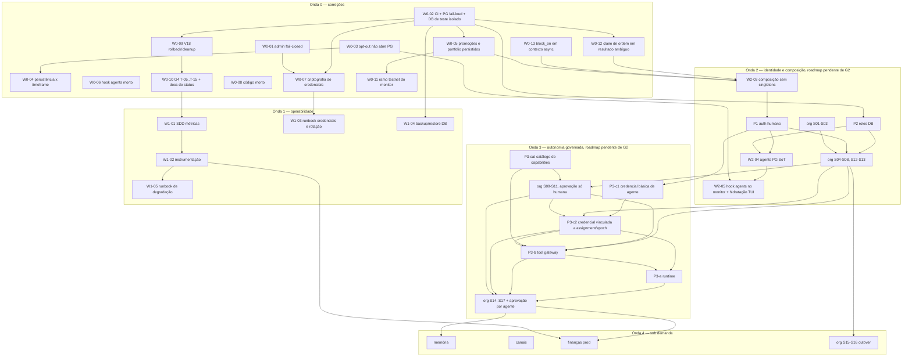

# Plano mestre do backend

- **Escopo:** Ondas 0 e 1 revisadas contra os achados do Critic G2 ciclo 1 (M1–M5, L1–L5). **Ondas 2–4: roadmap, pendente de G2.**
- **Estado:** draft. Não aprova nada, não marca gates, não substitui threat model (bot Segurança) nem Critic independente (`AGENTS.md`).
- **Base verificada:** código em `backend/` no `main` local em 2026-09-27 ~16:15 COT (commit `2d1e3863`; `acb7a97e` adicionou `0011`); W0-12 e futures reconferidos em `b003a9b7` (~16:20 COT). Outra sessão faz commits a cada poucos minutos; números podem mudar.
- **Regra de leitura:** toda afirmação sobre "existe" foi conferida em `backend/src`, `Cargo.toml`, `backend/tests`, `backend/scripts`, `.github/workflows` e `backend/src/core/database/migrations/`. Onde docs e código divergem, está escrito **[DOC×CÓDIGO]**. Itens com impacto de segurança: **[SEGURANÇA]**.
- **Cross-check:** auditoria read-only `module-audit-2026-09-27.md` (HEAD `acb7a97e`, fora do repo) e grafo Graphify `backend/graphify-out/graph.json` (a versão das 15:39 COT usada na revisão era anterior a `0011`; regenerado às 16:27 COT, já contém `monitor_supervisor_snapshot`). As afirmações usadas aqui foram reconferidas no código; onde grafo e código divergem, vale o código.
- **Documentos org:** este plano **não** redefine o módulo org; referencia [org-module-sdd](../sdd/org-module-sdd.md), [org-complete-implementation-plan](./org-complete-implementation-plan.md) e [org-plan-authority-errata](./org-plan-authority-errata.md) (errata marcada `incorporated`).

## 1. Inventário real do código

Binário único `bot` (`src/main.rs`, 170 linhas); crate `rust-trading-bot`, edition 2021, `rust-version = 1.85`, **sem** `rust-toolchain.toml`. Seis entradas: monitor TUI (padrão), `backtest`, `serve`, `graph-projection drain`, `graph query`, `orders retention-purge`. ~33,6k linhas Rust em `src/`; 515 atributos `#[test]`/`#[tokio::test]` em `src/` + 10 em `tests/` (5 suítes). Migrations: `src/core/database/migrations/0000`–`0011`; `backend/migrations/` e `src/core/persistence/migrations/` estão **vazios**.

| Módulo | Caminho | Linhas | Testes (estático) | Estado real |
|---|---|---:|---:|---|
| config | `core/config/**` | ~1,6k | 21 + `tests/config_cli.rs` | Implementado. Rejeita prod, `run_mode=testnet` e HFT (`core/config/mod.rs:381-394`). |
| database (PG) | `core/database/{postgres,bundle,monitor_bootstrap,…}.rs` | ~600 | parte de 34 | Implementado opt-in. Só aceita DB chamado `trading_bot` (`postgres.rs:57`), PG ≥ 18 (`postgres.rs:72`), migrations lidas em runtime de `CARGO_MANIFEST_DIR` (`postgres.rs:96`). |
| graph (Neo4j) | `core/database/{neo4j*,graph_*}.rs` | ~2,6k | parte de 34 | Parcial: projeção write-only agents/bots/orders, outbox `0009`, worker, 2 CLIs, 4 GETs admin. Desligado por padrão. `code-impact` depende de `scripts/sync-code-graph-neo4j.sh`. |
| persistence | `core/persistence/` | 244 | 5 | Implementado. Monitor só persiste com timeframe `1m` (`monitor_bootstrap.rs:52`); `bot.toml` padrão usa `15m`. |
| health | `core/health/mod.rs` | 153 | 3 | Implementado (`/healthz`, `/readyz`). |
| logging | `core/logging.rs` | 27 | 0 | Implementado (tracing JSON + arquivo rotacionado). |
| notifications | `core/notifications/` | 117 | 2 | Stub: só `LogNotifier` efetivo; `StubChannelNotifier` com `#[allow(dead_code)]`. |
| providers/jev | `core/providers/jev/` | 98 | 0 | Implementado, desligado por padrão (`jev.enabled=false`); timeout 1–30 s (`openai_compatible.rs:82`). |
| providers NIM/9router/openai | `core/providers/*.rs` | ~290 | 9 | NIM sem chamador (só o próprio arquivo referencia `NvidiaNimClient`). |
| providers/credentials | `core/providers/credentials/` | 333 | 6 | Implementado; segredo em texto plano (`PROVIDER_CREDENTIALS_ENCRYPTION_MODE = "none"`). |
| exchanges | `modules/exchanges/**` | ~2,55k | 43 + 5 redirect | Parcial: Spot testnet backfill/WS/submit/reconcile opt-in; prod REST bloqueado (`rest.rs`). Futures só **modelado**: `MarketType::Futures` (`models/mod.rs:27`), parsing de `[accounts.futures]` (`adapters/account_file.rs:60-78`), `futures_accounts()` no registry, capacidades Futures declaradas para Binance (`capabilities.rs:41-44`); `preflight.rs:98` calcula `_futures_registered` e descarta. Nenhum adapter, stream ou executor de futures. |
| market | `modules/market/**` | 718 | 14 | Implementado; WS só `1m`. |
| strategy / risk | `modules/strategy`, `modules/risk` | 188 / 180 | 5 / 4 | Implementados (SMA/EMA; limites). |
| portfolio | `modules/portfolio` | 349 | 5 | Parcial: ledger paper em memória estática (`paper_ledger_executor.rs:21`), perdido no restart; preço de fill fixo por config; `quote_amount`/`fill_unit_price` em `f64`. |
| backtest | `modules/backtest` | 1,39k | 11 + 1 | Implementado; só fixture sintética. |
| monitor | `modules/monitor/**` | 4,19k (`supervisor.rs` 2,7k) | 58 | Implementado. C15/C17 (T-15) presentes: `WsOverflowSignal` (`exchanges/adapters/live.rs:118-240`), `PersistenceHealth` Off/Healthy/Degraded/Gap (`monitor/models/persistence.rs`). Ramo de ordens testnet inalcançável (config rejeita testnet). |
| agents | `modules/agents/**` | 2,09k | 29 | Parcial: registry em memória (singleton `controllers/runtime.rs:11`), lifecycle, HTTP, write-through PG, owner singleton por env (`0010`). Hook do monitor é `dead_code` (`supervisor_hook.rs:1`). TUI não hidrata do PG. `AgentRole` = Ceo/LevelB/LevelA/Specialist/Worker. |
| bots | `modules/bots/**` | 2,14k | 30 | Parcial: catálogo/ranking/PG, `BotRuntimePort` fail-closed; promoção só em memória (`InMemoryBotRuntime`, singleton `runtime_port.rs:95`). |
| orders | `modules/orders/**` | 2,96k | 47 | Parcial: executores paper/dev_accept/recording/testnet; idempotência `0004`, reconciliação `0006`, purge CLI; 503 por padrão. Vários `static Mutex` globais (ledger, bindings, mirror PG com runtime tokio próprio). |
| http_bridge | `modules/http_bridge/` | 2,33k | 38 | Implementado (facades). |
| presentation/http | `presentation/http/**` | 7,78k (`state.rs` 2,8k) | 147 | Implementado: 42 paths / 45 operações OpenAPI. `state.rs` contém orquestração de domínio (`submit_order_http`, `promote_bot_http`, `reconcile_pending_orders_once`). |
| presentation/terminal | `presentation/terminal/` | 243 | 1 | Implementado. |
| org, auth humano, auth de agente, runtime/scheduler, tool gateway, memória, canais, finanças prod, métricas | — | 0 | 0 | **Ausentes** (sem `modules/org`, sem `core/auth`, sem prometheus/otel/`metrics` no `Cargo.toml`). |

Verificação: `scripts/verify-backend-gates.sh` (fmt, clippy `--bin bot`, import-direction, manifesto PG, `cargo test --bin bot --test-threads=1`, 5 suítes). PG: `scripts/run-pg-integration-tests.sh` com **28** testes. CI `.github/workflows/backend-ci.yml`: toolchain `stable` não fixado, job PG em `timescaledb-ha:pg16`; nunca verde.

## 2. Contradições doc×código relevantes

1. **[DOC×CÓDIGO] C17 tem dois significados.** No T-15, C17 = estado/recuperação de persistência: código presente e SDD T-15 registra "APROVADO COM FOLLOW-UP". `backend-work-plan.md` diz "em andamento"; `unimplemented-modules-analysis.md` e `current-state-and-roadmap.md` dizem "pendente". O commit `acb7a97e` chama de "C17 fatia 1" outra coisa (snapshot do supervisor, `0011`, [monitor-persistence-c17-sdd](../sdd/monitor-persistence-c17-sdd.md)).
2. **[DOC×CÓDIGO][SEGURANÇA] A "C17 fatia 1" quebra a invariante T-15/C16** "com `PERSIST_MARKET_DATA` desligado nenhum acesso ao banco é iniciado": `supervisor.rs:895-899` chama `optional_postgres_for_monitor_supervisor_snapshot()` (`bundle.rs:121`), que conecta **e roda migrations** quando só `DATABASE_URL` está definido.
3. **[DOC×CÓDIGO][SEGURANÇA] "Fail-closed" do admin é opcional:** sem `BOT_HTTP_ADMIN_TOKEN`, todas as rotas mutantes ficam abertas, inclusive CRUD de `provider_credentials` e `orders/submit`. O bind padrão é `127.0.0.1:8080` (`presentation/http/cli.rs:9`), mas nada impede `--bind 0.0.0.0` sem token.
4. **[DOC×CÓDIGO] "0 ignorados" não significa PG executado.** Testes PG retornam cedo quando não há banco (`core/persistence/pg_integration.rs`, "no `#[ignore]`"); falha de migração também vira skip. Com CI em pg16, `assert_server_version` falha → todos os 28 testes PG passariam sem executar nada.
5. **[DOC×CÓDIGO][SEGURANÇA] Testes e runtime usam o mesmo nome de DB** (`trading_bot` obrigatório em `postgres.rs:57`, no script PG e no CLI de purge). Não há isolamento por nome; o teste `pg_orders_retention_purge_dry_run_then_apply_deletes_fixture_rows` apaga linhas no banco alvo.
6. **[DOC×CÓDIGO]** Contagens divergentes: testes 470/503/507/512 nos docs vs 515 estático; manifesto PG 27 nos docs vs 28 no script (comentário do script diz 24); `module-catalog.md` diz 36 paths (real 42) e "migrações até 0010" (existe 0011); "três pontos de entrada" (real seis).
7. **[DOC×CÓDIGO]** Hook de agentes "integrado ao monitor": o arquivo abre com `#![allow(dead_code)] // monitor wiring pending`.
8. **[DOC×CÓDIGO]** Monitor "testnet": `Config::validate` rejeita `RunMode::Testnet`; o ramo de ordens `mon:` do supervisor é inalcançável pelo binário.
9. **[DOC×CÓDIGO]** Persistência do monitor exige `1m`; `bot.toml` padrão é `15m` → habilitar persistência com a config padrão aborta o boot.
10. **[DOC×CÓDIGO]** NIM "entregue" sem chamador; tabela `knowledge_embedding_scaffold` (`0003`) sem referência em Rust; futures modelado (tipo, parsing de conta, registry, capacidades declaradas em `capabilities.rs:41-44`) mas sem adapter/stream/executor. Declarar `FuturesOrders`/`FuturesStreamMarketData` como capacidade é afirmação falsa para quem consulta o catálogo.
11. **[DOC×CÓDIGO]** `check-import-direction.sh` procura só `use crate::modules::` em `core`; `core/config/mod.rs:213,458` usa `crate::modules::bots::models::MonitorEvaluatorKind` por caminho qualificado e passa. Em rotas, só `modules::agents::` é bloqueado.
12. **[DOC×CÓDIGO]** SDDs antigos citam caminhos que não existem mais (`src/persistence_health.rs`, `app.rs`, `src/monitor_startup.rs`); hoje `controllers/persistence_health.rs` é um reexport de 1 linha.
13. **[DOC×CÓDIGO] Hierarquia:** `AGENTS.md` = owner → CEO → Level B → Level A → especialistas; o código (`agents/models/hierarchy.rs:8`) segue isso. Versões anteriores do SDD org davam Level C como aprovado; a versão atual o trata como decisão pendente D-HIER (Proposed). Docs de planning antigos que citam Level C como fato estão desatualizados.
14. **[DOC×CÓDIGO]** Registry de agentes: SDD diz "PG espelho durável"; o código muta a memória antes de `persist_agent_after_mutation` (`state.rs:1112`). Falha PG retorna erro sem desfazer a memória → divergência memória×PG até o restart.

## 3. Avaliação por módulo

Formato: **Objetivo** · **Estado** · **Mais simples que funciona?** · **Alternativa** (só se relevante) · **Gaps** · **Depende de** · **Falta para completo** · **SDD**.

### 3.1 config
- **Objetivo:** fonte única de parâmetros validados (TOML `system.toml`/`bot.toml` + `.env`).
- **Estado:** implementado; gate de script proíbe `env::var` fora de `core/config` e `credentials`.
- **Mais simples?** Sim. Defeito: `core::config` depende de `modules::bots` (tipo `MonitorEvaluatorKind`).
- **Gaps:** timeframe padrão `15m` incompatível com persistência `1m`; contas futures carregadas sem uso; validação não cruza `serve --bind` não-loopback com token.
- **Depende de:** nada. **Falta:** mover `MonitorEvaluatorKind` para config ou tipo neutro; validações cruzadas (W0-01, W0-04).
- **SDD:** [centralized-config-sdd](../sdd/centralized-config-sdd.md) existe; deltas nas fatias W0.

### 3.2 database (PostgreSQL)
- **Objetivo:** pool, runner único de migrations, transações e readiness.
- **Estado:** implementado; `AppDatabases`; PG18; nome fixo `trading_bot`.
- **Mais simples?** Quase. Problemas: nome de DB como único guard; runtime lê migrations do diretório de build (binário não é relocável); testes compartilham o DB.
- **Alternativa:** `sqlx::migrate!` embutido no binário (menos um modo de falha em deploy). Guard por modo (`Runtime` × `IntegrationTest`) com marcador no próprio DB, não só nome (o plano org P2 já exige isso).
- **Gaps:** sem roles separadas (DML × migration); sem backup/restore; V18 formal ausente (nenhum teste de rollback com erro injetado; `rg rollback` em `src/**/*.rs` não retorna teste).
- **Depende de:** CI PG18 (T-CI-02). **Falta:** W0-02, W0-09, W1-04, P2.
- **SDD:** [core-database-sdd](../sdd/core-database-sdd.md) existe (draft); P2 precisa de SDD próprio.

### 3.3 graph (Neo4j)
- **Objetivo declarado:** projeção derivada para traversal (supervisão, bots por agente, impacto de código).
- **Estado:** ~2,6k linhas (≈8% do código) para um espelho write-only sem consumidor de runtime; leitura só em CLI/GET admin.
- **Mais simples?** **Não.** As consultas atuais (cadeia de supervisão de poucos agentes, bots por agente) cabem em CTE recursiva no PG. `code-impact` é ferramenta de desenvolvimento dentro do binário de produto.
- **Alternativa:** congelar: manter código e outbox, stack desligada, sem novas projeções até existir consumidor real (org S08 ou memória). Opção mais radical (remover) fica para decisão.
- **Gaps:** projetores de domínio (`neo4j_agent_hierarchy`, `neo4j_bot_projection`, `neo4j_order_intent`) vivem em `core`, que conhece conceitos de módulos.
- **Depende de:** PG outbox. **Falta:** nada para o produto atual. **SDD:** existem 5 (strategy, outbox, F3, projeções); nenhum novo. Ver Decisão D4.

### 3.4 persistence (datasets de mercado)
- **Objetivo:** gravar candles/datasets idempotentes.
- **Estado:** implementado com conflito de manifesto detectado; monitor só `1m`.
- **Mais simples?** Sim. **Gaps:** incompatibilidade com timeframe padrão (W0-04). **SDD:** T-15 existe.

### 3.5 monitor (inclui C10, C14–C17 do plano T-05…T-15)
- **Objetivo:** loop live/paper: candles → estratégia → risco → TUI, persistência opcional.
- **Estado:** C9/C10 (redirect/fallback REST), C12/C13, C14/C15, C16 e C17 (T-15) com G3 "APROVADO COM FOLLOW-UP" registrado nos SDDs; G4 pendente em todos. Evidência de código: `live.rs` (overflow sem bloquear), `monitor/models/persistence.rs`, testes GAP/DEGRADED em `supervisor.rs`.
- **Mais simples?** Funcional, mas `supervisor.rs` (2,7k linhas) concentra orquestração, persistência, ordens e snapshot.
- **Gaps:** regressão de opt-out (§2 item 2); ramo testnet inalcançável; hook de agentes morto; V18.
- **Depende de:** config, market, exchanges, persistence. **Falta:** W0-03/W0-04/W0-06/W0-07, G4 consolidado (W0-10).
- **SDD:** T-10, T-15, presentation-contract, c17-fatia-1 existem; W0 SDDs em redação.

### 3.6 exchanges
- **Objetivo:** adapters Binance (REST/WS), política de uso REST, credenciais de exchange.
- **Estado:** Spot testnet; `authorize_rest_use` bloqueia prod; submit/reconcile testnet via ccxt com runtime tokio próprio (`binance_spot_testnet_submit.rs:21`).
- **Mais simples?** Sim, exceto runtime tokio próprio com `block_on` chamado de contexto async (`binance_spot_testnet_submit.rs:167`, `binance_spot_testnet_reconcile.rs:64`): risco de pânico runtime-in-runtime (W0-13).
- **Gaps:** futures só modelado (capacidades declaradas sem implementação; `_futures_registered` descartado em `preflight.rs:98`); clippy `result_large_err` em `live.rs:165` quebra CI com toolchain novo.
- **Falta:** W0-13 (`block_on`), W0-08 (futures), W0-02 (CI). **SDD:** T-03 (proposta), T-05 existem.

### 3.7 market / strategy / risk
- **Objetivo:** feed híbrido, sinais puros, limites.
- **Estado:** implementados, testados, sem efeitos colaterais. **Mais simples?** Sim. **Falta:** nada para o escopo atual. **SDD:** market-phase3; strategy/risk sem SDD próprio (não necessário).

### 3.8 portfolio
- **Objetivo:** posição e saldo paper (depois real).
- **Estado:** ledger em memória estática; preço fixo; `f64` para valores monetários.
- **Mais simples?** Não para "completo": perder posições no restart invalida paper trading contínuo.
- **Gaps:** persistência; preço de marcação vindo do feed; `Decimal` em vez de `f64`.
- **Depende de:** orders (fills), database. **Falta:** W0-05. **SDD:** falta (wave0).

### 3.9 backtest
- **Objetivo:** avaliar bots offline.
- **Estado:** implementado com fixture sintética; SMA/EMA via `evaluate_for_kind`; rota HTTP chama-se `sma-crossover` mesmo aceitando EMA.
- **Mais simples?** Sim. **Gaps:** sem dados históricos reais (datasets persistidos não são usados como fonte). **Falta (futuro):** backtest sobre datasets do PG. **SDD:** T-07 existe; novo só quando houver dados reais.

### 3.10 orders
- **Objetivo:** submit idempotente pós-risco, reconciliação, execução em exchange.
- **Estado:** G2 parcial; prod bloqueado; invariantes `threat_model_invariants.rs`; LGTM Critic e threat model do bot Segurança pendentes.
- **Mais simples?** Não. Estado global em `static Mutex`/`OnceLock` (ledger, bindings, mirror PG com runtime tokio dedicado) força `--test-threads=1` e acopla processo inteiro.
- **Alternativa:** estado injetado via composição (`ApiState`/handle do monitor) com uma instância por processo criada no boot.
- **Gaps:** orquestração em `presentation/http/state.rs`; reconciliação prod ausente; saldo privado ausente. Achados do threat model [orders-g2-threat-model](../security/orders-g2-threat-model.md) conferidos no código: **F-ORD-03 (Alto)** qualquer `Err` de `submit_order_http` libera o claim PG (`state.rs:566-571`, `release_claim` em L569), inclusive depois do dispatch → retry com a mesma key pode duplicar ordem (W0-12) **[SEGURANÇA]**; F-ORD-04 dedupe em memória não atômico e key sem hash do payload; F-ORD-05 ack global `LAST_SUBMIT_ACK` lido depois do submit (`state.rs:575-587`); F-ORD-07 conta Dev fixa no executor; F-ORD-11 `block_on` de runtime próprio dentro de handler async (W0-13).
- **Depende de:** risk, exchanges, database, auth (para autorizar submit real). **Falta:** W0-12 (F-ORD-03), W0-13 (F-ORD-11), W2-03 (DI; resolve F-ORD-05 ao devolver o ack pelo port), revisão Critic G2 contra [orders-g2-threat-model](../security/orders-g2-threat-model.md) (bot Segurança), depois Onda 4 finanças.
- **SDD:** orders G1/G2 existem.

### 3.11 bots
- **Objetivo:** executores versionados strategy×timeframe, avaliação e promoção.
- **Estado:** catálogo/ranking/PG; promoção só memória; `0011` guarda `promoted_bot_id` só como metadado advisory.
- **Mais simples?** Parcial. Promoção sem persistência nem auditoria durável não serve como controle.
- **Gaps:** tabela de promoções com autor/tempo/estado; ligação com auth humano; singleton de runtime.
- **Depende de:** agents/owner, database. **Falta:** W0-05, W2-03, fechamento G2 após P1. **SDD:** bots G1/G2 existem; delta wave0.

### 3.12 agents
- **Objetivo:** identidade administrativa IdentityOnly e hierarquia.
- **Estado:** §1; owner singleton por env (`product_owner_bootstrap`, `0010`), não IdP.
- **Mais simples?** Não quanto a SoT: memória como verdade + PG como espelho cria divergência (§2 item 14).
- **Alternativa:** com PG ligado, PG é SoT: transação PG (identidade + outbox) antes de atualizar memória; memória vira cache.
- **Gaps:** hook monitor; hidratação na TUI; auth; enum sem Level C (pendente D-HIER).
- **Depende de:** database, P1. **Falta:** W0-06 (remover hook morto), W2-04, W2-05 (hook + hidratação), P1. **SDD:** agents, pg-registry, owner-bootstrap existem; delta W2-04.

### 3.13 presentation/http + http_bridge
- **Objetivo:** API v1 com OpenAPI; composição.
- **Estado:** 42 paths; 147 testes; admin bearer em tempo constante (`admin_auth.rs:143`).
- **Mais simples?** Não: `state.rs` de 2,8k linhas mistura composição e casos de uso.
- **Gaps:** token opcional; rotas de simulação abertas; sem autenticação de ator.
- **Falta:** W0-01, W2-03, P1. **SDD:** [http-admin-auth-seam-sdd](../sdd/http-admin-auth-seam-sdd.md) é o SDD de W0-01 (SEC-ADM-14 depende de P1).

### 3.14 providers / jev / credentials
- **Objetivo:** advisory Jev sem autoridade; chaves LLM.
- **Estado:** Jev ok; NIM morto; credenciais em texto plano. **[SEGURANÇA]**
- **Mais simples?** Jev sim. NIM não justifica existir sem chamador.
- **Gaps:** criptografia em repouso; rotação exige restart para env; runbook.
- **Falta:** W0-07 (criptografia), W0-08 (NIM), W1-03. **SDD:** jev, nim, provider-credentials existem; W0-07 usa [provider-credentials-db-sdd](../sdd/provider-credentials-db-sdd.md) + ADR `Proposed` da KEK.

### 3.15 notifications / canais
- **Objetivo:** alertas operacionais (hoje) e canais de conversa (futuro).
- **Estado:** só log; stub morto.
- **Mais simples?** Remover o stub agora; canal real só quando alertas (Onda 1) precisarem de destino.
- **Falta:** W0-08; canal de alerta único em W1-02 se necessário; canais de conversa na Onda 4 com SDD próprio.

### 3.16 observabilidade
- **Objetivo:** métricas, SLI/SLO, alertas, runbooks (credenciais, rotação, recuperação de DB).
- **Estado:** só logs estruturados; zero métricas.
- **Mais simples:** fachada `metrics` + exportador Prometheus em `/metrics` no `serve`; no modo TUI, contadores emitidos em log JSON periódico. Sem OTel até existir mais de um serviço.
- **Gaps:** catálogo de métricas com cardinalidade; idade do último candle; estado de persistência; fila WS; latência/erro REST; Jev; idade da outbox; pendências de reconciliação >7 dias; runbook de credenciais/rotação; backup/restore com drill.
- **Depende de:** Onda 0. **Falta:** W1-01..W1-05. **SDD:** falta `observability-metrics-sdd`; runbooks com validação por drill.

### 3.17 org
- **Objetivo:** estrutura organizacional, posições, assignments, policies e governança de autonomia; PG schema `org` SoT; Neo4j derivado.
- **Estado:** zero código. SDD e plano `draft`; o SDD voltou a **REJECTED** no Critic por F-ORG-01 (matriz de autorização estrutural, [org-module-threat-model](../security/org-module-threat-model.md)) e está em revisão agora, o que bloqueia S04+ além de P1/P2. Plano atual: fatias S01–S18; gates P1 (auth humano/IdP + D-OWNER-BIND), P2 (roles/migrations/PG isolado), P3 (runtime/tool gateway, catálogo de capabilities, **auth de principal agente**); decisões D-HIER, D-SEAM-AGENTS, D-OUTBOX, D-OWNER-BIND, D-OWNER-POSITION. S01–S03 (tipos e invariantes puros) não dependem de DB/auth/runtime; aprovações de agente só contam com auth de principal agente de P3 (S10, S14 dependem disso). Threat model do bot Segurança: [org-module-threat-model](../security/org-module-threat-model.md).
- **Mais simples?** O escopo completo (policies, epoch, delegação, cutover) é grande. A ordem S01–S08 sem grants é proporcional. Recomendação: S09–S11 entram na Onda 3 imediatamente antes de P3-c2/P3-b (que leem grants/epoch), com aprovação só humana; S14/S17 só depois de P3-a (§4.4).
- **Alternativas relevantes:** D-OUTBOX → reutilizar `graph_projection_outbox` (menos código); D-SEAM-AGENTS → importar reexports públicos de `modules::agents` (já puros).
- **Depende de:** SDD org aprovado (F-ORG-01), P1, P2; S09 depende de P3-cat e D-HIER; S14/S17 de P3-a/b/c2. **Falta:** tudo. **SDD:** existe (draft).

### 3.18 auth humano (P1) — transversal
- **Objetivo:** provar o owner humano (`HumanPrincipal{issuer,subject}`) em cada request.
- **Estado:** ausente; não há `core/auth`; só bearer admin e owner singleton por env.
- **Mais simples:** verificação OIDC/JWT (JWKS, issuer, audience, expiry) em middleware único que injeta o ator em `ApiState`; nada de senha própria.
- **Depende de:** W2-03 (composição limpa facilita). **SDD:** falta (P1). Ver D2.

### 3.19 auth de principal agente — transversal
- **Objetivo:** atribuir de forma verificável ações e aprovações a um `AgentId` (hoje o CEO é agente).
- **Estado:** ausente; o SDD org atribui a P3 e rejeita aprovações de agente até lá.
- **Avaliação:** P3 já cobre runtime, gateway e catálogo; colocar credencial de agente no mesmo documento o torna grande demais. Recomendação: SDD separado dentro do pacote P3, dividido em **P3-c1** (credencial básica: `AgentId` + lifecycle, depois de P1) e **P3-c2** (vínculo com assignment e `revocation_epoch`, depois de org S11), com regra interina "só humanos aprovam" até P3-c2. A divisão quebra o ciclo S11 ↔ P3-c (§4.4). Ver D3.

### 3.20 runtime / scheduler / worker
- **Objetivo:** tarefas duráveis, lease, retry, cancelamento, revalidação por ação.
- **Estado:** ausente (tasks do monitor não são runtime de agentes).
- **Mais simples:** fila em PG (`SELECT … FOR UPDATE SKIP LOCKED`) com lease e heartbeat no mesmo processo; sem broker externo.
- **Depende de:** P3-c2, P3-b (e, por elas, P1, org S05/S11). **SDD:** falta (P3-a).

### 3.21 tool gateway
- **Objetivo:** checagem de policy/epoch imediatamente antes de cada efeito, auditoria, aprovação humana para alto impacto.
- **Estado:** ausente. Jev não chama ferramentas.
- **Mais simples:** uma função de gateway síncrona in-process (`authorize(actor, action, resource) -> Decision`) com allowlist fechada; MCP só depois.
- **Depende de:** P3-c2, org S05/S11, P3-cat. **SDD:** falta (P3-b).

### 3.22 memória / conhecimento
- **Objetivo:** memória entre sessões com proveniência e revisão.
- **Estado:** ausente; `0003` cria tabela pgvector sem uso.
- **Mais simples:** PG + pgvector (já instalado) antes de qualquer uso de Neo4j para isso.
- **Depende de:** runtime, gateway. **SDD:** falta (Onda 4).

### 3.23 finanças / produção
- **Objetivo:** execução real, saldo privado, reconciliação prod.
- **Estado:** bloqueado por design (`Config::validate`, `authorize_rest_use`).
- **Depende de:** Onda 0–3, threat model do bot Segurança, autorização explícita. **SDD:** falta (Onda 4). **[SEGURANÇA]**

### 3.24 CI / verificação
- **Estado:** CI nunca verde; toolchain não fixado; PG16 × PG18; skip silencioso de testes PG; testes serializados por estado global.
- **Falta:** W0-02 (inclui T-CI-01/T-CI-02 em andamento, rastreados fora do repo). **SDD:** wave0.

## 4. Ondas

Ordem topológica da Onda 3 (sem ciclos; conferida por script sobre as arestas acima): **P3-cat → P3-c1 → org S09–S11 (aprovação só humana) → P3-c2 → P3-b → P3-a → org S14, S17 + habilitar aprovação por agente**. P3-cat e P3-c1 são independentes entre si e podem correr em paralelo.

Paralelismo permitido: org S01–S03 podem rodar em qualquer onda após acordo dos seams (não tocam DB/auth). SDDs (documentos) de P1/P2/P3 podem ser escritos durante a Onda 1. Nenhuma feature nova antes de W0-01 e W0-02 terminarem.

### 4.1 Onda 0 — correções (ordem por risco)

SDDs mínimos destas fatias estão sendo escritos em paralelo em `backend/docs/sdd/wave0-*` (não editados aqui; existência conferida em §9). Cada fatia: Builder + Critic independentes; seams abaixo precisam de acordo do Julio antes do primeiro teste.

| Ordem | Fatia | Risco | Depende de | Critérios de aceite (resumo) | Seams públicos a acordar |
|---|---|---|---|---|---|
| 1 | **W0-01 Admin auth fail-closed** (item 1) **[SEGURANÇA]** | Alto: rotas mutantes e CRUD de segredos abertos sem token | — (critérios do bot Segurança) | Fora de dev+loopback, `serve` sem configuração de auth válida **não sobe** (exit ≠ 0, socket não aberto); com o servidor no ar, toda rota `Protected` sem credencial válida → 401 na layer; modo dev aberto só com flag explícita e visível em `/meta`; teste HTTP para cada operação mutante do OpenAPI; critérios de aceite **SEC-ADM-01..14** de [admin-http-auth-fail-open](../security/admin-http-auth-fail-open.md). **SDD único:** [http-admin-auth-seam-sdd](../sdd/http-admin-auth-seam-sdd.md), com escopo SEC-ADM-01, 02, 03, 04, 06, 07, 08, 09, 13; SEC-ADM-05, 10, 11, 12 ficam como follow-up; SEC-ADM-14 bloqueado por P1. Pontos abertos do threat model que o SDD precisa fechar: (1) enumeração de rotas — o `Router` do axum não lista rotas; o SDD adota uma tabela declarativa única de rotas consumida pelo router e pelo teste de cobertura; (2) "401/503 ou boot falha" — o SDD decide que o boot falha sem config de auth fora de dev+loopback | Nome/semântica da flag dev; códigos de erro de boot; tabela declarativa de rotas (classe de acesso por entrada); comportamento de `/meta` |
| 2 | **W0-03 Opt-out não abre nem migra PG** (regressão de `0011`) **[SEGURANÇA]** | Alto: migração implícita em banco não pretendido | — | Com `PERSIST_MARKET_DATA` desligado, monitor não conecta nem migra, mesmo com `DATABASE_URL`; snapshot do supervisor só com opt-in explícito; teste com URL de banco inexistente prova zero conexão; [monitor-persistence-c17-sdd](../sdd/monitor-persistence-c17-sdd.md) revisado; renomear a fatia para não colidir com C17 do T-15; SDD [wave0-03-monitor-opt-out-sem-pg-sdd](../sdd/wave0-03-monitor-opt-out-sem-pg-sdd.md) | Flag do snapshot (reuso de `PERSIST_MARKET_DATA` ou nova) |
| 3 | **W0-12 Claim de ordem em resultado ambíguo** (F-ORD-03, Alto) **[SEGURANÇA]** | Alto: timeout/erro depois do dispatch libera o claim (`state.rs:566-571`) e o retry com a mesma key reenvia → ordem duplicada (hoje limitado a testnet/recording; bloqueia fechamento G2 e qualquer mainnet) | — para o SDD; W0-02 para a evidência PG | Claim só é liberado em falha **pré-dispatch** comprovada; erro pós-dispatch ou ambíguo grava estado `unknown` durável; retry com a mesma key durante `unknown` → 409 `order_outcome_unknown` sem novo envio; saída de `unknown` só por reconciliação; claim ocupado (`try_claim` falso porque outra request está em voo; hoje `state.rs:545-547` faz `record_completed` em memória e devolve `accepted:true`) → 409 `idempotency_in_flight`, **nunca** marca completed; teste com duas requests concorrentes em que a primeira falha antes do dispatch e o retry executa exatamente uma vez; teste com exchange fake que aceita e devolve timeout: após N retries, exatamente 1 ordem registrada; critério SEC-ORD-08 de [orders-g2-threat-model](../security/orders-g2-threat-model.md); SDD [wave0-12-order-ambiguous-claim-sdd](../sdd/wave0-12-order-ambiguous-claim-sdd.md) | Classificação de erro do executor (pré × pós-dispatch) no port de orders; estado `unknown` na tabela de idempotência (migration na próxima sequência livre, se necessária); códigos/corpos dos 409 (`order_outcome_unknown`, `idempotency_in_flight`); quem move `unknown` → `completed`/`released` |
| 4 | **W0-13 `block_on` de runtime próprio em contexto async** (F-ORD-11) | Alto **se reproduzido** (não verificado dinamicamente): `submit_order_http` do `http_bridge` é síncrono e chamado direto dentro de `async fn` (`state.rs:560`), sem `spawn_blocking`; ele chega a `ccxt_runtime().block_on` (`exchanges/adapters/binance_spot_testnet_submit.rs:167`). `reconcile_pending_orders_once` (async) chama `run_reconciliation_poll_once` síncrono (`state.rs:738`), que chega a `binance_spot_testnet_reconcile.rs:64`. Tokio proíbe `block_on` dentro de contexto de runtime → possível pânico no caminho testnet | — | 1) **Primeiro um teste RED** que reproduz o pânico pelo `ApiState` (submit e reconcile, `#[tokio::test]`, exchange fake), registrado no G3; se não reproduzir, a fatia desce na ordem de risco e o achado é reclassificado; 2) submit e reconcile testnet sem pânico e sem bloquear worker (port async ou `spawn_blocking`); 3) `MIRROR_RUNTIME.block_on` (`orders/adapters/live_reconciliation_pg_mirror.rs:37`): conferido — o único chamador é `monitor/controllers/supervisor.rs:84` (ramo de ordens do monitor, inalcançável, W0-11) e o mirror só é registrado no boot HTTP (`state.rs:324`); a reconciliação disparada por `state.rs` usa `pg.upsert_state(...).await` direto. Portanto fica fora do caminho async de `state.rs` e sai junto com o ramo em W0-11; se W0-11 mantiver o ramo, entra como escopo obrigatório aqui; critério SEC-ORD-17 de [orders-g2-threat-model](../security/orders-g2-threat-model.md); SDD [wave0-13-orders-block-on-sdd](../sdd/wave0-13-orders-block-on-sdd.md) | Port de submit/reconcile async × síncrono com `spawn_blocking`; onde vive o runtime ccxt (injetado no boot, alinhado com W2-03) |
| 5 | **W0-02 CI verde + PG fail-loud + DB de teste isolado** (item 8, T-CI-01/02) | Alto: evidência atual pode ser vazia | — | `rust-toolchain.toml` fixado; clippy limpo; job PG com imagem PG18+Timescale+pgvector; em modo integração, ausência de PG ou erro de migração **falha** o teste; guard recusa rodar testes contra DB de runtime (marcador no DB, não só nome); CI verde nos dois jobs; cada teste do manifesto PG roda exatamente uma vez e o script falha caso contrário (critério T-CI-02); SDD [wave0-02-ci-pg-fail-loud-sdd](../sdd/wave0-02-ci-pg-fail-loud-sdd.md) | Variável de modo (`…_PG_INTEGRATION_REQUIRED` ou equivalente); convenção de nome/marcador do DB de teste; comportamento do runtime ao ver marcador de teste |
| 6 | **W0-04 Persistência com timeframe padrão** (item 2) | Médio: boot falha com config padrão | W0-03 | Ou persistência funciona com `15m` (agregando WS `1m`/REST), ou `Config::validate` falha no carregamento com mensagem clara antes do monitor; teste pelo binário com `bot.toml` padrão | Escolha: suportar `15m` × validar cedo (recomendado: validar cedo agora; suportar depois se houver demanda) |
| 7 | **W0-05 Promoções de bots e portfolio persistidos** (item 5) | Médio: controle de promoção e posições perdidos no restart | W0-02 | Migration na **próxima sequência livre** (0011 já usada): tabela de promoções (bot, autor, estado, timestamps, append-only; autor registrado como **declarado, não autenticado**, porque `promoted_by` vem do body até P1 e o fechamento de bots G2) e fills/posições paper; restart preserva promoção ativa e posições; falha PG → 503 fail-closed, memória não muda; valores em `Decimal`; `0011` continua só advisory | `BotPromotionStore` e `PaperLedgerStore` (métodos, erros); DTO de posições; política sem PG (memória explícita × recusa) |
| 8 | **W0-06 Hook de agentes morto** (item 4, só a parte de correção) | Baixo: código morto (`supervisor_hook.rs` com `#![allow(dead_code)]`) e doc que diz "integrado ao monitor" | — | Escolher uma: remover o hook morto (recomendado) ou manter o arquivo e corrigir os docs para "não ligado"; gates verdes. Ligar o hook ao monitor e hidratar a TUI do PG **não** são correção: são feature e dependem de PG como SoT (§2 item 14); vão para W2-05, depois de W2-04 | Nenhum |
| 9 | **W0-07 Criptografia de `provider_credentials`** (item 7) **[SEGURANÇA]** | Alto em impacto, depende de gestão de chave | W0-01, W0-02 | ADR de origem da chave (env/arquivo/KMS) e algoritmo AEAD; migração das linhas existentes; `PROVIDER_CREDENTIALS_ENCRYPTION_MODE` ≠ `none` só com leitura e escrita cifradas; teste prova ciphertext no PG e falha fechada com chave ausente/errada; rotação de chave documentada; critérios de aceite **SEC-CRED-01..12** de [provider-credentials-plaintext](../security/provider-credentials-plaintext.md). SDD: o existente [provider-credentials-db-sdd](../sdd/provider-credentials-db-sdd.md) + ADR `Proposed` da escolha da KEK (decisão do Julio, D5); nenhum ADR existe ainda | Formato do blob (versão+nonce); origem da chave; comportamento sem chave |
| 10 | **W0-08 Código morto** (item 6) | Baixo | — | NIM: remover (recomendado) ou ligar a um chamador real com teste; `StubChannelNotifier` removido; futures: remover as capacidades Futures declaradas em `capabilities.rs:41-44` e o `_futures_registered` descartado (`preflight.rs:98`), mantendo `MarketType::Futures`/parsing de conta só se houver fatia futures planejada (senão remover também `[accounts.futures]`); `0003`: manter e marcar como reservado para memória (drop exige migration nova e memória provavelmente usará pgvector); gates verdes | Nenhum público (remoções); decisão sobre `0003` |
| 11 | **W0-09 V18 formal** | Médio: rollback nunca provado | W0-02 | Teste PG em DB descartável: erro injetado no meio de TX de domínio (identidade+outbox, idempotência+outbox) → nada persiste, outbox vazia; limpeza verificada (DB dropado ou schema vazio); evidência registrada com host/versão | Ponto de injeção de falha (seam de teste) |
| 12 | **W0-10 G4 de T-05/T-07/T-10/T-15 + docs de status** | Baixo | W0-02, W0-09 | Critic consolida G4 de C9/C10/C12–C17 com evidência de CI; docs de planning deixam de dizer "C17 pendente"; contagens vêm de uma fonte gerada (linha `OK:` + manifesto), não copiadas à mão | Nenhum |
| 13 | **W0-11 Ramo testnet do monitor** (item 3) | Baixo hoje (inalcançável), alto se ligado sem gate | W0-05 | Recomendado: remover o ramo inalcançável; ordens testnet continuam pelo `serve` com gates atuais; reintroduzir no monitor só na Onda 2/3 com promoção persistida e ator autenticado. Alternativa: gate explícito + testes | Se mantido: flag e pré-condições |

Fora da lista do owner, incluídas por risco: W0-02 (skip silencioso e DB compartilhado), W0-03 (regressão), W0-09, W0-10, W0-12 e W0-13 (achados F-ORD-03 e F-ORD-11 do bot Segurança). IDs são estáveis; a coluna Ordem é a ordem de risco (W0-03 subiu para 2º: pequena, isolada, de segurança e regressão de hoje). Também recomendado junto de W0-02: endurecer `check-import-direction.sh` (caminhos qualificados `crate::modules::` em `core`) e mover `MonitorEvaluatorKind` para fora de `modules::bots`.

### 4.2 Onda 1 — operabilidade mínima

| Fatia | Depende de | Aceite | Seams |
|---|---|---|---|
| W1-01 SDD observabilidade: catálogo de métricas (nome, tipo, labels, cardinalidade), SLI iniciais, destino de alertas | W0-10 | Catálogo cobre WS aceitas/rejeitadas/descartadas, REST latência/erro, idade do último candle, estado de persistência, fila WS, Jev latência/falha, idade da outbox, pendências de reconciliação, 401/403/503 por rota; sem IDs de principal em labels | Crate (`metrics` + exporter Prometheus); rota `/metrics` e proteção |
| W1-02 Instrumentação fatia 1 (monitor + HTTP) | W1-01 | `/metrics` expõe o catálogo; teste HTTP lê métricas após eventos simulados; TUI emite contadores em log JSON | Nomes do catálogo |
| W1-03 Runbook de credenciais e rotação **[SEGURANÇA]** | W0-07 | Inventário de todo segredo (`BINANCE_TESTNET_*`, `TYPESAFE_API_KEY`, `provider_credentials`, `BOT_HTTP_ADMIN_TOKEN`, senha PG, Neo4j, chave de criptografia): onde vive, quem rota, como revogar, vazamento; drill de rotação executado em dev com evidência; teste de `reload_from_pool` após PUT | Nenhum público |
| W1-04 Backup/restore e recuperação de DB | W0-02 | Procedimento `pg_dump`/snapshot de volume; restore em clone isolado; checksum de migrations; RPO/RTO propostos; drill executado e registrado | Nenhum |
| W1-05 Runbook de degradação (WS, REST, Jev, PG, Neo4j) | W1-02 | Cada alerta do W1-01 aponta para passo de runbook | Nenhum |

### 4.3 Onda 2 — identidade e composição

| Fatia | Depende de | Aceite | Seams |
|---|---|---|---|
| W2-03 Composição sem singletons; casos de uso fora de `state.rs` | W0-05 | Ledger, runtime de bots, registry, bindings e mirror PG criados no boot e injetados; `verify-backend-gates.sh` passa sem `--test-threads=1`; `submit_order_http`/`promote_bot_http`/reconciliação movidos para controllers de módulo; sem mudança de contrato HTTP | Construtores/handles de estado por módulo |
| P1 Auth humano (IdP) + D-OWNER-BIND **[SEGURANÇA]** | W2-03, W0-01, D2 | Middleware verifica issuer/audience/assinatura/expiry/rotação de chave; ator derivado no servidor; testes válido/inválido/expirado/issuer errado/audience errada/replay/org errada em rota real; owner singleton `0010` migrado para principal vinculado | Local do módulo (`core/auth` novo); tipo `Actor`/`HumanPrincipal`; extração no `ApiState` |
| P2 Roles de DB e migrations **[SEGURANÇA]** | W0-02 | Role DML × role migration; runtime sem DDL; runner único; migrations embutidas no binário (recomendado); fresh/upgrade/rollback em DB isolado | Config de roles/URLs por modo |
| W2-04 Agents com PG como SoT | P1, P2 | Com PG ligado, mutação = TX PG (identidade+evento+outbox) e só então memória; falha PG não altera memória (teste com falha injetada); TUI e `serve` hidratam igual | `AgentIdentityStore` (trait) |
| Bots G2 fechamento (promoção só por ator autenticado) | P1, W0-05 | `promoted_by` vem do ator autenticado, nunca do body; auditoria durável | Contrato de promote |
| org S01–S03 | acordo D-SEAM-AGENTS | Conforme plano org | Conforme plano org |
| W2-05 Hook de agentes no monitor + hidratação PG na TUI (feature que saiu de W0-06) | W2-04, W0-03 | Monitor chama `MonitorAgentHook::on_evaluation_cycle` por ciclo; hook não altera sinal/risco/ordem (teste de não interferência); TUI hidrata do PG já como SoT (W2-04) quando opt-in | Assinatura do hook; o que o hook pode fazer (só log/advisory Jev com `consult_jev`); flag de hidratação |
| org S04–S08, S12–S13 | P1, P2, S01–S03, D-OUTBOX, D-OWNER-BIND, **SDD org aprovado** | Conforme plano org; migrations na próxima sequência livre. Bloqueado também pelo SDD org, que voltou a REJECTED no Critic por F-ORG-01 (matriz de autorização estrutural) e está em revisão | Conforme plano org |

### 4.4 Onda 3 — autonomia governada (pacote P3)

| Fatia | Depende de | Aceite | Seams |
|---|---|---|---|
| P3-cat Catálogo de capabilities (tipos, sem enforcement) | P1 (documento pode sair antes) | Catálogo tipado e fechado de ações/recursos; sem efeito em runtime; usado por S09 e P3-b | Tipos do catálogo |
| P3-c1 Credencial básica de agente **[SEGURANÇA]** | P1, D3 | Credencial de curta duração emitida pelo servidor, vinculada a `AgentId` + lifecycle; revogação imediata; agente não se autentica como humano; ainda sem efeito em aprovações | Formato da credencial; emissão/rotação/revogação |
| org S09–S11 com regra interina "só humanos aprovam" **[SEGURANÇA]** | org S04–S08/S12 (S05, S12), P3-cat, D-HIER, D-OWNER-POSITION | Policies, aprovações e grants/`revocation_epoch` no PG `org`; toda aprovação exige principal humano (P1); aprovação por agente negada com erro estável até ORG3B | Conforme plano org |
| P3-c2 Credencial vinculada a assignment e epoch **[SEGURANÇA]** | P3-c1, org S05/S06, S11 | Credencial carrega assignment + `revocation_epoch`; mudança de assignment/epoch invalida a credencial na próxima checagem; teste de revogação por epoch | Claims de assignment/epoch; checagem de epoch |
| P3-b Tool gateway **[SEGURANÇA]** | P3-c2, org S05, S11, P3-cat | `authorize(actor, action, resource)` lê grant/epoch no PG `org` antes de cada efeito; PG indisponível → nega; allowlist fechada; alto impacto negado | Tipo `Decision` |
| P3-a Runtime/scheduler | P3-c2, P3-b | Fila PG com lease/heartbeat/retry limitado/idempotência; `task.start` ≠ `tool.invoke`; cancelamento em mudança de policy/assignment | `TaskStore`, estados de task |
| org S14, S17 + habilitar aprovação por agente em S10 | P3-a, P3-b, P3-c2, S10, S11 | Conforme plano org; aprovação por agente só com credencial P3-c2 válida | Conforme plano org |

Divergência a reconciliar no plano org (não editado aqui): hoje ele lista "P3" inteiro como dependência de S09–S11; este plano propõe S09 depender só do catálogo (P3-cat) e S10–S11 rodarem com aprovação só humana antes de P3-b/P3-c2.

### 4.5 Onda 4 — sob demanda (cada item exige SDD e, quando aplicável, threat model do bot Segurança)

- Memória/conhecimento (PG+pgvector; `0003` reaproveitada ou substituída).
- Canais de conversa/voz/mobile; canal externo de alerta se W1 não resolver.
- Finanças/produção: saldo privado, reconciliação prod, prod REST — só com autorização explícita do Julio. **[SEGURANÇA]**
- org S15–S16 (migração de papéis/cutover), após D-HIER e ensaio isolado.
- Backtest sobre datasets reais do PG.
- Expansão Neo4j só com consumidor comprovado (D4).

## 5. Mudanças em relação ao plano atual

1. **Onda 0 de correções antes de qualquer feature.** O plano atual (`unimplemented-modules-analysis.md` §"Ordem recomendada") ia de C10/C15/C17/V18 direto para agents/auth; não tratava admin opcional, skip silencioso de PG, DB compartilhado, regressão de `0011` nem código morto.
2. **C10/C15/C16/C17 (T-15) saem de "pendente" para "G3 aprovado com follow-up; falta G4".** O código e os SDDs T-05/T-10/T-15 mostram isso; os docs de planning estão desatualizados. O que resta é W0-09 (V18) e W0-10 (G4).
3. **Evidência antes de contagem.** "512 passed / 0 ignored" deixa de ser critério; o critério passa a ser CI verde com PG18, cada teste do manifesto PG executado exatamente uma vez e falha quando o PG não está lá (W0-02).
4. **Isolamento do DB de teste entra na Onda 0**, antecipando a parte de isolamento do P2 do org; roles DML×migration ficam no P2 (Onda 2).
5. **Neo4j congelado** (sem novas projeções) até consumidor real; o plano atual listava F3 HTTP e graphify unificado como próximos passos.
6. **Refatoração de composição (W2-03) antes de P1**, porque o middleware de auth entra no `ApiState` e o estado global força testes seriais. O plano atual não previa isso.
7. **Auth de principal agente vira fatia própria, dividida em P3-c1 (credencial básica) e P3-c2 (vínculo assignment/epoch)** dentro do pacote P3, com regra interina "só humanos aprovam"; o plano atual não tinha dono para isso.
8. **Agents: PG como SoT quando ligado** (W2-04) em vez de memória SoT + espelho best-effort.
9. **org S09–S11 imediatamente antes de P3-c2/P3-b**, com aprovação só humana; S14/S17 depois de P3-a. Quebra o ciclo S11 ↔ P3-b/P3-c do plano anterior.
10. **Migrations novas sempre "próxima sequência livre"** (0011 já existe); nenhum plano deve fixar número.
11. **Idempotência de ordens com estado `unknown` e claim ocupado → 409 (W0-12) e remoção do `block_on` em contexto async (W0-13, condicionada a teste RED) entram na Onda 0**, logo após W0-01 e W0-03; o plano atual tratava idempotência de orders (`0004`) e o submit testnet como entregues.
12. **Hook de agentes:** Onda 0 só remove o código morto (W0-06); ligar ao monitor e hidratar a TUI vira W2-05, depois de W2-04.

## 6. Decisões do Julio

| # | Decisão | Opções | Recomendação |
|---|---|---|---|
| D1 | Hierarquia (D-HIER do SDD org): Level C | A) adotar Level C (ADR, atualizar `AGENTS.md`, migrar enum/dados — org S15); B) sem Level C, "líder de departamento" = Level B; C) nível como dado de `org` (cargo), sem mudar `AgentRole` | **C para estrutura + B no enum**, mantendo `AGENTS.md` como está; A só se houver necessidade concreta de um quarto nível aprovador, via ADR. |
| D2 | Provedor de auth humano (P1) e owner por organização (D-OWNER-BIND) | A) OIDC com provedor gerenciado (JWKS); B) OIDC self-hosted (ex.: Keycloak); C) par de chaves local do operador (token assinado ed25519) | **A**, mapeando `issuer+subject` para `HumanPrincipal`; owner por organização, com o singleton `0010` migrado para o owner da organização legada vinculado ao principal. C só se o backend continuar estritamente local e mono-usuário. |
| D3 | Auth de principal agente | A) dentro do SDD P3 de runtime; B) SDD separado P3-c no pacote P3; C) adiar e manter só humanos aprovando indefinidamente | **B**, dividido em P3-c1/P3-c2, com regra interina de C (aprovações de agente negadas até P3-c2 aprovado e implementado). |
| D4 | Escopo do Neo4j | A) congelar (código mantido, stack opcional, sem novas projeções); B) continuar expandindo (org S08, F3 HTTP); C) remover e usar CTE recursiva no PG | **A**; reavaliar em org S08. C reduz ~2,6k linhas, mas descarta trabalho que pode servir a org/memória. |
| D5 | Criptografia de `provider_credentials` (W0-07): origem da chave | A) chave em variável de ambiente/arquivo protegido do host; B) KMS/secret manager externo; C) não guardar segredos no PG (voltar a env/arquivo) | **A** agora (menor dependência), com formato de blob versionado para migrar para B depois. |

Decisões locais do org já listadas no plano org (D-SEAM-AGENTS, D-OUTBOX, D-OWNER-POSITION) não entram aqui; recomendação: reexports públicos de `modules::agents`, reutilizar `graph_projection_outbox` e manter o default do plano org (owner ocupando posição bloqueia policy global).

## 7. SDDs: existentes e faltantes

Existentes relevantes: agents (+pg-registry, owner-bootstrap, neo4j), bots (+catálogo G1, runtime G2, neo4j), orders (+G2, neo4j), core-database, graph outbox, graph-query F3, http-admin-auth-seam, provider-credentials, centralized-config, jev, nim, T-03, T-05, T-07, T-10, T-15, monitor-presentation-contract, monitor-persistence-c17 (fatia 1), org (draft).

Faltantes, na ordem em que devem ser escritos:

1. Onda 0 — um SDD mínimo por fatia W0-01…W0-13, na ordem de risco: W0-01 ([http-admin-auth-seam-sdd](../sdd/http-admin-auth-seam-sdd.md), SDD único), W0-03 ([wave0-03-monitor-opt-out-sem-pg-sdd](../sdd/wave0-03-monitor-opt-out-sem-pg-sdd.md)), W0-12 ([wave0-12-order-ambiguous-claim-sdd](../sdd/wave0-12-order-ambiguous-claim-sdd.md)), W0-13 ([wave0-13-orders-block-on-sdd](../sdd/wave0-13-orders-block-on-sdd.md)), W0-02 ([wave0-02-ci-pg-fail-loud-sdd](../sdd/wave0-02-ci-pg-fail-loud-sdd.md)), W0-04, W0-05, W0-06, W0-07 ([provider-credentials-db-sdd](../sdd/provider-credentials-db-sdd.md) + ADR `Proposed` da KEK), W0-08, W0-09, W0-11; W0-10 pode ser só registro de G4. Os demais são redigidos em paralelo como `wave0-*`.
2. `observability-metrics-sdd` (W1-01), com os runbooks W1-03/W1-04/W1-05 como anexos validados por drill.
3. SDD de composição/DI (W2-03).
4. SDD P1 auth humano/IdP + D-OWNER-BIND.
5. SDD P2 roles de DB/migrations embutidas (a parte de isolamento de teste já estará em W0-02).
6. Delta de [agents-pg-registry-sdd](../sdd/agents-pg-registry-sdd.md) para PG SoT (W2-04) e hook/hidratação (W2-05).
7. Pacote P3: P3-cat catálogo e P3-c1 credencial básica → (org S09–S11) → P3-c2 vínculo assignment/epoch → P3-b tool gateway → P3-a runtime/scheduler.
8. Onda 4: memória, canais, finanças/produção (cada um com threat model do bot Segurança).

## 8. Critérios para declarar um módulo completo

Código integrado ao fluxo correto; contrato público acordado com o Julio; teste comportamental determinístico no entrypoint real; falha tratada e fail-closed; evidência de CI (PG executado quando aplicável); revisão de Critic independente registrada; threat model do bot Segurança quando marcado **[SEGURANÇA]**; docs de status gerados a partir da evidência, sem contagens copiadas à mão.

## 9. Estado dos documentos referenciados no fechamento

Conferido em 2026-09-27 ~16:25 COT e reconferido ~16:35 COT (HEAD `35c45a93`), depois de reler os documentos org:

- [org-module-sdd](../sdd/org-module-sdd.md): frontmatter `draft`; voltou a REJECTED no Critic por F-ORG-01 e está em revisão; D-HIER `Proposed`; P1 = só principais humanos; P2 = roles/migrations/PG isolado (PG 18 × CI pg16, tarefa T-CI-02); P3 = runtime/tool gateway, catálogo de capabilities **e** auth de principal agente; migrations na próxima sequência livre (`0011` já é `0011_monitor_supervisor_snapshot.sql`).
- [org-complete-implementation-plan](./org-complete-implementation-plan.md): `draft`; fatias S01–S18; S01–S03 sem dependência de DB/auth/runtime (só acordo D-SEAM-AGENTS); S04 usa "next free sequence number"; decisões D-HIER, D-SEAM-AGENTS, D-OUTBOX, D-OWNER-BIND, D-OWNER-POSITION; S10/S14 exigem auth de principal agente (P3).
- [org-plan-authority-errata](./org-plan-authority-errata.md): `incorporated`.
- ADR: nenhum encontrado em `backend/docs` (nem de org, nem da KEK de W0-07).
- `backend/docs/security/`: existem `admin-http-auth-fail-open.md` (SEC-ADM-01..14 → W0-01), `provider-credentials-plaintext.md` (SEC-CRED-01..12 → W0-07), `orders-g2-threat-model.md` (F-ORD-03/SEC-ORD-08 → W0-12), `org-module-threat-model.md` (bot Segurança, `draft`).
- `backend/docs/sdd/wave0-*` (~16:35 COT): existem `wave0-02-ci-pg-fail-loud-sdd.md`, `wave0-03-monitor-opt-out-sem-pg-sdd.md`, `wave0-12-order-ambiguous-claim-sdd.md` e `wave0-13-orders-block-on-sdd.md` (não editados aqui). Não existe arquivo `wave0-01-*`; o SDD de W0-01 é só `http-admin-auth-seam-sdd.md` (`status: partial`).
- Grafo Graphify: `backend/graphify-out/graph.json` e `backend/docs/graphify-out/graph.json` regenerados às 16:27 COT; `graphify update .` (a partir de `backend/`) rodado depois desta revisão. Arquivos `.sql` não entram no grafo (falta `tree_sitter_sql`).
