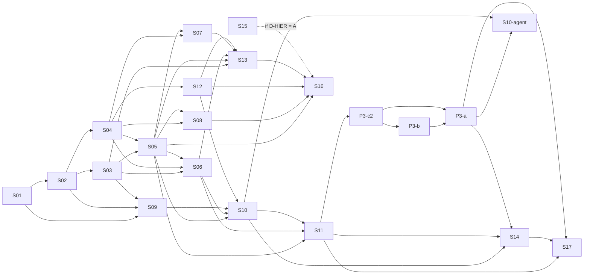

# Org Complete System Implementation Plan

> **For agentic workers:** execute only after the owner explicitly approves the SDD revision and this plan. Every slice has a Builder and a separate independent Critic; no gate in this document is marked passed.

**Goal:** implement the `org` domain (units, titles, positions, assignments, hierarchical policies, autonomous-agent governance) with PostgreSQL schema `org` as source of truth and Neo4j as a derived projection.

**Spec:** [org-module-sdd](../sdd/org-module-sdd.md) (draft, revision 2026-09-27, Critic cycles 1–4, the security verdict on SDD `905ed5e7`, Critic cycle 3 on SDD `f11d9966`/plan `fc85fc93` and the owner and Security decisions of 2026-09-27 applied). The [threat model do `org`](../security/org-module-threat-model.md) (aligned to sha256 `276a98f6`, published by Security with the owner decisions of 2026-09-27) is **normative** for `org`: every SEC-ORG criterion is acceptance of the slice mapped in the traceability table below. The errata [org-plan-authority-errata](org-plan-authority-errata.md) is **incorporated** into this plan and the SDD; the errata file is kept for traceability only.

**Architecture:** `org` owns structure, assignments, policy versions, approvals, delegation, grants, `revocation_epoch` and audit in PG schema `org`, migrated by the central `core::database` runner (`backend/src/core/database/migrations/`; S04 uses the first number after those reserved in [master-plan](master-plan.md) at the time of S04; today ≥ `0014`, since `0000`–`0011` exist, `0012` is reserved for W0-12 and W0-05 takes the next free after `0012`, today `0013`). Neo4j receives an idempotent `graph_domain=org` structural projection through the core outbox/projection seams (SDD D-OUTBOX); it never authorizes. Owner authentication (P1), DB authority (P2) and the runtime/tool gateway including agent-principal authentication (P3) are separate prerequisites.

**Tech stack:** Rust backend, MVC module convention, SQLx/PostgreSQL (code minimum PG 18; CI currently `timescaledb-ha:pg16`, divergence tracked by task T-CI-02), Neo4j via `core::database`, HTTP/OpenAPI, OpenKnowledge, Graphify.

## Global constraints

- `OrgId` is 1:1 with legacy `AgencyId`; `legacy_agency_id NOT NULL UNIQUE` survives cutover.
- Hierarchy per root `AGENTS.md`: owner → CEO → Level B → Level A → specialists/workers. Level C is **not** approved (SDD §3 D-HIER). No slice before S09 encodes levels or tiers, under any D-HIER option, and no alias maps Level C to Level B.
- Exactly one root `OrgUnit` and one root `Position` per org; the root position's occupant is the CEO for global approval. One active occupant per position; one principal may hold many positions, subject to separation of duties. Published `JobTitleVersion`s are immutable.
- **Authority (errata):** PG schema `org` is the only authoritative store for `capability_grants` and `revocation_epoch`. Neo4j is a structural projection; there is **no grants projection into `agents`**. No projection or cache authorizes or keeps a revoked authorization. No cross-database grant and no authority transaction outside PG `org`. The runtime reads grant, assignment, policy ancestry and epoch from PG `org` before every effect; if it cannot, it denies/cancels.
- The outbox is written in the local PG `org` transaction and only propagates/rebuilds projections.
- **Approvals:** global policy needs owner + CEO, **distinct principals**, on the same hash/version. Subordinate policy needs the direct active superior, subset only. No approver may approve policy for a position they occupy or whose subtree contains a position they occupy. No self-approval, and interim delegation never approves. No eligible approver ⇒ blocked. **Approval binding (SEC-ORG-30, F-ORG-20; succession option B proposed by the Architect, accepted by Security, decided by the owner on 2026-09-27; the Critic finds it acceptable):** approval of T's grants is bound to (policy version/`JobTitleVersion` of T, `parent(T)`, assignment of the approving occupant of `parent(T)`); re-parent, title-version change, reuse under another superior, succession or vacancy of a non-root `parent(T)` leave T's grants `reconciling` (risk-reducing actions stay available), with an epoch bump, until the current occupant of `parent(T)`, a principal independent of whoever changed the chain by the creation-and-ownership chain (SEC-ORG-32), re-approves (`403 approver_not_independent`, always `403` by Security's decision; stale tuple → `409 approval_chain_mismatch`; no re-approval within `D-SEC-REAPPROVAL-TTL` → `expired`); the successor sees an audited list of pending re-approvals. Adoption is mandatory before the LGTM of S03 (structural side), S05, S09, S10 and S13 (condition of Security's CONFIRMO). Labels: conditions 1–6 are SDD §7.5; letters (a)–(e) and (d1)–(d6) are the TM's SEC-ORG-30 test cases, and (dN) tests condition N.
- **Owner decisions (Julio, 2026-09-27):** **D-CHAIN-AUTHOR (option A, strict reading):** only the owner, or an occupant strictly above N (the new `parent(T)`; for a title-version change, the current `parent(T)`), changes T's title version or re-parents T; the occupant of N cannot → `403 forbidden_scope` (`409` is only for the root); except for the owner, T stays in the actor's strict subtree, and in a re-parent the old parent O and the new N are in the actor's scope too; the author of a chain change never re-approves, and the occupant of N may re-approve. TM `276a98f6` SEC-ORG-05 ("the new `parent(T)` or an ancestor", case (i) accepting the occupant of N) needs this adjustment by Security. **INV-ROOT (SEC-ORG-34, F-ORG-25):** the root position (CEO) gets its occupant once, at the S12 bootstrap, in the same transaction that creates it; afterwards, for every actor including the owner, there is no assign, succession, unassign, transfer, re-parent, title-version change, freeze or retire of the root, no second root, no child made root, and a batch touching the root is refused whole; the S16 cutover never rewrites the root occupant; every attempt → `409 root_position_immutable` (state invariant; TM `276a98f6` recommends `403`, the owner chose `409`). Deactivation of the root holder in the IdP, revocation of the P3 credential or retirement of the CEO agent is external: it does not vacate the root, actions from the root fail closed and the root keeps its occupant. **D-ROOT-BREAKGLASS (F-ORG-24):** Security's proposal, pending Julio: out-of-band, audited, owner-only recovery of the **same** principal; a permanent loss has no path in the product (SDD §3, §7.3).
- **Security decisions (2026-09-27):** `approver_not_independent` is always `403`; `409` only for real state conflicts; precedence and error mapping in SDD §10; approver independence follows the creation-and-ownership chain (SEC-ORG-32); approvals share the tree lock (SEC-ORG-31); route class `Org` and `400 unknown_field` extractor (SEC-ORG-33).
- **Agent approvers:** an agent approval counts only with P3-c2 agent-principal authentication bound to `AgentId`, assignment and lifecycle; an `AgentId` in a body/header is never proof. Interim rule: only humans approve; agent approvals are rejected with a stable error until P3-a is done and the P3-c2 credential exists (SDD §14).
- `task.start` is separate from `tool.invoke`; every effect rechecks the SoT. "Deny immediately" applies to checks after the revoke commit (TOCTOU window defined in P3-b, maximum `D-SEC-W`). Finance, payments, production and credential/permission changes stay denied until their own SDD, threat model and human approval.
- **Structural authorization (SDD §7.3 matrix, SEC-ORG-05):** act only within the strict subtree of the acting position; assign/transfer/unassign need the approver of the target level (root: owner only); no self-assignment; no re-parenting of one's own position or its ancestors; JobTitle versions are drafted/published only by owner or CEO; re-parent and title-version change follow D-CHAIN-AUTHOR; the root position is immutable (INV-ROOT); a transfer is unassign at the origin + assign at the destination in one transaction, each half authorized by its own row, so a non-owner transfers only between siblings under its acting position (SEC-ORG-21); closing, freezing or retiring a position, or closing a unit, needs a vacant node without active descendants (`409 position_not_vacant` / `409 has_descendants`); `OrgUnit` re-parent follows the position re-parent scope rules, its only effect is an epoch bump (unit and position trees are independent), and a parent in another org gets a uniform `400`/`404`.
- **Activation (SEC-ORG-06):** an assignment made by anyone other than the eligible approver of the target level leaves its grants `reconciling` until that approver confirms.
- **Pending assignment (SEC-ORG-28, F-ORG-18):** a `pending_approver_confirmation` assignment is inert (no structural authority, approval or delegation → `403 assignment_pending`); the confirmer is the eligible approver and a principal distinct from the author (`403 confirmer_not_independent`), while an owner who also occupies `parent(T)` and acts through `Position(parent(T))` gets `ActiveOnCommit`, audited with `actor_is_owner = true` (SEC-ORG-28 (b′)); after `D-SEC-PENDING-TTL` (PG `now()`) it is closed as `expired`, with audit. SDD §7.5 rule (c) makes an approver's assignment to a position covered by its own policy pending (SEC-ORG-27).
- **Monotone authority (SEC-ORG-29, F-ORG-19):** `effective(T) = policy(T) ∩ effective(parent(T))`, evaluated at each decision from PG primary; re-parent, title-version change of T or an ancestor, new version/revocation of an ancestor policy and ancestor vacancy bump the epoch (or chain version) in the same transaction, as do succession, each re-approval and each expiry (SEC-ORG-30 (5)).
- **Security parameters:** `D-SEC-W`, `D-SEC-TTL`, `D-SEC-LEEWAY`, `D-SEC-AUTHZ-TIMEOUT`, `D-SEC-EPOCH-BUMP`, `D-SEC-PENDING-TTL` and `D-SEC-REAPPROVAL-TTL` are owner decisions (threat model §6.4); this plan fixes no numbers.
- **Acting position (SEC-ORG-21):** every command/action names `acting_position_id`; no union of authority across a principal's positions.
- Existing `AgentCapabilities` stay authoritative in `agents` for current consumers; `org` grants never read or override them.
- No module-local pool, runner or `neo4rs` import. Docs/OpenKnowledge and Graphify updated per slice.

## Per-slice workflow (applies to every slice)

1. Owner agrees the slice's public seams (listed per slice) **before** any test is written (AGENTS.md G3).
2. Red: one test of one public behavior fails. Green: minimal implementation. Refactor during review, preserving tests.
3. The threat model exists and is normative. Slices marked **[SEGURANÇA]** must include the SEC-ORG criteria mapped to them (traceability table) as acceptance tests; a change to the threat model re-opens the affected slices.
4. Independent Critic reviews and records a verdict (template at the end). Author never approves own work. Segurança owns the threat model: every [SEGURANÇA] slice has, besides its Critic, the threat model check by Segurança.

## Review focus

1. Concurrent hierarchy edits that jointly create a cycle are serialized/denied (S06).
2. Stale or unavailable policy/epoch denies every check after the revoke commit; cache invalidation and in-flight revalidation (S11, S17).
3. Wrong-organization or spoofed actor/occupant never crosses tenants: domain, SQL constraints, HTTP auth and Neo4j traversal filtered by `org_id` (S02–S05, S07, S08, S13).
4. **(Replaces the former cross-database focus, per errata.)** Grants/epoch are authoritative only in PG `org`; a Neo4j projection or cache that is missing, lagging, duplicated or reordered never authorizes and never delays a revoke; outbox replay is ordered and idempotent (S08, S11).
5. Neo4j lag/down/rebuild never authorizes or loses PG state; rebuild only touches `graph_domain=org` (S08).
6. Separation of duties: the same principal never supplies both global approvals nor approves a policy it benefits from; agent approvals are verifiably attributed (S10).
7. Structural authorization: whoever assigns or re-parents cannot grant capability or pick their own approver outside the matrix; union across positions is impossible (S03, S06, S13, S11); a pending assignment confers nothing (S03, S05, S13) and an approval does not survive a change of chain or of the superior's occupant (structural record in S03, S05, S06, S13; approval and grant effect in S09–S11, S17); the root never changes (INV-ROOT).
8. Authority never grows through structural change: epoch/chain bump in the same transaction and effective limit recomputed at each decision (S06, S11, S17).

## Decisions required from the owner (block only their dependents)

| ID | Decision (SDD §3) | Blocks |
|---|---|---|
| D-HIER | Level C: adopt (A), map to existing levels (B), level/tier as `org` data (C, added additively in S09) | S09, S10, S15, S16 |
| D-SEAM-AGENTS | `org::models` imports `AgentId`/`AgencyId`/`AgentLifecycleState` from `modules::agents` public re-exports vs. `application_contracts` | S01 |
| D-OUTBOX | Reuse core `graph_projection_outbox` (`graph_domain=org`) vs. dedicated `org` outbox | S05 (outbox write), S08, S11 |
| D-OWNER-BIND | Per-org owner vs. existing singleton `product_owner_bootstrap` | S12, S13 |
| D-OWNER-POSITION | May the owner occupy positions? Default: owner occupying any position blocks global policy | S10 |
| `D-SEC-*` | Security parameters of threat model §6.4: `D-SEC-W`, `D-SEC-TTL`, `D-SEC-LEEWAY` (`exp`, `nbf`, `iat`), `D-SEC-AUTHZ-TIMEOUT`, `D-SEC-EPOCH-BUMP`, `D-SEC-PENDING-TTL`, `D-SEC-REAPPROVAL-TTL` | P1 (TTL, leeway), S05/S13 (pending TTL), S10/S11/S17 (re-approval TTL, also the SEC-ORG-32 window), S11 (authz timeout, epoch bump), S17 (W), S18 (epoch bump) |
| D-ROOT-BREAKGLASS | Security's proposal, pending the owner: out-of-band, audited, owner-only break-glass when the identity of the root holder falls (no mechanism specified) | no slice implementation; S18 runbook before launch |

**Decided by the owner on 2026-09-27 (no longer block):** SEC-ORG-30 option B (only the `D-SEC-REAPPROVAL-TTL` value stays open), D-CHAIN-AUTHOR option A, INV-ROOT. These decisions do not approve the SDD or this plan.

## Prerequisite gates

P1/P2/P3 are identifiers, not priorities. None is passed. P3 is split as in [master-plan](master-plan.md) §3.19–§3.21 and §4.4 (P3-cat, P3-c1, P3-c2, P3-b, P3-a). An **approved** P1 is a prerequisite of S07, S10, S11, S12, S13, S14, S16 and S17 (security verdict, F-ORG-02). **LGTM gates (security verdict):** F-ORG-18/19/20 incorporated before the LGTM of S03, S05, S06, S09, S10, S11 and S13; SEC-ORG-30 (decided by the owner 2026-09-27) before the LGTM of S03 and S05 (structural side), S09, S10 and S13 (structural side); SEC-ORG-31/32 before the LGTM of S10 and S11; SEC-ORG-33 before the LGTM of S07 and S13; F-ORG-25 (SEC-ORG-34) before the LGTM of S02, S03, S05, S12, S13 and S16.

### P1 — Owner authentication / IdP and bootstrap (human principals only)

- Provider, issuer/audience, signature and key rotation, expiry/revocation, mapping to `HumanPrincipal(issuer, subject)`; D-OWNER-BIND.
- Per-organization owner bootstrap via controlled operator setup or signed enrollment; no public self-appointment. `BOT_HTTP_ADMIN_TOKEN` and `VerifiedProductOwner` never substitute owner identity.
- Location of the auth seam is chosen in the P1 SDD: there is **no** `core/auth` today; the only HTTP seam is the admin bearer in `presentation/http/admin_auth.rs`.
- Agent principals are **not** in P1 (see P3).
- Per-principal `principal_auth_epoch`/session version checked on every request, short access token, logout-all and revocation on owner transfer (F-ORG-02, SEC-ORG-15); verified per-person identity or audited out-of-band approval for a human CEO distinct from the owner (F-ORG-06); owner binding only by P1 enrollment, never by env string (SEC-ORG-23).
- Acceptance: valid/invalid/expired/wrong-issuer/wrong-audience/replayed/org-mismatch credentials tested at a real HTTP entrypoint; actor always server-derived; SEC-ORG-15 tests (token rejected after logout-all/owner transfer, TTL ≤ `D-SEC-TTL`, leeway ≤ `D-SEC-LEEWAY` (owner decisions, threat model §6.4), `alg`/`none`/JWKS rotation).

### P2 — DB roles, migrations and isolated PostgreSQL

- Central DB/schema `org` ownership; runtime DML role vs. migration role; runtime role has only `INSERT`/`SELECT` on `org_audit_events`; core runner as sole executor.
- Disposable PG with the version the code requires (PG 18 vs. CI `pg16`: task T-CI-02); never the shared `trading_bot`. The isolation guard must not rely only on the DB name, because CI's ephemeral service is also named `trading_bot`.
- Acceptance: fresh/upgrade/rollback run isolated with cleanup proof; no pool or runner inside `org`.

### P3 — Runtime/tool-gateway package, capability catalog and agent-principal authentication

Split per [master-plan](master-plan.md) §3.19–§3.21 and §4.4. Wave-3 order: **P3-cat → P3-c1 → S09–S11 (human-only approval) → P3-c2 → P3-b → P3-a → S14, S17 + agent approval in S10**; P3-cat and P3-c1 may run in parallel. The master plan gives P3-cat + P3-c1 as the P3 dependencies of S09–S11 (the master plan itself is not edited here).

- **P3-cat — capability catalog:** typed, closed capability/action/resource/limit schema, no enforcement; approval protocol; which changes are restrict-only vs. global-envelope. Needed by S09–S11 and P3-b.
- **P3-c1 — basic agent credential (after P1):** short-lived server-issued credential bound to `AgentId` + lifecycle, immediate revocation, an agent never authenticates as a human; no effect on approvals yet. Interim rule until agent approval is enabled: **only humans approve**. Needed by S09–S11. (Agent authentication sits in P3 because the runtime/tool gateway executes agent actions; there is no agent credential in the code today, and `promoted_by` in `/bots/runtime/promote` is an unauthenticated body field.)
- **P3-c2 — credential bound to assignment and epoch (after P3-c1, S05/S06 and S11):** the credential carries assignment + `revocation_epoch` and a change invalidates it at the next check; issuance, rotation and revocation; the only accepted proof for agent approvals (S10, after P3-a), agent revocations (SEC-ORG-26) and agent-initiated delegation (S14).
- **P3-b — tool gateway (implementation after P3-c2; its SDD, the TOCTOU contract, is a document prerequisite of S11):** reads grant/epoch on PG `org` before each effect; outbox owner, per-agent ordering, idempotency, retry/DLQ, registered consumer acks for `revocation_complete`; committed revoke increments the PG epoch and every later check denies, with no grace period; TOCTOU window ≤ `D-SEC-W` and audit of effects completed after the commit; high-impact deny.
- **P3-a — runtime/scheduler (after P3-c2 and P3-b):** `task.start` vs. `tool.invoke`, per-action authorization, cancellation/revalidation. Unlocks S14, S17 and agent approval in S10.
- Acceptance: separate SDDs reviewed by independent Critics with threat model; `org` implements no external effects.

## Dependency table

✔ = required; — = not required. "Other" lists slice and owner-decision dependencies.

| Slice | Former task | P1 | P2 | P3 | Other | [SEGURANÇA] |
|---|---|---|---|---|---|---|
| S01 Domain IDs, occupant reference, import rule | 1 | — | — | — | D-SEAM-AGENTS | — |
| S02 Structure invariants (units, titles, supervisor tree) | 1, 3 (pure) | — | — | — | S01; LGTM: F-ORG-25 | — |
| S03 Position/assignment invariants + structural authorization matrix (pure) | 1, 4 (pure) | — | — | — | S01, S02; LGTM: F-ORG-18/19/20 + SEC-ORG-30 (structural side) | — (implements SEC-ORG-05/06/21/28, the structural side of SEC-ORG-30 and INV-ROOT as pure functions; the threat model is an existing input, not a gate) |
| S04 Schema + repository: org map, units, titles, positions | 2 | — | ✔ | — | S02 | tenant isolation, DB roles |
| S05 Schema + transactions: assignments and audit | 2, 4 | — | ✔ | — | S03, S04, D-OUTBOX, D-SEC-PENDING-TTL; LGTM: F-ORG-18/19/20 + SEC-ORG-30 (structural side) | tenant isolation, pending assignment (SEC-ORG-28), chain-change record (SEC-ORG-30) |
| S06 Concurrent hierarchy edits and re-parent authorization (`SERIALIZABLE`) | 3 | — | ✔ | — | S03, S04, S05; LGTM: F-ORG-18/19/20 | privilege escalation (re-parent), monotone authority (SEC-ORG-29) |
| S07 Authenticated read-only API | 7 | ✔ (approved) | ✔ | — | S04, S05, W0-01 class `Org`; LGTM: SEC-ORG-33 | tenant isolation (incl. traversal), PII, route class |
| S08 Neo4j structural projection | 6 | — | ✔ | — | S04, S05, D-OUTBOX | tenant isolation (traversal), PII |
| S09 Policy domain types (pure; tier if D-HIER=C) | 5 (pure) | — | — | P3-cat, P3-c1 | S01, S02, S03, D-HIER; LGTM: F-ORG-18/19/20 + SEC-ORG-30 | privilege escalation |
| S10 Policy approvals persistence + API | 5 | ✔ (approved) | ✔ | P3-cat, P3-c1 (human-only approval); increment S10-agent after P3-a + P3-c2 | S05, S06, S09, S12, D-OWNER-POSITION, D-SEC-REAPPROVAL-TTL; LGTM: F-ORG-18/19/20 + SEC-ORG-30/31/32 | privilege escalation, separation of duties, agent auth |
| S11 Grants and `revocation_epoch` | 5 | ✔ (approved) | ✔ | P3-cat, P3-c1, P3-b SDD (contract only) | S05, S06, S10, D-OUTBOX, D-SEC-AUTHZ-TIMEOUT, D-SEC-EPOCH-BUMP, D-SEC-REAPPROVAL-TTL; LGTM: F-ORG-18/19/20 + SEC-ORG-31/32 | revocation, TOCTOU, pending assignment, monotone authority |
| S12 Per-org owner bootstrap and transfer | 8 | ✔ (approved) | ✔ | — | S04, D-OWNER-BIND; LGTM: F-ORG-25 | owner bootstrap, actor derivation |
| S13 Mutating API: structure and assignments (no grants) | 8 | ✔ (approved) | ✔ | — | S03, S05, S06, S07, S12, D-SEC-PENDING-TTL, W0-01 class `Org`; LGTM: F-ORG-18/19/20 + SEC-ORG-30 (structural side) + SEC-ORG-33 | privilege escalation (matrix), tenant isolation, actor derivation, route class |
| S14 Interim delegation | 5 | ✔ (approved) | ✔ | P3-a (after P3-c2, P3-b; agent-principal auth = P3-c2) | S10, S11 | authority delegation, agent auth |
| S15 Role serialization migration (only if D-HIER = A) | 9 (part) | — | ✔ | — | D-HIER | privilege escalation (role mapping) |
| S16 Hierarchy cutover from `agents.supervisor` | 9 | ✔ (approved) | ✔ | — | S05, S08, S12, S13, D-HIER, S15 if A; LGTM: F-ORG-25 | cutover authority |
| S17 Runtime/tool integration | 10 | ✔ (approved) | ✔ | P3-a, P3-b, P3-c2 (is P3) | S11, S14, D-SEC-W | revocation, high-impact deny |
| S18 Operations, docs, final verification | 11 | — | — | — | runs with each slice; release after all | — |

Changes relative to the previous draft: structure/assignment writes (S13) no longer wait for P3 because they emit no grants (consistent with SDD §19 step 4); structural Neo4j projection (S08) uses the existing core outbox and no longer waits for P3; policy/grant/delegation work (S09–S11, S14) and runtime (S17) keep P3. Critic cycle 1: agent-principal authentication assigned to P3 (S10, S14); separation of duties added to S10; S02 no longer carries a [SEGURANÇA] precondition; tier (D-HIER option C) moved to S09 as an additive change; traversal tenant filter added to S07/S08. Critic cycle 3 (threat model F-ORG-01): structural authorization matrix as pure function in S03, enforced in PG in S06 and at HTTP in S13; SEC-ORG-06 confirmation state in S05/S13 and grant effect in S11; acting position (SEC-ORG-21) from S01 to S17; SEC-ORG-03/10/14/19 mapped below. P1/P2/P3 columns unchanged. Critic cycle 4 + security verdict (threat model `c1d21216`): the P3 column now uses the master-plan split (S09–S11 on P3-cat + P3-c1 with human-only approval; S14, S17 and agent approval after P3-a); F-ORG-18/19 block S05, S06, S11, S13; approved P1 before S07, S10, S12, S13; the F1 approval binding (then pending SEC-ORG-30, since decided by the owner on 2026-09-27) conditioned the G1 of S09/S10; `D-SEC-*` parameters added where used. Alignment to threat model `5dd982c6`: SEC-ORG-05 codes (`409 position_not_vacant`, `409 has_descendants`) and cross-org `OrgUnit` parent; approved P1 also before S11, S14, S16, S17; LGTM of S03/S05/S06/S09/S10/S11/S13 gated by F-ORG-18/19/20, and of S03 (title-version row)/S05/S09/S10/S13 by SEC-ORG-30 (option B, later decided by the owner on 2026-09-27); N3 map; SEC-ORG-28 (b′), SEC-ORG-20 startup failure and SEC-ORG-30 (a)–(e) with (d1)–(d6). Critic cycle 3 on `fc85fc93` (A1): S03, S05, S06 and S13 assert only the structural side (chain-change record, epoch bump, activation value); approval and grant assertions (`403`/`409`, `reconciling`, gateway, (d6), SEC-ORG-27) moved to S09–S11; added dependencies S09←S02/S03, S10←S05/S06, S11←S06, S06←S05, S13←S07; S05 no longer waits for `D-SEC-REAPPROVAL-TTL`; S07/S13 wait for the W0-01 class `Org` (SEC-ORG-33).

Dependency graph (slices only; P1/P2/P3 gates and owner decisions omitted; S18 runs with every slice). S10-agent is the agent-approval increment of S10, after P3-a; it is a separate node so the graph stays acyclic:



## Task 1 independence (evidence and slicing change)

**Verdict:** the original Task 1 was *almost* independent; it is now split into S01–S03, which depend on no DB, no auth, no runtime, no threat model and no D-HIER option.

Evidence from the code (2026-09-27):

- `backend/src/modules/org` does not exist; nothing to migrate or wire.
- The only external types S01–S03 need are `AgentId`, `AgencyId` (`modules/agents/models/identity.rs`, imports only `std::fmt` and `thiserror`) and `AgentLifecycleState` (`models/definition.rs`, pure enum). All are publicly re-exported by `modules/agents/mod.rs`. No SQLx, tokio, HTTP or config.
- Tests run as `cargo test --locked --bin bot modules::org::tests` without `DATABASE_URL`, Neo4j or IdP. The S01 import-direction rule is a shell-script change, also without external services.
- S01–S03 carry no [SEGURANÇA] precondition: same-org, acyclicity and the structural authorization matrix are pure functions over an in-memory snapshot. S03 implements SEC-ORG-05/06/21/28, the structural side of SEC-ORG-30 and the owner decisions INV-ROOT and D-CHAIN-AUTHOR from the already existing normative threat model and SDD; that document is an input, not a gate, and needs no DB, auth or runtime. The acting principal is a value (`OccupantRef` or owner `HumanPrincipal`), not an authenticated context.
- The only remaining pre-condition is **owner agreement** on D-SEAM-AGENTS and on the S01–S03 seams (process gate, not a technical dependency).

What was changed to make it true:

1. Removed policy and delegation state enums from Task 1 → S09 (they depend on the P3-cat capability catalog).
2. Removed any role/level/tier typing from Task 1 and from S04 → S09/S15 (depends on D-HIER).
3. `HumanPrincipal` in S01 is an opaque, bounded, normalized pair; IdP semantics and verification stay in P1.
4. "One active assignment per position" and "retired agent closes assignments" are pure rules over in-memory values in S03; the atomic transactional closure and DB uniqueness move to S05.
5. `OrgId↔AgencyId` is an in-memory mapping type in S01; the `UNIQUE` guarantee is S04.

## Slices

Builder/Critic are roles; concrete independent instances are assigned by the Orchestrator per AGENTS.md. Files are indicative.

### S01 — Domain IDs, occupant reference and import rule

- **Depends on:** none (D-SEAM-AGENTS agreement). **Builder:** backend domain. **Critic:** architecture/patterns.
- **Seams to agree:** `OrgId`, `OrgUnitId`, `JobTitleId`, `JobTitleVersionNo` (monotonic number of the `JobTitleVersion` entity), `PositionId`, `AssignmentId` constructors and normalization rules (proposal: same as `agents`: trimmed, non-empty, ≤64 chars, no control characters); `HumanPrincipal { issuer, subject }` as opaque validated pair; `OccupantRef::{Human, Agent(AgentId)}`; `ActingContext::{Owner, Position(PositionId)}` (SEC-ORG-21); `OrganizationAgencyMap(OrgId, AgencyId)`; `OrgDomainError` variants (including `ForbiddenScope`, `SelfAssignmentForbidden`, `AssignmentPending`, `ConfirmerNotIndependent`, `PositionNotVacant`, `HasDescendants`, `HierarchyConflict`, `RootPositionImmutable`, `ApproverNotIndependent`, `ApprovalChainMismatch`); S09 adds the policy variants.
- **Acceptance:** invalid IDs rejected with typed errors; `HumanPrincipal` `Debug`/`Display` never prints raw issuer/subject; no SQL/HTTP/tokio imports in `modules/org/models`; `check-import-direction.sh` gains a rule rejecting `modules::org::` in `presentation/http/routes` (today it only checks `modules::agents::`); the Builder proves it reproducibly with a script self-test: the script accepts an alternative `SRC` (e.g. `SRC=<fixture> bash scripts/check-import-direction.sh`), a committed fixture containing a forbidden `modules::org::` import in a routes path makes it exit non-zero with the `FAIL` line, and the real tree still passes; both outputs are recorded in the delivery log.
- **Files:** `modules/org/{mod.rs,models/ids.rs,models/occupant.rs,models/error.rs,tests.rs}`, `modules/mod.rs`, `scripts/check-import-direction.sh`.

### S02 — Structure invariants (pure)

- **Depends on:** S01. **Builder:** backend domain. **Critic:** architecture/patterns.
- **Seams to agree:** exactly one root `OrgUnit` and exactly one root `Position` per org (the only position with no supervisor; its occupant is the CEO); `JobTitleVersionState` transitions (`draft→published→retired`); pure validators `validate_unit_parent(...)`, `validate_supervisor(...)`, `is_in_strict_subtree(ancestor, target, snapshot)` over an in-memory snapshot, returning `OrgDomainError`.
- **Acceptance:** second root unit rejected; a second root position or a supervisor change to null (child made root) → `RootPositionImmutable` (INV-ROOT, SEC-ORG-34 (g)); cross-org parent/supervisor rejected (SEC-ORG-07); unit and position cycles rejected; published version content immutable; a position is never in its own strict subtree.

### S03 — Position and assignment invariants (pure)

- **Depends on:** S01, S02; owner decisions D-CHAIN-AUTHOR and INV-ROOT (decided 2026-09-27). **LGTM gate:** F-ORG-18/19/20 incorporated; SEC-ORG-30 (decided by the owner 2026-09-27) for the structural side of rows 4, 7 and 9. **Builder:** backend domain. **Critic:** QA.
- **Seams to agree:** `PositionState` (`filled` derived); `AssignmentState` (`pending_approver_confirmation | confirmed | expired | ended`; pending and expired never count as active); validators `can_assign(position, occupant, lifecycle)`, `can_freeze/retire(position, active_assignment)`, `assignments_to_close_on_retire(agent)`; lifecycle passed as `AgentLifecycleState` value; `StructuralOp` (create, close unit/retire position, open/freeze, assign/unassign, transfer O→T, re-parent position, re-parent `OrgUnit`, change title version, draft/publish/retire title version, bootstrap root with its occupant); `authorize_structural(actor, acting: ActingContext, op, snapshot) -> Result<StructuralDecision, OrgDomainError>` with `StructuralDecision { activation: Activation::{ActiveOnCommit, PendingApproverConfirmation, NoGrants}, chain_changed: positions whose `parent`/title/approving occupant changes, epoch_scopes }` (SDD §7.3 matrix). S03 asserts only this structural value; approval and grant effects (`reconciling`, gateway, `approver_not_independent`, `approval_chain_mismatch`) are tested in S09–S11.
- **Acceptance:** one active assignment per position; multiple positions per occupant accepted; frozen/retired positions refuse assignment; occupied position refuses freeze/retire; paused agent keeps assignment; retired agent cannot be assigned and yields the full close set, except the root assignment, which stays (row 6). **Matrix (SEC-ORG-05): at least one positive and one negative test for each row of SDD §7.3**, through `authorize_structural`:
  1. Create unit/position under X — positive: A creates under its strict subtree → `NoGrants`, position vacant; negative: X outside A's scope → `ForbiddenScope`; position without supervisor (second root) → `RootPositionImmutable`; second root unit → `HierarchyConflict`.
  2. Close unit U — positive: vacant U without active positions or units in A's unit scope → allowed; negative: U with an active position or unit → `HasDescendants`; U = `unit(A)` or an ancestor → `ForbiddenScope`. Retire position T — positive: vacant T without active descendants in A's strict subtree → allowed; negative: occupied T (including pending) → `PositionNotVacant`; active descendant → `HasDescendants`; T = A or an ancestor → `ForbiddenScope`.
  3. Open/freeze position T — positive: A opens a planned T and freezes a vacant T in its strict subtree; negative: T = A or an ancestor → `ForbiddenScope` (open and freeze); freezing an occupied T → `PositionNotVacant`, with an active descendant → `HasDescendants`.
  4. Assign/unassign non-root T — positive: direct superior assigns in its strict subtree → `ActiveOnCommit`; direct superior unassigns T → allowed, `chain_changed` lists T's children (vacancy of their `parent`, SEC-ORG-30 condition 4) and `epoch_scopes` has T's subtree; negative: intermediate occupant assigns to a peer or superior → `ForbiddenScope`; assign self → `SelfAssignmentForbidden`; unassign of T outside the actor's strict subtree → `ForbiddenScope`.
  5. Transfer O→T — positive: A with `parent(O) = parent(T) = A` (siblings; without union across positions, SEC-ORG-21, a non-owner cannot be approver of both ends otherwise) → unassign + assign, activation as in row 4; owner transfers between any non-root positions; negative: O in scope and T outside → `ForbiddenScope`, and the inverse (O outside, T in scope) → `ForbiddenScope` (SEC-ORG-05 (f)).
  6. Root position after bootstrap (INV-ROOT, SEC-ORG-34) — positive: the root occupant set by the bootstrap (row 11) stays, and `assignments_to_close_on_retire` for the retired CEO agent returns the close set without the root assignment (the root is not vacated, SEC-ORG-34 (j)); negative: one test per forbidden operation, each by the owner and by another actor → `RootPositionImmutable`: assign of another occupant (succession), unassign, transfer from or to the root, re-parent of the root, re-parent of a child to a null parent, change of the root's title version, freeze, retire.
  7. Re-parent position T (O → N) — positive: A strictly above N, with T and N in A's strict subtree and O = A or in A's strict subtree, re-parents T → allowed, `chain_changed = [T]`, `epoch_scopes` has T's subtree (SEC-ORG-29); owner, for any non-root T and N → same; with the tree R → X → O → T and R → X → Y → N, the occupant of X succeeds; negative: own position or an ancestor → `ForbiddenScope`; the occupant of N re-parents T to N, even with T in its strict subtree (D-CHAIN-AUTHOR, strict) → `ForbiddenScope`; the occupant of O (above T's old parent, not above N) → `ForbiddenScope`; N outside scope → `ForbiddenScope`; root T or N null → `RootPositionImmutable`; cycle → `HierarchyConflict`.
  8. Re-parent `OrgUnit` U — positive: A re-parents U inside its unit scope → allowed, `epoch_scopes` has U's scope and `chain_changed` is empty (unit and position trees are independent, SDD §7.3); negative: U = `unit(A)` or an ancestor → `ForbiddenScope`; root unit → `ForbiddenScope`; cycle → `HierarchyConflict`; N in another org → cross-org rejection (uniform `400`/`404` at HTTP, SEC-ORG-05 (h)).
  9. Change title version of T — positive: owner, or A strictly above `parent(T)`, changes the version → allowed, `chain_changed = [T]`, `epoch_scopes` has T's subtree; negative: the occupant of `parent(T)` (approver of T's level) → `ForbiddenScope` (D-CHAIN-AUTHOR, strict); actor outside scope → `ForbiddenScope`; root T → `RootPositionImmutable`. The approval side (author never re-approves, approval under another superior) is S10.
  10. Draft/publish/retire title version — positive: owner or root occupant; negative: any other position → `ForbiddenScope`.
  11. Bootstrap root — positive: owner at bootstrap creates the root unit, the root position and its occupant in one operation → `ActiveOnCommit`; negative: owner as occupant → `SelfAssignmentForbidden`; a later attempt by any actor → `RootPositionImmutable`.
- **SEC-ORG-06:** owner assigning a non-root position → `PendingApproverConfirmation`. **SEC-ORG-28:** a pending or expired assignment used as acting position (assign, approve, delegate) → `AssignmentPending`; confirmation by the assignment's author, including the owner who also occupies `parent(T)` → `ConfirmerNotIndependent`; (b′) the same principal acting through `Position(parent(T))` with `acting_position_id = parent(T)` → `ActiveOnCommit`, audited with `actor_is_owner = true`; with `parent(T)` vacant the owner fills the chain below the root, which is never vacant after bootstrap (`ActiveOnCommit`), and confirmation proceeds (no deadlock). **SEC-ORG-21:** an acting position the actor does not occupy → denied; authority from position X is never used for a target only reachable from position Y. SEC-ORG-27 needs policies and moved to S09–S11 (Critic cycle 3, A1).

### S04 — Schema and repository: org map, units, titles, positions

- **Depends on:** P2, S02. **Builder:** data/backend. **Critic:** database; threat model: Segurança. **[SEGURANÇA]** tenant isolation, DB roles.
- **Seams to agree:** migration numbered as the first number after those reserved in [master-plan](master-plan.md) at the time of S04 (today ≥ `0014`: `0000`–`0011` exist, `0012` is reserved for W0-12, W0-05 takes the next free after `0012`, today `0013`), e.g. `00NN_org_structure.sql`, with table/constraint list, `positions.created_by` (SEC-ORG-32 data) and **no level/tier column**; `OrgRepository` port methods taking a `core` transaction and an `AuthorizedOrgScope` (SEC-ORG-03; production constructor only in the auth layer delivered with P1, test constructor behind `cfg(test)`); no own pool.
- **Acceptance:** SEC-ORG-03 (a) visibility test proves no public constructor of `AuthorizedOrgScope` outside the auth layer, (b) position with a unit of another org → FK violation, (c) every SELECT has a two-org test; isolated PG tests for cross-org FK rejection, `legacy_agency_id` uniqueness, one root unit/position per org, immutable published version guard, fresh + upgrade migration; runtime role has DML only.

### S05 — Assignments, audit and outbox write

- **Depends on:** P2, S03, S04, D-OUTBOX, D-SEC-PENDING-TTL. **LGTM gate:** F-ORG-18/19/20 incorporated; SEC-ORG-30 structural side. **Builder:** data/backend. **Critic:** database; threat model: Segurança. **[SEGURANÇA]** tenant isolation, pending assignment (SEC-ORG-28), chain-change record (SEC-ORG-30).
- **Seams to agree:** `assign_occupant`, `end_assignment`, `transfer_occupant`, `retire_agent_assignments`, `confirm_assignment` command shape (actor, `acting_position_id`, expected version, idempotency key, reason code); `assignments.confirmation_state` (`confirmed | pending_approver_confirmation | expired`), author and confirmer (SEC-ORG-32 data); chain-change record (position, cause, author, previous and new `parent`/title/approving assignment, timestamp) that S10/S11 consume; audit event schema; outbox payload; `principal_ref = HMAC-SHA256(k, issuer‖subject)` with `k` from `core::config`, stored outside PG/Neo4j.
- **Acceptance:** partial unique index blocks a second active occupant; SEC-ORG-06 persistence: assignment recorded with the `Activation` from S03 and only an eligible approver's `confirm_assignment` sets `confirmed`; SEC-ORG-19: different keys yield different refs and audit/outbox payloads contain no `issuer`/`subject`; SEC-ORG-17: allowed and denied commands each produce exactly one audit event with `correlation_id`; SEC-ORG-24: `UNIQUE (org_id, idempotency_key)`, same key in two orgs gives independent commands; SEC-ORG-03: every assignment/audit SELECT has a two-org test; injected failure rolls back the whole transfer (assignment + audit + outbox); audit append-only enforced by privilege (runtime role has `INSERT`/`SELECT` only on `org_audit_events`) and proved by a test where `UPDATE` and `DELETE` with the runtime role fail; no grants written. **Transfer (F2):** unassign at O + assign at T in one transaction, each half authorized by its row; a failure in either half rolls back both. **INV-ROOT (SEC-ORG-34, F-ORG-25):** `assign_occupant`, `end_assignment` and `transfer_occupant` touching the root → `409 root_position_immutable`, zero rows changed, one deny audit event; `retire_agent_assignments` for the CEO agent closes its other assignments and keeps the root one (not vacated, SEC-ORG-34 (j)); a multi-row command or import with one row touching the root is refused whole, zero rows (SEC-ORG-34 (h)); defense in depth (P2): a PG trigger rejects `UPDATE`/`DELETE` of the root assignment and of the root `supervisor_position_id` after bootstrap, and a direct runtime-role `UPDATE` fails (SEC-ORG-34 (k)). **SEC-ORG-28 (F-ORG-18, blocks the LGTM):** assignment rows carry author, `confirmation_state`, confirmer and expiry; `confirm_assignment` by the author → `403 confirmer_not_independent`; after `D-SEC-PENDING-TTL` by PG `now()` the pending assignment reads as expired, is closed as `expired` with exactly one audit event, and can no longer be confirmed. SEC-ORG-28 (b′): an owner who also occupies `parent(T)` assigning through `Position(parent(T))` → `ActiveOnCommit`, with an audit row carrying the acting position and `actor_is_owner = true`. **SEC-ORG-29 (triggers):** vacancy or succession in a non-root ancestor bumps the affected epoch in the same transaction as the assignment change; injected failure → neither persists. **SEC-ORG-30 (structural side):** unassign, succession or vacancy in `parent(T)` writes one chain-change record for each child T and bumps the epoch exactly once in the same transaction; injected failure → neither persists. Approval invalidation and `409 approval_chain_mismatch` are S10; grant state is S11.

### S06 — Concurrent hierarchy edits

- **Depends on:** P2, S03, S04, S05. **LGTM gate:** F-ORG-18/19/20 incorporated. **Builder:** backend. **Critic:** database + security. **[SEGURANÇA]** privilege escalation (re-parent), monotone authority (SEC-ORG-29).
- **Seams to agree:** org-level lock + `SERIALIZABLE` + bounded retry on serialization failure only; re-parent and title-change commands run `authorize_structural` inside the same transaction after the lock, reading the epoch `FOR SHARE` (SEC-ORG-12).
- **Acceptance:** two concurrent edits that together form a cycle cannot both commit, the loser gets `409 hierarchy_conflict` (SEC-ORG-07); committed graph acyclic. Re-parent (SEC-ORG-05), isolated PG: positive, an occupant strictly above N re-parents T inside its strict subtree to N, the epoch of T's subtree is bumped and one chain-change record for T is written in the same transaction; negative, re-parent of own position, of an ancestor, by the occupant of N (D-CHAIN-AUTHOR, strict), by the occupant of an O not above N, or to an N outside the actor's scope → `403 forbidden_scope`; of the root or to a null parent → `409 root_position_immutable`; each with zero rows changed and a deny audit event; a concurrent re-parent and assignment on the same subtree cannot both commit with a stale authorization. Title-version change: positive by owner or an occupant strictly above `parent(T)` (epoch bump + chain-change record); negative by the occupant of `parent(T)` → `403 forbidden_scope`. **`OrgUnit` re-parent (F3, M7):** same positive/negative set as positions (own unit or ancestor, root unit, out-of-scope N → `403 forbidden_scope`; cycle → `409 hierarchy_conflict`; zero rows changed and a deny audit event), plus a parent in another org → uniform `400`/`404` (SEC-ORG-05 (h)); the positive bumps only the epoch of U's scope and writes no chain-change record. **SEC-ORG-29 (F-ORG-19, blocks the LGTM):** re-parent of a position or unit, title-version change of T or an ancestor, and non-root ancestor vacancy or occupant change each bump the affected epoch in the same transaction; injected failure → neither the change nor the bump persists. Grant effects of re-parent (`reconciling`, gateway `403` until N approves) are S11.

### S07 — Authenticated read-only API

- **Depends on:** approved P1, P2, S04, S05, W0-01 route table with class `Org` (cross-SDD follow-up, SEC-ORG-33). **Builder:** backend/HTTP. **Critic:** security. **[SEGURANÇA]** tenant isolation, PII.
- **Seams to agree:** OpenAPI for reads under `/api/v1` (org, tree, titles, positions, current occupant, history, chain); route class `Org` (SDD §8); error contract `ApiErrorBody { error, code }` (SDD §10); JSON extractor that maps unknown fields to `400 unknown_field` (SDD §9; none exists in code today, and axum 0.8's default `Json` gives `422` plain text); pagination/version token; every query (PG and Neo4j traversal) scoped by the actor's `org_id`.
- **Acceptance:** SEC-ORG-02 (member of A on `/api/v1/orgs/{B}/…` → uniform `404 org_not_found`, zero B rows read), SEC-ORG-03 (repositories only via `AuthorizedOrgScope`), SEC-ORG-04 (read traversal goes only through the parameterized S08 port with `org_id`), SEC-ORG-18 (PG failure → `503 org_store_unavailable` without driver text), SEC-ORG-20 (no private reads without the P1 verifier, regardless of `BOT_HTTP_ADMIN_TOKEN`; feature `org` enabled without the P1 verifier → startup fails); SEC-ORG-33 (a) inventory test: every `/api/v1/org*` route has class `Org` and a policy, (b) per read route: no credential → `401` (or `503 owner_auth_required` without P1), valid admin token → `401`, P1 bearer of another org → `404 org_not_found`, (c) P1 bearer on an admin `Protected` route → `401`, (e) an `org` route registered outside the table fails the guard test; unauthenticated and wrong-org reads denied at the real route; a traversal request for another org's position returns nothing from that org (cross-org traversal test); DTOs redact principals; Neo4j-down traversal returns `degraded`, never empty.

### S08 — Neo4j structural projection

- **Depends on:** P2, S04, S05, D-OUTBOX. **Builder:** data/graph. **Critic:** database; threat model: Segurança. **[SEGURANÇA]** tenant isolation (traversal), PII in projection.
- **Seams to agree:** projection payload (aggregate ID, `org_id`, version, event ID, redacted fields); new `GraphProjectionPort` method or generic event; traversal query API with mandatory `org_id` parameter; `graph_domain=org` added to the unified Neo4j strategy doc.
- **Acceptance:** SEC-ORG-04 (A/B fixture with a wrong `REPORTS_TO` A→B: A's traversal returns only A nodes; Cypher-payload ID → 400/empty and graph intact; no `format!`-built query); SEC-ORG-19 (projection carries `principal_ref`, never `issuer`/`subject`); every projected node carries `org_id`; traversal queries without `org_id` are not expressible through the port; cross-org traversal test with two orgs returns only the caller's org; idempotent `MERGE`; out-of-order version rejected; rebuild replaces only `graph_domain=org`; Neo4j outage leaves PG committed and outbox pending; no PII.

### S09 — Policy domain types (pure)

- **Depends on:** P3-cat, P3-c1 (interim: only humans approve), D-HIER, S01, S02, S03. **LGTM gate:** F-ORG-18/19/20 incorporated and SEC-ORG-30 (decided by the owner 2026-09-27; condition of Security's CONFIRMO: a reused `JobTitleVersion` counts only within the intersection with its chain). **Builder:** backend domain. **Critic:** security. **[SEGURANÇA]** privilege escalation.
- **Seams to agree:** `CapabilityPolicyVersion`, typed limits, `is_subset_of(ancestor)`, approval-requirement function per level (from D-HIER), hash definition, pure eligibility check `is_eligible_approver(principal, policy_scope, target_position, occupancy_snapshot)` (separation of duties): rejects a principal occupying the target position or any position in its subtree, with **one exception**: the CEO (root-position occupant) is eligible **only** for the global policy of its own org and **only** jointly with the distinct owner approval (SDD §7.5 rules a/b). Pure `is_independent(approver, author, provenance_snapshot, now)` (SEC-ORG-32: placement or position creation by the author within `D-SEC-REAPPROVAL-TTL`, creator/owner chain of agents and keys, same person). `OrgDomainError` gains `PolicyExceedsAncestor` (`422 policy_exceeds_ancestor`) and `PolicyHashMismatch` (`409 policy_hash_mismatch`). If D-HIER = C: tier as a new nullable column on `job_title_versions` in its own migration plus a new published title version carrying the tier; published versions are never rewritten; a version without tier admits no subordinate policy. Approval tuple `(policy_version/JobTitleVersion, parent(T), approver_assignment)` and pure `approval_is_current(approval, snapshot)` (SEC-ORG-30); `effective(T) = policy(T) ∩ effective(parent(T))`.
- **Acceptance:** expansion beyond ancestor → `PolicyExceedsAncestor`; effective limit is the chain intersection; hash changes invalidate approvals (`PolicyHashMismatch`); eligibility rejects approver occupying the target position or its subtree; **positive test:** CEO is eligible for its own org's global policy when a distinct owner also approves; **negative tests:** CEO is not eligible for a subordinate policy of a position whose subtree contains another position the CEO occupies, CEO is not eligible for another org's global policy, and CEO approval alone (or with an owner who is the same principal) does not satisfy the global policy (`ApproverNotIndependent`). **SEC-ORG-30 (pure; LGTM gate):** an approval recorded under superior S1 is not current for the same version under S2 (reuse or re-parent, TM case (c)), nor after the occupant of a non-root `parent(T)` changes or it becomes vacant (cases (d), (d4)); re-approval by the principal who changed the chain is ineligible (case (d2)); rules (b) and (c) are evaluated against the current superior's position and assignment, never the original approver's. **SEC-ORG-32 (pure):** TM cases (a)–(d) and (f) over a provenance snapshot. **SEC-ORG-27 (pure):** the approver of P assigned to a position covered by P → grants withheld until another eligible approver approves a new version; its own approval of the new version is ineligible. **SEC-ORG-29 (a) (pure property test):** for any tree and policies, `effective(T) ⊆ effective(A)` for every ancestor A.

### S10 — Policy approvals: persistence and API

- **Depends on:** approved P1, P2, P3-cat, P3-c1 (interim: only humans approve; P3-c2 comes after S11 and agent approval is the separate increment S10-agent, enabled only after P3-a with the P3-c2 credential), S05, S06, S09, S12, D-OWNER-POSITION, D-SEC-REAPPROVAL-TTL. **LGTM gate:** F-ORG-18/19/20 incorporated, SEC-ORG-30 (decided by the owner 2026-09-27), SEC-ORG-31 and SEC-ORG-32. **Builder:** backend. **Critic:** security. **[SEGURANÇA]** privilege escalation, separation of duties, agent auth.
- **Seams to agree:** `approve_global_policy(actor, org, version, hash)`, `approve_subordinate_policy(superior_actor, …)`, `publish_policy`, `reject_policy`, read of pending re-approvals; actor from verified human auth (P1) or verified agent credential (P3) only; subordinate approvals act from `acting_position_id = parent(target)` (SEC-ORG-21) and are stored with `superior_position_id` and `approver_assignment_id` (FK to S05 assignments, SEC-ORG-30); approvals consume the S05/S06 chain-change records; approval routes in class `Org` (SEC-ORG-33); every approval takes the org lock + `SERIALIZABLE` and reads the epoch scope `FOR SHARE` (SEC-ORG-31).
- **Acceptance:** single signature does not activate; mismatched hash/version → `409 policy_hash_mismatch`; policy above its ancestor → `422 policy_exceeds_ancestor`; vacant owner/CEO, wrong-level approver → `403 forbidden_scope`; self-approval → `403 approver_not_independent`; **owner occupying the root (CEO) position ⇒ global policy blocked** (and, under the default of D-OWNER-POSITION, owner occupying any position); owner and CEO as the same principal → `403 approver_not_independent`; **a principal occupying the target position or any position in its subtree cannot approve**; approval re-checked at publish; no eligible approver ⇒ policy stays unpublished with an explicit blocked status; every agent approval rejected with a stable error until S10-agent (after P3-a, then only with a valid P3-c2 credential), and an `AgentId` only in body/header never counts; owner+CEO recorded as two distinct principals on the same hash (SEC-ORG-08, 09). SEC-ORG-21: approval declared from a position other than `parent(target)`, even if the principal also occupies `parent(target)`, → `403 forbidden_scope`; a principal occupying `parent(T)` and `parent(U)` cannot combine them in one approval. **SEC-ORG-30 (LGTM gate; TM cases):** (a) after re-parent of T to N, only the occupant of N approves; if that occupant is the author's principal (through another position) or not independent of it → `403 approver_not_independent`; (b) after a title-version change, approval by its author (owner or occupant above `parent(T)`) → `403 approver_not_independent`, and the occupant of `parent(T)` approves successfully (D-CHAIN-AUTHOR); (c) a version approved under S1 and used under S2 activates only after S2 approves; (d) after succession in a non-root `parent(T)` only the successor's audited `approve_subordinate_policy` counts, and approval by the previous occupant → `403 approver_not_independent`; (d2) approval by a principal who is not the current occupant of `parent(T)`, or who changed the chain → `403 approver_not_independent`; (d6) the successor reads the audited list of pending re-approvals of its position, and another position's occupant gets a uniform `403`/`404`; (e) stale tuple from an independent approver → `409 approval_chain_mismatch`. **Precedence:** independence is checked before the tuple, so the previous occupant always gets `403 approver_not_independent`, never `409` (Security decision, SDD §10). **SEC-ORG-32 (Security's rule):** TM cases (a) A creates N under itself, places P (controlled by A) `ActiveOnCommit` in N, re-parents T under N, P re-approves → `403 approver_not_independent`; (b) the author approving directly → `403`; (c) agent/service account created by the author → `403`; (d) transitive creator chain → `403`; (e) second IdP identity of the same person (after P1) → `403`; (f) approver placed by a third party outside the window → allowed; each deny audited. **SEC-ORG-31 (concurrency, barrier-interleaved transactions):** (a) approve × succession of the approver, (b) approve × vacancy of `parent(T)`, (c) approve × re-parent of T → never an approval that counts under a chain or occupant that no longer holds; (d) two interleaved approvals of the same request → one commits, the other `409`. **SEC-ORG-27:** approval of the new version by the approver who now occupies the covered position → `403 approver_not_independent`, with audit. **SEC-ORG-28:** approval acting from a pending or expired assignment → `403 assignment_pending`. **F-ORG-24 / SEC-ORG-34 (j):** with the root holder's identity deactivated in the IdP, a global-policy approval from the root → denied (no verified principal), the global policy stays blocked, the root keeps its occupant and no other principal can approve as CEO. SEC-ORG-01: body with `actor`/`approved_by` → `400 unknown_field`. SEC-ORG-17: allow and deny of each approval audited. SEC-ORG-18: generic errors. SEC-ORG-20: no approval route without the P1 verifier.

### S11 — Grants and `revocation_epoch`

- **Depends on:** approved P1, P2, P3-cat, P3-c1, the P3-b **SDD** (TOCTOU contract; not the P3-b implementation, which comes after P3-c2), S05, S06, S10, D-OUTBOX, D-SEC-AUTHZ-TIMEOUT, D-SEC-EPOCH-BUMP, D-SEC-REAPPROVAL-TTL. **LGTM gate:** F-ORG-18/19/20 incorporated (SEC-ORG-28/29/30), SEC-ORG-31 and SEC-ORG-32. P3-c2 comes after S11. No external effect consumes grants before P3-c2/P3-b. **Builder:** backend. **Critic:** security. **[SEGURANÇA]** revocation, TOCTOU, pending assignment, monotone authority.
- **Seams to agree:** grant states, origin/precedence, `acting_position_id` on each grant check, `org_revocation_epochs(org_id, scope_kind, scope_id, epoch)` with increment via `UPDATE … RETURNING` and anti-decrement trigger, read API the runtime calls (primary only); TTL expiry: authorization reads compare with PG `now()` and deny, and the materialization (`expired`, epoch bump, audit) runs on the first transaction touching the row and in an `org` sweep inside `serve`, following the order reconciliation poll pattern (`presentation/http/server.rs:30-49`, interval from `core::config`); the assign path gains the SEC-ORG-27 check once policies exist.
- **Acceptance:** SEC-ORG-06/28: grants of an assignment in `pending_approver_confirmation` are `reconciling` and the read API denies; confirmation by the eligible approver, independent of the author (SEC-ORG-32) → `active` with audit, and confirmation by a principal placed or created by the author → `403 approver_not_independent`; an `expired` assignment's grants stay denied. SEC-ORG-21: principal with X (cap a) and Y (cap b): action needing a+b → deny; action with cap a declaring Y → deny. SEC-ORG-10: property test of strictly increasing epochs; runtime-role `UPDATE` to a lower value → error; injected failure after revoke → neither revoke nor increment persists. SEC-ORG-11/13: next check after commit with the cached epoch → `stale_epoch` even with the outbox worker stopped; PG unavailable → `authz_unavailable` within `D-SEC-AUTHZ-TIMEOUT`; replica pool not accepted by the authz seam; revoking an intermediate policy denies the rest of that chain. SEC-ORG-12: concurrent revoke × internal effect commits before or is denied, never after with the old epoch. SEC-ORG-14: migration down never decrements/removes epoch; restore bump ≥ `D-SEC-EPOCH-BUMP`. SEC-ORG-16: expiry uses PG `now()`; app clock ±10 min changes nothing. SEC-ORG-26: revoke attributed to an `AgentId` without a P3 credential → `403`. Assignment applies only approved, non-revoked policy grants whose approval is current for (policy version, current `parent(T)`, its current assignment); **SEC-ORG-27:** assigning an approver to a position covered by its own policy → `pending_approver_confirmation`, and the grants stay withheld after confirmation until another eligible approver approves a version; committed revoke increments epoch and any check after the commit with the old epoch denies even while outbox is pending; revoking one origin keeps others; no projection or cache is consulted to allow; the TOCTOU contract from the P3-b SDD (a document dependency, not the P3-b implementation) is referenced in the read API docs. **SEC-ORG-29 (F-ORG-19, blocks the LGTM):** (a) property test: for any tree and policies, `effective(T) ⊆ effective(A)` for every ancestor A; (b) re-parent of T to an N with a smaller envelope → the next decision for T and its descendants uses the new limit even with a warm cache, and a caller holding the old epoch gets `stale_epoch`; (c) narrowing a grandparent's policy → the grandchild's next action above the new limit is denied without re-approving the grandchild; (d) the same `JobTitleVersion`/policy approved under S1 and reused under S2 **without** S2's approval → grants `reconciling` and gateway `403`; after S2 approves, the effective limit is S2's chain intersection (distinct from S1's when the envelopes differ); (e) an old `active` grant never authorizes an action beyond the current intersection. **SEC-ORG-30 (option B, decided by the owner 2026-09-27; conditions 1, 3, 4 and 5 here and in S17):** re-parent, title-version change in T, reuse under another superior, succession, unassign and vacancy of a non-root `parent(T)` move T's grants to `reconciling` and the read API/gateway denies (`403`) until the current occupant of `parent(T)` approves (TM cases (a)–(d), (d4)); unassign of T moves the grants of T's children to `reconciling` (condition 4); (d1) with T's grants `reconciling`, an occupant above using its own active grants and the owner trigger the kill switch, cancel open orders, reduce exposure and revoke T's grants successfully; an action not classed risk-reducing in the P3-cat catalog, any action that widens authority or exposure, and T's occupant cancelling its own orders through the `reconciling` grants → `403`; (d3) no re-approval within `D-SEC-REAPPROVAL-TTL` (PG clock) → grants `expired`/revoked, epoch bumped, audit, both on first touch and by the sweep, and no path from `reconciling` to `active` without an approval command; (d5) succession, re-approval and expiry each produce exactly one epoch/chain-version increment in the same transaction (injected failure → neither the change nor the increment persists). **F-ORG-24:** with the root holder deactivated, the owner triggers the kill switch and revokes grants successfully, and the root assignment is unchanged. **SEC-ORG-31 (concurrency):** (e) revoke during approve → after both commits, no `active` grant with an epoch older than the revoke; (f) expiry × confirmation of the same pending assignment → one final state. SEC-ORG-17: allow and deny of each revoke and confirmation audited. SEC-ORG-18: generic errors. SEC-ORG-24: grant idempotency key `UNIQUE (org_id, key)`; the same key in two orgs gives independent commands.

### S12 — Per-organization owner bootstrap and transfer

- **Depends on:** approved P1, P2, S04, D-OWNER-BIND. **Builder:** backend/auth. **Critic:** security. **[SEGURANÇA]** owner bootstrap, actor derivation.
- **Seams to agree:** operator-only bootstrap command (creates the root unit, the root position and its occupant in one transaction; INV-ROOT); `org_owner_bindings`; transfer requiring old+new owner approvals; relation to `product_owner_bootstrap`.
- **Acceptance:** no public self-appointment; one active owner per org; transfer audited; spoofed body owner rejected; the operator bootstrap creates exactly one root unit, one root position and its occupant (the CEO, a principal distinct from the owner) in one transaction, the only point where the root occupant is set (this is the positive of S13 row 11); owner as root occupant → `403 self_assignment_forbidden`; a second bootstrap → `409 root_position_immutable`; SEC-ORG-23 (only `BOT_PRODUCT_OWNER_BOOTSTRAP_ID`/ACK → no row in `org_owner_bindings`; conflict logs pseudonymized). SEC-ORG-01: body with `owner_id`/`actor` → `400 unknown_field`. SEC-ORG-17: bootstrap and transfer, allowed or denied, each audited. SEC-ORG-20: no owner route without the P1 verifier, regardless of `BOT_HTTP_ADMIN_TOKEN`.

### S13 — Mutating API for structure and assignments (no grants)

- **Depends on:** approved P1, P2, S03, S05, S06, S07 (route class and extractor), S12, D-SEC-PENDING-TTL, W0-01 route table with class `Org` (SEC-ORG-33). **LGTM gate:** F-ORG-18/19/20 incorporated; SEC-ORG-30 structural side. **Builder:** backend/HTTP. **Critic:** security. **[SEGURANÇA]** tenant isolation, actor derivation.
- **Seams to agree:** OpenAPI commands under `/api/v1` for units/titles/positions/re-parent/assignments/`confirm_assignment`, each with `acting_position_id` (except owner), all in route class `Org`; DTOs `deny_unknown_fields` through the S07 extractor; error codes `403 forbidden_scope`, `403 self_assignment_forbidden`, `403 assignment_pending`, `403 confirmer_not_independent`, `409 root_position_immutable`, `409 position_not_vacant`, `409 has_descendants`, `409 hierarchy_conflict`, uniform `400`/`404` for a cross-org parent, `400 unknown_field`, in `ApiErrorBody { error, code }`; feature gate name and default off. Human actors only until P3 provides agent credentials. S13 writes no grants and asserts no approval result.
- **Acceptance:** no auth, forged actor, wrong org and version conflict tested at the real entrypoint against isolated PG; audit and outbox rows verified; routes fail closed when the gate is off, and enabling `org` without the P1 verifier makes startup fail (SEC-ORG-20). **Matrix at HTTP (SEC-ORG-05): at least one positive and one negative per row of SDD §7.3**; every negative asserts zero changed rows and exactly one deny audit event:
  1. Create unit/position — 2xx under own strict subtree / `403 forbidden_scope` outside it; position without supervisor → `409 root_position_immutable`.
  2. Close unit — 2xx for a vacant unit without active descendants / `409 has_descendants` with an active position or unit, `403 forbidden_scope` on `unit(A)` or an ancestor. Retire position — 2xx for a vacant T without active descendants / `409 position_not_vacant` for an occupied (or pending) T, `409 has_descendants` with an active descendant, `403 forbidden_scope` outside scope.
  3. Open/freeze position — 2xx opening a planned T and freezing a vacant T in scope / `403 forbidden_scope` opening or freezing own position or an ancestor, `409 position_not_vacant` freezing an occupied T, `409 has_descendants` with an active descendant.
  4. Assign/unassign non-root — direct superior assign 2xx, `confirmed`; direct superior unassign 2xx, with one chain-change record per child of T and the epoch of T's subtree bumped / intermediate occupant assigning on a peer or superior → `403 forbidden_scope`; self → `403 self_assignment_forbidden`; unassign outside scope → `403 forbidden_scope`.
  5. Transfer O→T — 2xx between siblings under the acting position (one transaction) / O in scope and T outside → `403 forbidden_scope`, and the inverse → `403 forbidden_scope`, O and T unchanged.
  6. Root position after bootstrap (INV-ROOT, SEC-ORG-34) — the positive is the S12 bootstrap / one negative per forbidden operation, by the owner and by another actor → `409 root_position_immutable`: assign of another occupant, unassign, transfer from or to the root, re-parent of the root, re-parent of a child to a null parent, title-version change of the root, freeze, retire; a batch/import request with one row touching the root → refused whole, zero rows.
  7. Re-parent position — 2xx by an actor strictly above N, with one chain-change record for T and the epoch bumped / own position or an ancestor → `403 forbidden_scope`; the occupant of N → `403 forbidden_scope` (D-CHAIN-AUTHOR, strict).
  8. Re-parent `OrgUnit` — 2xx inside the actor's unit scope, with only the epoch of U's scope bumped / own unit or an ancestor → `403 forbidden_scope`; parent in another org → uniform `400`/`404`, revealing nothing about that org.
  9. Change title version — 2xx by the owner or an occupant strictly above `parent(T)`, with one chain-change record and the epoch bumped / the occupant of `parent(T)` → `403 forbidden_scope` (D-CHAIN-AUTHOR, strict); outside scope → `403 forbidden_scope`. Approval side in S10.
  10. Draft/publish/retire title version — owner or root occupant 2xx / other positions → `403 forbidden_scope`.
  11. Bootstrap root — the positive lives in S12 (operator bootstrap) / an HTTP attempt to create a root → `409 root_position_immutable`.
- **SEC-ORG-06:** owner assigns a non-root position → 2xx with `pending_approver_confirmation`; `confirm_assignment` by a non-approver → `403 forbidden_scope`, by the eligible approver → `confirmed`. **SEC-ORG-28:** the pending occupant acting from T (assign, approve, delegate) → `403 assignment_pending`; confirmation by the assignment's author, including the owner who also occupies `parent(T)` → `403 confirmer_not_independent`; (b′) the same principal acting through `Position(parent(T))` → 2xx, `ActiveOnCommit`, audit with `actor_is_owner = true`; after `D-SEC-PENDING-TTL` → `expired`, confirmation refused, audit event recorded. **SEC-ORG-21:** `acting_position_id` not occupied by the actor → `403 forbidden_scope`; body carrying `actor`/`owner_id`/`approved_by` → `400 unknown_field` (SEC-ORG-01). **SEC-ORG-33:** (a) inventory, (b) per route (no credential → `401`/`503`, admin token → `401`, other org → `404 org_not_found`), (d) body with an extra `actor` → `400 unknown_field` with the JSON error body, (e) guard test. SEC-ORG-03/17/18/24 as in S05/S07. **SEC-ORG-29 (triggers):** each re-parent, title-version change and non-root vacancy/succession commits its epoch bump in the same transaction (verified in isolated PG). **SEC-ORG-30 (structural side):** rows 4, 7 and 9 write the chain-change record in the same transaction; approval results (`403 approver_not_independent`, `409 approval_chain_mismatch`, list of pending re-approvals) are S10.

### S14 — Interim delegation

- **Depends on:** approved P1, P2, P3-a (after P3-c2 and P3-b; agent-principal auth is P3-c2), S10, S11. **Builder:** backend. **Critic:** security. **[SEGURANÇA]** authority delegation, agent auth.
- **Seams to agree:** `create_interim_delegation`, `revoke_delegation`; scope, allowlist, start/end, policy version; delegator identity from P1 (human) or P3 (agent).
- **Acceptance:** SEC-ORG-22 (cross-org → 400; subdelegation → 403; after delegator revocation the delegate's next action → `stale_epoch`); cannot execute structural-matrix operations; expiry by PG `now()` (SEC-ORG-16); executes only pre-approved actions; cannot approve or subdelegate; delegation by an unauthenticated or body-declared agent rejected; invalid on expiry, delegator revocation, lifecycle/assignment change, stale epoch or revoked ancestor policy; delegation acting from a pending or expired assignment → `403 assignment_pending` (SEC-ORG-28/21). SEC-ORG-01: body with authority fields → `400 unknown_field`. SEC-ORG-20: no delegation route without the P1 verifier.

### S15 — Role serialization migration (only if D-HIER = A)

- **Depends on:** P2, D-HIER = A, accepted ADR. **Builder:** data/backend. **Critic:** database + security. **[SEGURANÇA]** role mapping.
- **Acceptance:** inventory of every serialized role value (Rust, HTTP `AgentRoleBody`, PG `CHECK` in `0002`, fixtures, Neo4j `a.role`, docs); explicit mapping; unknown/duplicate/unmappable value blocks; no alias Level C↔Level B; rehearsed in disposable DB with rollback; SEC-ORG-25 (no existing `level_b` gains approval over a new tier without an explicit entry in the owner-approved report hash).

### S16 — Hierarchy cutover from `agents.supervisor`

- **Depends on:** approved P1, P2, S05, S08, S12, S13, D-HIER (S15 if A), owner approval of the exact preflight hash. **Builder:** data/SRE. **Critic:** database + SRE. **[SEGURANÇA]** cutover authority.
- **Acceptance:** SEC-ORG-25 and F-ORG-13 (multiple CEOs, CEO reporting to an arbitrary `owner_id`) resolved in the divergence report; the cutover never rewrites the root occupant set at bootstrap: a divergence at the root blocks the cutover with `409 root_position_immutable` and zero rows (INV-ROOT, SEC-ORG-34 (i)); SDD §13 steps 1–9 evidenced in a disposable clone; zero unresolved mismatches; rollback restores legacy reads before accepting non-representable mutations; no dual writable hierarchy.

### S17 — Runtime and tool integration

- **Depends on:** approved P1, P3-a, P3-b, P3-c2 (their own SDDs and threat model), S11, S14, D-SEC-W, D-SEC-REAPPROVAL-TTL. Not implemented inside `org`. **Builder:** backend/runtime (P3 owners). **Critic:** security + SRE; threat model: Segurança. **[SEGURANÇA]** revocation, high-impact deny.
- **Acceptance from `org`:** `task.start` independent of tool invocation; agent actions carry the P3-c2 agent credential and an `acting_position_id` (SEC-ORG-21); epoch checked on the primary before each effect (SEC-ORG-11); external check→effect window documented and measured (`authz_epoch_check_to_effect_ms` p99 ≤ `D-SEC-W`, owner decision, SEC-ORG-12); effective limit recomputed at each decision and a stale chain epoch denied (SEC-ORG-29); ancestry intersection before each effect; in-flight revalidation/cancel on policy/assignment/lifecycle change; stale/unavailable SoT denies; high-impact denied. **SEC-ORG-30 conditions 1, 3 and 5 at the runtime:** with T's grants `reconciling`, risk-reducing actions (kill switch, cancel open orders, reduce exposure, revoke) by the chain above and the owner succeed and anything that widens authority or exposure is denied; an expired re-approval never reactivates; each succession, re-approval and expiry epoch bump denies in-flight work holding the old epoch.

### S18 — Operations, docs and final verification

- **Builder:** SRE/docs. **Critic:** SRE + QA (independent of the slice Builders). Runs with every slice. SEC-ORG-14 rehearsal in isolated PG: restore an old snapshot + procedure (epoch bump ≥ `D-SEC-EPOCH-BUMP`, grants `reconciling`) → grants revoked after the snapshot stay denied; readiness green only after the audited bump. Runbook (backup/restore, projection lag/rebuild, owner bootstrap/recovery, root-holder recovery per D-ROOT-BREAKGLASS once the owner decides, approve/revoke, TTL sweep, replay, cutover rollback); SLI/SLO and alerts before launch; `./scripts/verify-backend-gates.sh` (`cargo fmt --check`, `cargo clippy --locked --bin bot -- -D warnings`, import direction, bin `bot` tests and listed integration tests), `./scripts/run-pg-integration-tests.sh` on isolated PG, Neo4j suite, OpenAPI; Graphify update; OpenKnowledge links. No deploy or cutover without explicit authorization.

## Traceability: threat model SEC-ORG → slice

Source: [threat model do `org`](../security/org-module-threat-model.md) §6.1 (normative, sha256 `276a98f6`). "Acceptance" points to the slice line that carries the criterion verbatim or by reference; "SDD section" points to the rule in [org-module-sdd](../sdd/org-module-sdd.md).

| SEC-ORG | Topic | SDD section | Slice(s) | Acceptance line |
|---|---|---|---|---|
| 01 | Actor only from auth; `deny_unknown_fields` | §8, §9, §10 | S07 (read DTOs, extractor), S10, S12, S13, S14 | S10/S12/S14 SEC-ORG-01; S13 SEC-ORG-21 / `400 unknown_field` |
| 02 | Org from path only selects; uniform 404 | §8, §10 | S07, S13 | S07 SEC-ORG-02; S13 SEC-ORG-33 (b) |
| 03 | `AuthorizedOrgScope` in every repository; composite FKs | §8, §11 | S04, S05, S07, S13 | S04 SEC-ORG-03 (a)(b)(c); S05 SEC-ORG-03; S07; S13 (as in S05/S07) |
| 04 | Parameterized Cypher with `org_id` on every node | §6 | S07 (read traversal), S08 | S07 SEC-ORG-04; S08 SEC-ORG-04 |
| 05 | Structural authorization matrix (incl. D-CHAIN-AUTHOR, strict) | §7.3 | S03 (pure), S06 (re-parent in PG), S13 (HTTP) | S03 Matrix; S06 Re-parent; S13 Matrix at HTTP |
| 06 | Non-approver assignment leaves grants `reconciling` | §7.3, §7.4 | S03, S05, S11, S13 | S03/S05/S11/S13 SEC-ORG-06 |
| 07 | Anti-cycle / same-org | §7.1, §7.3 | S02, S06 | S02; S06 `409 hierarchy_conflict` |
| 08 | Separation of duties; `409 policy_hash_mismatch` | §7.5 | S09, S10 | S09 eligibility; S10 |
| 09 | No self-approval; monotone subset; `422 policy_exceeds_ancestor` | §7.5 | S09, S10, S14 | S09; S10; S14 (cannot approve) |
| 10 | Epoch table, `UPDATE … RETURNING`, anti-decrement | §7.5 | S11 | S11 SEC-ORG-10 |
| 11 | Epoch on primary, no permissive cache | §7.5, §8 | S11, S17 | S11 SEC-ORG-11/13; S17 |
| 12 | Internal effects `FOR SHARE`; external window `D-SEC-W` | §7.5 | S06, S11, S17 | S06 seams; S11 SEC-ORG-12; S17 |
| 13 | Ancestor revocation invalidates descendants | §7.5 | S11 | S11 SEC-ORG-11/13 |
| 14 | Anti-rollback of epoch on restore/PITR/migration down | §7.5, §17, §19 | S11, S18 | S11 SEC-ORG-14; S18 rehearsal |
| 15 | Per-principal session epoch, short TTL, full claim validation | §14 (P1) | P1 | P1 acceptance |
| 16 | PG `now()` as authoritative clock | §7.5 | S11, S14 | S11 SEC-ORG-16; S14 |
| 17 | Audit of allow and deny | §12 | S05, S10, S11, S12, S13 | S05/S10/S11/S12 SEC-ORG-17; S13 (as in S05) |
| 18 | Generic errors, redacted `Debug` | §8, §10 | S07, S10, S11, S13 | S07/S10/S11 SEC-ORG-18; S13 (as in S07) |
| 19 | `principal_ref` = HMAC with key outside the DBs | §6, §12 | S05, S08 | S05 SEC-ORG-19; S08 |
| 20 | Fail-closed until P1, independent of admin token | §8 | S07, S10, S12, S13, S14 | S07/S10/S12/S14 SEC-ORG-20; S13 |
| 21 | Authorization by acting position, no union | §4, §7.4 | S01 (type), S03, S10, S11, S13, S14, S17 | S03/S10/S11/S13/S17 SEC-ORG-21; S14 SEC-ORG-28/21 |
| 22 | Bounded interim delegation | §10 | S14 | S14 SEC-ORG-22 |
| 23 | Owner only by P1 enrollment | §14 (P1) | P1, S12 | S12 SEC-ORG-23 |
| 24 | `UNIQUE (org_id, idempotency_key)` | §7.5 | S05, S11, S13 | S05/S11 SEC-ORG-24 |
| 25 | Role mapping only by owner-approved report | §3 D-HIER, §13 | S15, S16 | S15; S16 |
| 26 | Revocation by agent only with P3 credential | §7.5 (d), §14 | S11 | S11 SEC-ORG-26 |
| 27 | Rule (c): approver occupying a covered position → pending, grants withheld until another approver approves a new version | §7.5 (c) | S09 (pure), S10, S11 | S09/S10/S11 SEC-ORG-27 (moved from S03/S05/S13 by A1: no policies before S09; the TM N3 map still lists S03/S05/S13) |
| 28 | Pending assignment inert; distinct confirmer; `D-SEC-PENDING-TTL` → `expired` | §7.4 | S03, S05, S10, S11, S13, S14 | S03/S05/S13 SEC-ORG-28 incl. (b′); S10/S14 `assignment_pending`; S11 SEC-ORG-06/28 |
| 29 | Monotone effective authority; epoch/chain bump on structural change | §7.5 | S05, S13 (epoch triggers), S09 (property test), S06, S11, S17 | S05/S06/S11/S13 SEC-ORG-29; S09 SEC-ORG-29 (a); S17 |
| 30 | Approval bound to (policy/`JobTitleVersion`, `parent(T)`, approving assignment); option B (decided by the owner 2026-09-27), conditions 1–6, non-root `parent(T)` only | §7.5 | structural side: S03 (rows 4, 7, 9), S05, S06, S13; approval and grants: S09, S10, S11, S17 | S03 rows 4/7/9; S05/S06/S13 SEC-ORG-30 (structural side); S09/S10/S11/S17 SEC-ORG-30 |
| 31 | Approve/reapprove/confirm/expire under the org lock + `SERIALIZABLE`; epoch scope `FOR SHARE` | §7.3, §7.5 | S10, S11 | S10 SEC-ORG-31 (a)–(d); S11 SEC-ORG-31 (e)(f) |
| 32 | Approver independence by the creation-and-ownership chain | §7.4, §7.5, §14 | S09 (pure), S10, S11; data in S04/S05 | S09/S10 SEC-ORG-32; S11 SEC-ORG-06/28 confirmation; S04/S05 author, confirmer and creator columns (the TM lists S03, S05, S09, S10, S13) |
| 33 | Route class `Org` in the W0-01 table; `400 unknown_field` extractor | §8, §9, §10 | S07, S13 | S07/S13 SEC-ORG-33 |
| 34 | Root position immutable (INV-ROOT), direct and indirect paths | §3, §7.3, §13 | S02, S03, S05, S12, S13, S16; F-ORG-24 tests in S10, S11 | S02; S03 rows 6/11; S05 INV-ROOT; S12 bootstrap; S13 rows 6/11; S16 cutover; S10/S11 F-ORG-24 |

SEC-ORG-30 option B was proposed by the Architect, accepted by Security and decided by the owner on 2026-09-27; the Critic finds it acceptable. Option A (the successor inherits approvals with an audited review list) was rejected. No LGTM for S03/S05/S13 (structural side), S09 and S10 without it. Only the value of `D-SEC-REAPPROVAL-TTL` remains with the owner. Open divergences with TM `276a98f6`, to be settled by Security: the root code (`409` here, `403` recommended in SEC-ORG-34) and the strict reading of D-CHAIN-AUTHOR in SEC-ORG-05 (case (i) accepts the occupant of N).

Threat-model code findings outside `org` (F-ORG-03, 10–13, 15, 16) are debts of existing seams (`agents`, admin HTTP, graph query); `org` does not reuse those seams.

## Per-slice review record (required before accepting any slice)

```markdown
### ENTREGA ORG-Sxx
- Builder:
- Resumo e artefato:
- Testes/evidências:
- Achados/revisão: <itens e evidências>
- Riscos, premissas e pendências:
- Veredito: PENDENTE | APROVADO | APROVADO COM FOLLOW-UP | REPROVADO — por <Critic independente>
```

Builder is never its own Critic. Critical/high findings block dependents until fixed or formally accepted by the authorized human. Independent review capacity must exist before a slice starts.

## Stop conditions

Any uncertainty about actor/tenant, agent-principal identity, role mapping, outbox/revocation, PG isolation or projection stops the dependent slices; pure, tested work that writes no authority (S01–S03, S09 once P3-cat, P3-c1 and D-HIER close) may continue. Do not substitute mocks for required real DB/HTTP behavior, and never proceed to grants or cutover on a failing tenant/policy/revocation/separation-of-duties test.

## Open design inputs

Resolved in P1/P2/P3 or owner decisions (SDD §3, §20): IdP and owner bootstrap/recovery, per-principal session epoch (SEC-ORG-15) and human-CEO identity distinct from owner (F-ORG-06); external check→effect window `D-SEC-W` (SEC-ORG-12); agent-principal credential (issuance, rotation, revocation); whether the owner may occupy positions; capability schema, quotas and finance/production rule; outbox storage, ordering, DLQ and consumer acks; TOCTOU window; DB roles and PG version (T-CI-02); Neo4j required-vs-degraded readiness; retention/pseudonymization/legal hold; SLI/SLO, RPO/RTO and cutover window; restrict-only vs. global-envelope policy changes; security parameters `D-SEC-*`, including `D-SEC-REAPPROVAL-TTL` (threat model §6.4); D-ROOT-BREAKGLASS (F-ORG-24).

## Approval

This plan is **draft** and is not implementation authorization. The owner must approve the SDD revision, this plan, the decisions above and the seams of each slice before its tests are written.
