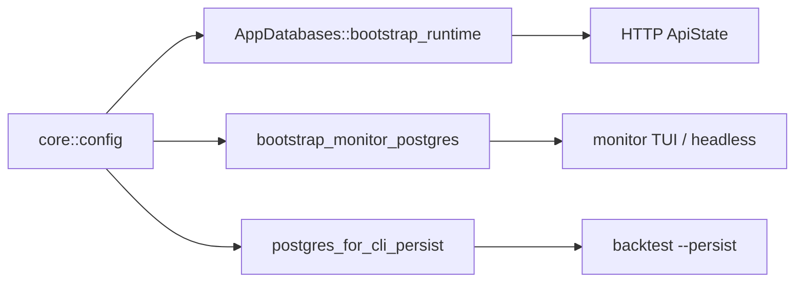

# SDD — Integração de módulos com serviços do `core`

Regra: **todo módulo em `modules/*` e `presentation/*` usa infra do `core`**. Proibido pool próprio ou bootstrap duplicado.

Ver também [database-module-integration](./database-module-integration-sdd.md).

## Bootstrap

| Seam | Consumidores |
|------|----------------|
| `AppDatabases::bootstrap_runtime` | `presentation/http/server::run`, `ApiState` |
| `bootstrap_monitor_postgres` | `main`, `bootstrap_monitor_database` |
| `postgres_for_cli_persist` | `backtest/cli --persist` |

## Matriz módulo × core

| Módulo | config | DB/persistence | health | notifications | error |
|--------|--------|----------------|--------|---------------|-------|
| monitor | O | O | domínio | O supervisor | P |
| agents/bots/orders | O | O PG | — | — | O |
| exchanges | O | — | — | — | O |
| backtest | O | O CLI bootstrap | — | — | O |
| presentation/http | via ApiState | O | O /readyz | — | ApiError |

## Gaps

- `exchanges` credenciais testnet em testes (`credentials_env`)
- Admin `provider_credentials` HTTP CRUD (PG + admin bearer; criptografia em repouso ainda follow-up)
- Neo4j opcional no bootstrap HTTP

## Validação

`./scripts/verify-backend-gates.sh`
