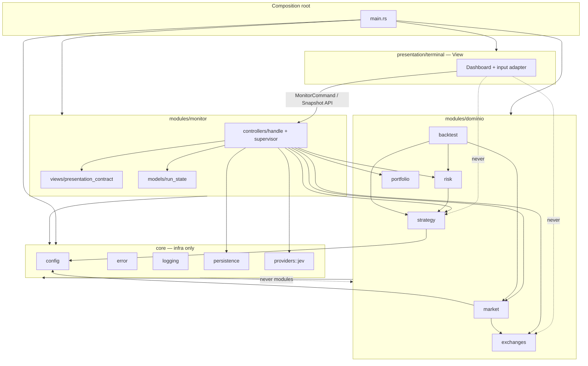

# SDD — Convenção MVC para módulos do backend Rust

- **Estado:** draft — submissão G1 (revisão independente pendente).
- **Requisito do owner:** cada módulo de domínio deve ter estrutura MVC explícita.
- **Referências:** [Proposta 0001](../proposals/0001-backend-core-modules-mvc.md), [SDD extração core F1](./core-extraction-phase1-sdd.md), [SDD contrato apresentação monitor](./monitor-presentation-contract-sdd.md).
- **Escopo deste documento:** convenção, árvores, imports e cronograma de esqueletos vs migração. **Não** autoriza mover código de produção fora das fatias planejadas.

## Estado observado do repositório (2026-09-26)

Inspeção de `backend/src/`:

| Área | Estado |
|------|--------|
| `core/` | **F1 em uso:** `config`, `error`, `logging`, `persistence`, `health`, `notifications`, `providers` (incl. `core::providers::jev` — não há `modules/jev`). |
| `modules/` | Domínios em MVC ou equivalente: `monitor`, `market`, `strategy`, `risk`, `portfolio`, `backtest`, `exchanges`, `agents`, `bots`, `orders`, `http_bridge`, `application_contracts`, `config_api`. |
| Raiz `src/` | Entrada em `main.rs`; sem crates de domínio legados na raiz (`app`, `ui`, `jev` migrados ou removidos). |
| `presentation/` | `terminal/` (TUI) e `http/` (Axum, OpenAPI, Scalar). |

**Nota F1:** outro agente pode estar concluindo detalhes da fatia 1 (`core-extraction-phase1-sdd.md`). Este SDD assume F1 como baseline aceito e não duplica passos de `git mv` do core.

**Addendum sugerido para `core-extraction-phase1-sdd.md`:** uma seção “Relacionados” com link para este arquivo e a frase: *`core/` não segue MVC; convenção MVC aplica-se somente a `modules/*` e `presentation/terminal`.*

---

## 1. Contexto e objetivo

O backend é um binário CLI/TUI com subcomando HTTP opcional (`serve`). O padrão MVC aqui é **arquitetural e de dependência**, não um framework web:

- **Model:** tipos, invariantes e transformações puras do domínio do módulo.
- **Controller:** casos de uso e orquestração — aceita comandos da aplicação (`MonitorCommand`, jobs de backtest, bootstrap de exchange), coordena Model e adapters, publica resultados/eventos.
- **View:** **somente** camada de apresentação humana (Ratatui). DTOs de tela vivem na View ou em contrato de apresentação do módulo produtor (`presentation_contract`), nunca na Model de outro módulo.

A proposta 0001 rejeita pastas MVC vazias; esta convenção define **o que é obrigatório quando o módulo existe** e **o esqueleto mínimo aceitável** na criação.

### Não objetivos

- Multi-crate, HTTP/REST público, mudança de comportamento de trading/monitor/backtest.
- Renomear `models` → entidades DDD ou impor `services/` paralelo a `controllers/` sem necessidade.
- Criar `views/` dentro de módulos que não produzem DTO de apresentação.

---

## 2. Convenção MVC Rust (definição normativa)

### 2.1 Mapeamento de camadas

| Camada MVC | Pasta Rust (módulo de domínio) | Responsabilidade |
|------------|--------------------------------|------------------|
| **Model** | `models/` (+ opcional `ports/` para traits de repositório) | Structs/enums, validação, cálculo puro, políticas sem I/O. Sem `tokio`, sem Ratatui, sem HTTP/WS direto. |
| **Controller** | `controllers/` | Casos de uso: `run`, `handle`, loops de aplicação, handles (`MonitorHandle`), composição Model + `adapters/`. Único lugar que inicia I/O do módulo (exceto adapters). |
| **View (global)** | `presentation/terminal/` | Renderização Ratatui, input de teclado, adaptação visual. Consome API pública tipada do monitor (e futuros contratos), não importa `models` internos de strategy/risk/market. |
| **View (contrato)** | `views/` **ou** `presentation_contract/` no módulo produtor | DTOs e traits **somente para apresentação** (`MonitorSnapshot`, validação de limites UTF-8). Sem lógica de negócio; conversão interna→DTO fica em `controllers/` ou `views/mapping.rs`. |
| **Adapter** | `adapters/` (quando há I/O) | Implementações de ports: REST/WS, arquivos TOML de conta, PostgreSQL específico do módulo. Não é camada MVC clássica; é **hexagonal** dentro do módulo. |

**Controller ≠ handler HTTP:** no projeto, Controller = **application controller** (comandos `MonitorCommand`, `BacktestCli`, bootstrap de registry).

**View ≠ `ui` legado:** `src/ui/` migra para `presentation/terminal/`; até lá, tratar `ui` como View legada.

### 2.2 `core/` — MVC ou só infra?

**Somente infraestrutura compartilhada.** Sem `models/controllers/views` de domínio.

```text
src/core/
  mod.rs
  error.rs
  logging.rs
  config/          # parsing/validação estrutural de processo (sem política de strategy)
  persistence/     # pool, migrate, transações genéricas
```

- `core` importa apenas crates externos + exceções legadas documentadas (ex.: `persistence` → tipo `HistoricalDataset` até fatia de desacoplamento).
- `core` **nunca** importa `modules::*` nem `presentation::*`.

### 2.3 `presentation/terminal` — só View?

**Sim**, com adaptadores finos permitidos:

```text
src/presentation/terminal/
  mod.rs
  dashboard.rs      # render
  input.rs          # teclado → MonitorCommand
  adapter.rs        # MonitorSnapshot → layout (sem domínio)
```

- Pode importar: `modules::monitor` (API pública / `presentation_contract`), `core::error` para erros de UI, crates Ratatui.
- **Não** importa: `modules::strategy`, `risk`, `market`, `exchanges`, `core::persistence` diretamente.

### 2.4 Contratos neutros entre módulos

Arquivo compartilhado (proposta 0001):

`modules/application_contracts.rs` — tipos de dados neutros (`Signal`, etc.) sem lógica de geração. Models de strategy **produzem**; risk/backtest **consomem** via contrato, não via import do módulo strategy.

---

## 3. Árvore obrigatória por módulo

Legenda:

- **Obr.** = pasta/arquivo exigido quando o módulo for declarado em `modules/mod.rs`.
- **Cond.** = criar apenas quando há DTO de tela ou I/O dedicado.
- **Fora** = não colocar no módulo (ownership elsewhere).

### 3.1 `modules/market`

**Origem legada:** `market.rs`, `market_feed.rs`.

```text
modules/market/
  mod.rs
  models/
    mod.rs
    candle.rs            # Timeframe, Candle, HistoricalDataset
    feed_state.rs        # watermark, dedup keys
  controllers/
    mod.rs
    hybrid_feed.rs       # HybridCandleFeed — orquestra REST+WS
  adapters/
    mod.rs
    rest_candle.rs
    ws_candle.rs
```

| Camada | Responsabilidade | Exemplo |
|--------|------------------|---------|
| Model | OHLCV válido, gaps, agregação 1m→Tf | `Candle::validate`, `HistoricalDataset::merge` |
| Controller | Loop híbrido, ordenação, dedup | `HybridCandleFeed::poll_next` |
| Adapter | Chamadas async a exchange | `RestCandleSource::fetch` |

**Não entra:** bootstrap de contas (`exchanges`), política de risco, TUI, SQL de persistência (só trait/callback se necessário).

### 3.2 `modules/strategy`

**Origem:** `strategy/`, partes de `domain` (sinais).

```text
modules/strategy/
  mod.rs
  models/
    mod.rs
    snapshot.rs
    periods.rs
  controllers/
    mod.rs
    evaluate.rs
```

**Não entra:** gating de risco (`risk`), renderização, feeds.

### 3.3 `modules/risk`

**Origem:** `risk.rs`.

```text
modules/risk/
  mod.rs
  models/
    mod.rs
    profile.rs
    intent.rs
  controllers/
    mod.rs
    gate.rs
```

**Não entra:** execução de ordens, exchange, UI.

### 3.4 `modules/portfolio`

**Origem:** `portfolio.rs`.

```text
modules/portfolio/
  mod.rs
  models/
    mod.rs
    asset.rs
    position.rs
    snapshot.rs
  controllers/
    mod.rs
    reconcile.rs
```

**Não entra:** envio de ordens, persistência SQL (até haver repositório dedicado).

### 3.5 `modules/backtest`

**Origem:** `backtest.rs`, `backtest_cli.rs` (CLI pode permanecer em `src/` como composition root fino).

```text
modules/backtest/
  mod.rs
  models/
    mod.rs
    config.rs
    report.rs
    simulator.rs
  controllers/
    mod.rs
    run_sma.rs
  adapters/
    mod.rs               # Cond.
    dataset_fixture.rs
```

**Não entra:** feed ao vivo, monitor loop, Ratatui.

### 3.6 `modules/exchanges`

**Origem:** `exchanges/*` (13 submódulos).

```text
modules/exchanges/
  mod.rs
  models/
    mod.rs
    ids.rs
    account.rs
    stream.rs
    capabilities.rs
  controllers/
    mod.rs
    bootstrap.rs
    registry.rs
    router.rs
    preflight.rs
  adapters/
    mod.rs
    account_file.rs
    binance.rs
    rest.rs
    live.rs
    ws.rs
    market_data.rs
```

**Não entra:** strategy, risk, TUI, migrations SQL genéricas (`core::persistence`).

### 3.7 `modules/monitor`

**Origem:** `app.rs`, `monitor_startup.rs`, `persistence_health.rs`, scaffold `modules/monitor.rs`.

```text
modules/monitor/
  mod.rs
  models/
    mod.rs
    run_state.rs
  views/
    mod.rs
    presentation_contract.rs
  controllers/
    mod.rs
    supervisor.rs
    startup.rs
    persistence_health.rs
    handle.rs
```

**Não entra:** cálculo SMA (`strategy`), regras de risco, adapters Binance (delega a `market`/`exchanges`).

### 3.8 `core::providers::jev` (não é `modules/*`)

**Origem:** integração advisory migrada de `jev/` raiz para `core/providers/jev/`.

```text
core/providers/jev/
  mod.rs
  models/
  controllers/
    review.rs
  adapters/
    http_client.rs
```

**Não entra:** autoridade sobre sinais, UI, persistência. Módulos de domínio (`agents`, monitor) delegam via `JevAdvisor` reexportado em `core::providers`.

### 3.9 `modules/config` (opcional fatia 2)

Se `OperationMode` migrar para fora de `core::config`:

```text
modules/config/
  mod.rs
  models/
    operation_mode.rs
  controllers/
    resolve.rs
```

Até decisão explícita, **`OperationMode` permanece em `core::config`** (F1 SDD).

---

## 4. Matriz de imports permitidos

```text
                    core   contracts   models   controllers   adapters   views/pres_contract   presentation/terminal
core                  —        —         —          —            —              —                      —
application_contracts ext      —         —          —            —              —                      —
models (módulo)       ext      ext        —          —            —              —                      —
adapters              ext      ext       mod         —            ext            —                      —
controllers           ext      ext       mod        mod           mod            mod*                   —
views/pres_contract   ext       —        —**        —            —              —                      —
presentation/terminal ext       —        —          —            —              — (via monitor API)    —
main                  all      all       —          —            —              —                      all
```

\* `controllers` importam `views` apenas para **montar** DTO (mapeamento), não o inverso.

\** `presentation_contract` define tipos próprios; não importa `strategy::StrategySnapshot` etc.

**Regras duras:**

1. `models` ↛ `controllers`, `adapters`, `views`, `presentation::*`.
2. `views` / `presentation_contract` ↛ `controllers`, `adapters`, outros `modules::*` (exceto `application_contracts` e `core` tipos neutros).
3. `presentation/terminal` ↛ qualquer `modules::*` exceto API pública do monitor (e futuros contratos explícitos no mesmo padrão).
4. `modules::*` ↛ `presentation::*`.
5. `core` ↛ `modules::*`, `presentation::*`.
6. Sem ciclos entre módulos; dependências cruzadas só via `application_contracts` ou APIs públicas estreitas documentadas na proposta 0001.

**Verificação planejada (F6):** script Rust ou `cargo deny` + teste de fixture com import proibido (deve falhar CI).

---

## 5. Anti-arquivo-vazio vs esqueleto mínimo aceitável

### 5.1 Proibido (MVC vazio)

- Pastas `models/`, `controllers/`, `views/` **sem nenhum** `.rs` com tipo ou função pública/usável.
- `mod.rs` que só declara `pub mod models;` com `models/mod.rs` vazio.
- Reexports que existem apenas para “cumprir checklist” sem código migrado ou teste ancorado.

### 5.2 Esqueleto mínimo aceitável ao **criar** o módulo

Na fatia que **declara** o módulo em `modules/mod.rs`:

1. `mod.rs` com doc-module uma linha + `pub mod models;` (mínimo).
2. `models/mod.rs` com **≥1** tipo ou função real (migrado ou movido da raiz), **ou** tipo já usado em teste de contrato.
3. `controllers/` só quando a fatia migra o orquestrador — deve incluir ≥1 função com corpo real, não `todo!()`.
4. `views/` / `presentation_contract` só junto com SDD de apresentação aprovado e ≥1 DTO + teste de schema.
5. `adapters/` só com implementação ou trait wiring real.

### 5.3 Ponte temporária

Durante migração, `pub use crate::market_feed::*` no `modules/market/mod.rs` é permitido **uma fatia**, listado no plano da fatia, removido antes do merge da fatia seguinte (proposta 0001).

---

## 6. Plano de fatias F1–F6 (esqueleto vs código migrado)

| Fase | Objetivo | Esqueleto MVC | Preenchimento / migração |
|------|----------|---------------|---------------------------|
| **F1** | Extrair `core/` | **Não** aplica MVC | Mover `config`, `error`, `logging`, `persistence` — **em progresso/concluído parcialmente** |
| **F2** | Contratos e matriz de imports | `application_contracts.rs`; script CI de direção (fixture) | Extrair `Signal`; decidir `OperationMode` (`core` vs `modules/config`); inventário imports |
| **F3** | Market + saúde operacional | `modules/market/{models,controllers,adapters}` com código real | `market_feed` + `market.rs` → market; `persistence_health` → monitor |
| **F4** | Monitor + apresentação | `modules/monitor` completo + `presentation/terminal` View | `app` → monitor controllers; `ui` → terminal; contrato presentation (SDD) |
| **F5** | Demais domínios | Pastas MVC **somente** ao migrar cada crate raiz | `strategy`, `risk`, `portfolio`, `backtest`, `exchanges`; Jev em `core::providers::jev` (F1 providers) |
| **F6** | Limpeza e gates | Remover reexports ponte | Apagar módulos raiz legados; `cargo test/clippy`; script imports + `cargo deny` |

**Ordem recomendada dentro de F5:** `exchanges` → `strategy` + contratos → `risk` → `portfolio` → `backtest` (Jev já em `core::providers`).

**Esqueletos:** criar árvore MVC **no mesmo PR** que move o primeiro arquivo substantivo para cada camada — nunca PR só de pastas vazias.

---

## 7. Diagrama geral (MVC + composição)



---

## 8. Alternativas consideradas

| Alternativa | Decisão |
|-------------|---------|
| MVC estrito com `views/` em todos os módulos | Rejeitada — View global + `presentation_contract` só no produtor. |
| `services/` separado de `controllers/` | Adiada — um único `controllers/` por módulo salvo necessidade futura documentada. |
| `core` com `models/` de domínio | Rejeitada — domínio fica em `modules/*`. |
| Crate `bot-modules` separado | Adiada (proposta 0001). |

---

## 9. Riscos e validação

| Risco | Mitigação |
|-------|-----------|
| Pastas vazias por pressão de “cada módulo MVC” | Regras §5; gate de revisão G1. |
| Ciclo `config` ↔ `strategy` | F2: contratos + composition em `main`. |
| TUI importa domínio | F4: lint/script; só API monitor. |
| Churn em `exchanges/` | F5 dedicado; manter testes REST/WS verdes por sub-fatia. |

**Critérios de aceite G1 (este documento):**

1. Critic confirma alinhamento com proposta 0001 e SDD core F1.
2. Owner confirma mapeamento Controller/application e View=presentation only.
3. Cada módulo listado tem árvore, exclusões e exemplos verificáveis.

**Pós-G1 (implementação):** não iniciar migração em massa sem fatia e testes da proposta 0001.

---

## 10. Referências

- [Proposta 0001 — core e módulos MVC](../proposals/0001-backend-core-modules-mvc.md)
- [SDD extração core (F1)](./core-extraction-phase1-sdd.md)
- [SDD contrato apresentação monitor](./monitor-presentation-contract-sdd.md)
- [Catálogo de módulos](../architecture/module-catalog.md)
